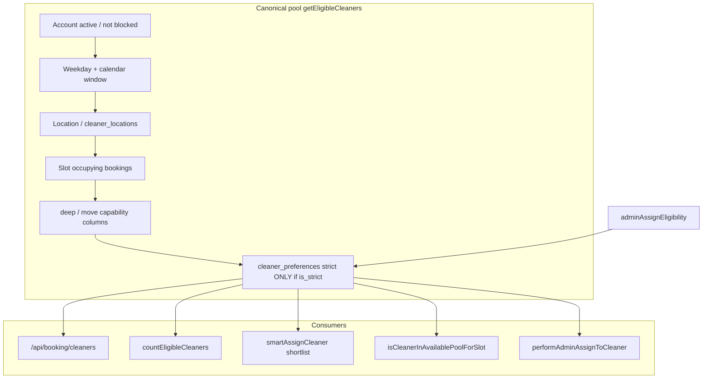

# Platform issues register (revenue-critical)

> **Generated:** 2026-05-25 (Phase 1 audit). **Phase 2 fixes:** 2026-05-30.  
> **Scope:** Booking funnel, Paystack, dispatch, cleaner eligibility, payouts.  
> **Related:** Broader backend audit in [`docs/audits/shalean-backend-end-to-end-system-audit.md`](audits/shalean-backend-end-to-end-system-audit.md).

---

## Executive summary

| Metric | Value |
|--------|-------|
| **P0 (revenue / assignment / payment)** | 0 confirmed open product bugs in this pass |
| **P1 (customer/cleaner visible + CI blind spots)** | 6 |
| **P2 (test drift, tooling, doc debt)** | 8 |
| **P3 (backlog)** | 3 |
| **Full vitest** | **2248 passed** / 0 failed (315 files) |
| **CI `test:critical`** | 31/31 passed |
| **CI revenue slice** | Added in `web-test.yml` (booking/dispatch/cleaner/cron/admin) |
| **`npx tsc --noEmit`** | Passed |
| **`npm run lint`** | **Failed** (220 errors, 128 warnings) — REV-008 open |
| **`npm run build`** | Passed |
| **`npm run ops:smoke`** | Zero-member teams warn; fails only on &lt;2 members (not empty roster) |

**Headline (post Phase 2):** Full vitest and typecheck are green. CI now runs a revenue-focused vitest slice in addition to `test:critical`. Admin schedule hints apply strict `cleaner_preferences` when `bookingCapabilitySlug` is set (aligned with picker/dispatch). Remaining debt is mostly repo-wide ESLint and optional E2E/staging coverage.

**Cleaner eligibility convergence:** `getEligibleCleaners` + `adminAssignEligibility` + dispatch share `cleanerPreferenceStrictExcludesJob` when a service slug is known.

---

## Severity legend

| Level | Meaning |
|-------|---------|
| **P0** | Revenue loss, wrong assignment, payment integrity, or exploitable security |
| **P1** | Wrong or confusing customer/cleaner/admin state; recoverable via ops; CI misses real failures |
| **P2** | Test drift, observability gaps, non-blocking tooling debt |
| **P3** | Backlog, documentation, non-revenue surfaces |

**Evidence types:** `confirmed` (command output / failing test), `code review` (static trace), `suspected` (needs runtime repro).

---

## Issues register

| ID | Sev | Domain | Symptom | Root cause | Evidence | Suggested fix | Status |
|----|-----|--------|---------|------------|----------|---------------|--------|
| REV-001 | P1 | CI / quality | Full vitest not in CI | CI ran `test:critical` only | `confirmed` | Revenue vitest slice added to `web-test.yml`; full suite still local/nightly candidate | **fixed** |
| REV-002 | P1 | Cleaner API | `view=card` earnings test failed on `typeof null` | Preview mock / assertion drift | `confirmed` | Booking-id-scoped preview mock; assert `31_500` + `earnings_basis_pending` | **fixed** |
| REV-003 | P1 | Cleaner API | Dashboard cap test returned 0 jobs | Past dates + assigned without acceptance | `confirmed` | Future dates + `cleaner_response_status: accepted` | **fixed** |
| REV-004 | P1 | Dispatch / cron | H-9 content-guard tests fail | Tests targeted inline updates | `confirmed` | Guards assert `assignmentBookingStateCommands` + shared imports | **fixed** |
| REV-005 | P1 | Cron | H-15 `ops-health` orphan | Manifest lists stale | `confirmed` | `ops-health` in protected + expected locked sets | **fixed** |
| REV-006 | P2 | Admin eligibility | Admin hints ignored strict service prefs | Parallel implementation gap | `code review` | `cleaner_preferences` + `cleanerPreferenceStrictExcludesJob` in `computeAssignEligibility` | **fixed** |
| REV-007 | P2 | Typecheck | `tsc` failed on eligibility tests | Incomplete `LockedBooking` types | `confirmed` | `baseLocked()` + correct offer earnings inputs | **fixed** |
| REV-008 | P2 | Lint | 220 ESLint errors repo-wide | Many `react-hooks/refs` violations; not limited to revenue paths | `confirmed`: `npm run lint` | Triage: fix revenue-touching routes first; consider CI lint job with incremental baseline | open |
| REV-009 | P2 | Dispatch | Strict preference filter applied twice for dispatch | `getEligibleCleaners` filters prefs; `findSmartDispatchCandidates` calls `cleanerPreferenceStrictExcludesJob` again | `code review` | Harmless redundancy; optional dedupe for performance | open |
| REV-010 | P2 | Checkout | Customer can still receive dispatch **offer** to picked cleaner on eligibility fallback | By design: `checkoutPaidDispatchOfferCleanerId` returns pick on `fallback` for visibility; auto-assign excludes via `excludeCleanerIds` | `code review` | Documented in runbook + this register | **documented** |
| REV-011 | P2 | Ops | Ops smoke fails on zero-member teams | Data: empty roster on active team | `confirmed` | Zero-member → WARN; fail only when `0 < members < 2` | **fixed** (script); DB roster still ops task |
| REV-012 | P2 | E2E | Revenue E2E env-gated | Secrets not in CI | `code review` | See [`apps/web/e2e/README.md`](../apps/web/e2e/README.md) + staging vars table below | **documented** |
| REV-013 | P3 | Docs | Audit doc fragmentation | Multiple `docs/audits/*` | `code review` | This register is canonical for REV IDs; link audits when touching an area | **documented** |
| REV-014 | P3 | README | App README boilerplate | No dev onboarding | `code review` | `apps/web/README.md` points to repo docs + test commands | **fixed** (minimal) |
| REV-015 | P3 | Marketing API | `GET /api/cleaners/available` is not slot-aware | Intentional marketing roster; forbidden in booking funnel via test | `confirmed`: `forbidCleanersAvailableFetch.test.ts` | Keep; ensure no new funnel code calls it | open |

---

## Revenue flow integrity matrix

Canonical service IDs (must not change): `standard`, `airbnb`, `deep`, `move`, `carpet` — no `quick` in [`BOOKING_SERVICE_IDS`](apps/web/components/booking/serviceCategories.ts) (see `serviceCategories.retireQuick.test.ts`).

| Stage | Entry | Eligibility engine | Strict `preferred_services` | Standard vs Airbnb |
|-------|--------|-------------------|----------------------------|-------------------|
| Slot grid | `getAvailableTimeSlots` → `getEligibleCleaners` | Same | Yes, when `bookingServiceSlug` set | Isolated per slug |
| Lock validation | `validateLockSlotAgainstEligibility` → `countEligibleCleaners` | Same | Yes | Same |
| Public picker | `GET /api/booking/cleaners` → `getAvailableCleaners` → `getEligibleCleaners` | Same | Yes | Same |
| Checkout honor | `resolveCheckoutCleanerSelection` → `isCleanerInAvailablePoolForSlot` | Same | Yes | Same |
| Post-pay offer | `checkoutPaidDispatchOfferCleanerId` | Pool check at checkout; offer may still target pick on fallback | Partial | N/A |
| Dispatch pool | `findSmartDispatchCandidates` → `getEligibleCleaners` + strict filter again | Same + travel/overlap | Yes | Same |
| Admin assign (hard gate) | `performAdminAssignToCleaner` → `getEligibleCleaners` | Same | Yes | Same |
| Admin schedule hints | `adminAssignEligibility.ts` | Same strict pref helper when slug set | **Yes** | Capability + strict prefs |
| User-selected retry | `userSelectedOfferExpiryRetry` → `isCleanerInAvailablePoolForSlot` | Same | Yes | Same |



**Strict preference rules** (from [`cleanerPreferenceMatch.ts`](apps/web/lib/dispatch/cleanerPreferenceMatch.ts)):

- `is_strict === false`: service prefs affect dispatch **score only**, not exclusion.
- `is_strict === true` + empty `preferred_services`: **eligible** (neutral).
- `is_strict === true` + configured services: job slug must be in list or cleaner is **excluded**.
- `preferred_areas`: **not** used for strict exclusion (location uses `cleaner_locations`).

---

## Test and CI gap register

### Vitest (full suite — `npm run test`)

**2026-05-30:** 315 files, **2248 passed**, 0 failed.

### CI workflow (`.github/workflows/web-test.yml`)

Runs: `test:critical`, **revenue path vitest slice**, `validate:blog-routes`, `audit:internal-links`, `validate:cms-blog-links`, `tsc --noEmit`, blog SEO reports, optional live SEO.

Does **not** run: full vitest (2248 tests), ESLint, `npm run build`, Playwright E2E, `ops:smoke`.

### Revenue slice tests (this audit)

| Command | Result |
|---------|--------|
| `npm run test -- booking` | Pass (791 tests) |
| `npm run test -- service` | Pass (49 tests) |
| `npm run test -- booking dispatch payout paystack` | 2 fail (H-9 only in dispatch slice) |

### E2E (env-gated — not product bugs)

Under `apps/web/e2e/`: Paystack, dispatch, completion lifecycle require secrets documented in [`apps/web/e2e/README.md`](apps/web/e2e/README.md). Treat as **coverage gap**, not failing product.

### Critical path tests (CI-green)

`paymentAmountVsSnapshot`, `upsertBookingFromPaystack`, `finalizePaystackChargeSuccess`, `failedJobs`, `enqueuePaystackRecoveryFailedJobs`, `runBookingLockValidation`, `notificationIdempotencyClaim`, `paystackVerifyIpLimit`, `validateReferral` — all pass.

---

## Untested / weakly tested revenue branches (code review)

| Branch | Location | Risk |
|--------|----------|------|
| Paystack webhook vs verify race | `finalizePaystackChargeSuccess`, webhook route | Critical tests cover upsert idempotency; full double-delivery E2E gated |
| Selected-cleaner offer insert failure → auto-dispatch fallback | `upsertBookingFromPaystack` | Unit tests in `checkoutDispatchOfferFailureFallback.test.ts` |
| Amount mismatch on finalize | `upsertBookingFromPaystack` | `paymentAmountVsSnapshot.test.ts` |
| Dispatch strict prefs + non-strict airbnb-only in pool | `getEligibleCleaners` | `cleanerServicePreferenceEligibility.test.ts` |
| Admin assign force override | `performAdminAssignToCleaner` | Admin tests; may bypass pool when `force` |
| Weekly payout 23505 duplicate | `generateWeeklyPayouts` | Covered in `m18CleanerPayoutsUniquePeriod.test.ts` |

---

## Appendix: command outputs (truncated)

### `npm run test` (exit 0 — 2026-05-30)

```
Test Files  315 passed (315)
Tests       2248 passed (2248)
Duration    ~43s
```

### `npm run test:critical` (exit 0)

```
Test Files  9 passed (9)
Tests       31 passed (31)
```

### `npx tsc --noEmit` (exit 0 — 2026-05-30)

No errors.

### `npm run lint` (exit 1)

```
348 problems (220 errors, 128 warnings)
```

### `npm run build` (exit 0)

```
Compiled successfully; static generation 202 routes
```

### `npm run ops:smoke`

Zero-member active teams log **WARN** (fix roster in DB). Script still **FAIL**s when an active team has exactly one member.

---

## Staging E2E (REV-012)

| Variable | Purpose |
|----------|---------|
| `PLAYWRIGHT_BASE_URL` | Target URL (preview or staging) |
| `E2E_PAYSTACK` | Enable Paystack sandbox specs (`e2e/paystack/`) |
| `E2E_DISPATCH` | Enable dispatch lifecycle specs (when present) |
| `SUPABASE_SERVICE_ROLE_KEY` | Widget draft + admin paths on server |

Run locally: `cd apps/web && npx playwright install chromium && npm run test:e2e`. Not wired in GitHub Actions by default.

---

## Checkout cleaner fallback (REV-010)

When `resolveCheckoutCleanerSelection` returns **`fallback`**, the customer may still receive a **dispatch offer** aimed at their picked cleaner (`checkoutPaidDispatchOfferCleanerId`) for visibility. **Auto-assign** excludes that cleaner via `excludeCleanerIds`. Ops should not treat “offer to picked cleaner” as proof they remained in the canonical eligibility pool. See [`checkoutCleanerEligibility.ts`](../apps/web/lib/booking/checkoutCleanerEligibility.ts).

---

## Phase 2 status

| ID | Status |
|----|--------|
| REV-001–007, REV-011, REV-014 | Fixed |
| REV-008 | Open (220 ESLint errors — incremental triage) |
| REV-009 | Open (redundant dispatch pref filter; harmless) |
| REV-010, REV-012, REV-013, REV-015 | Documented / by design |
