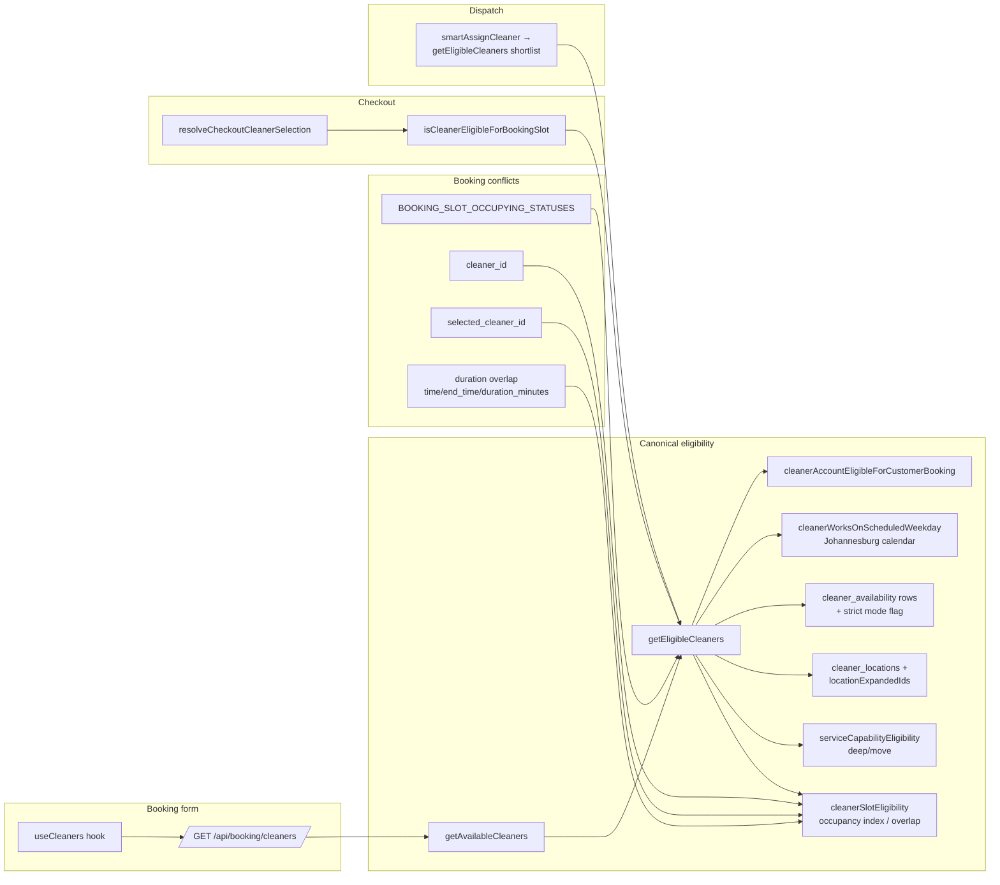
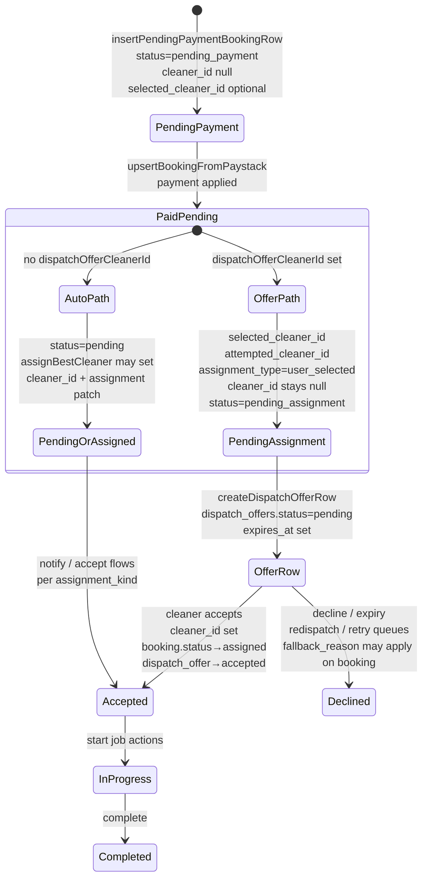
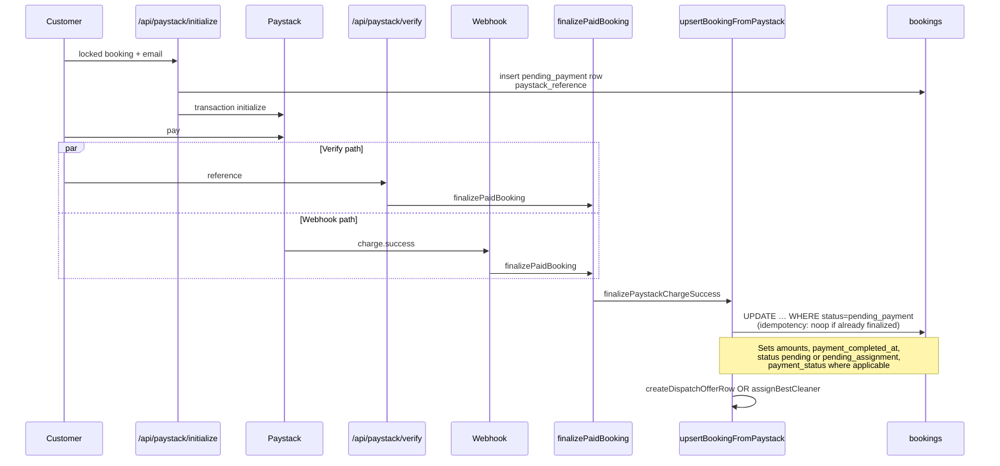
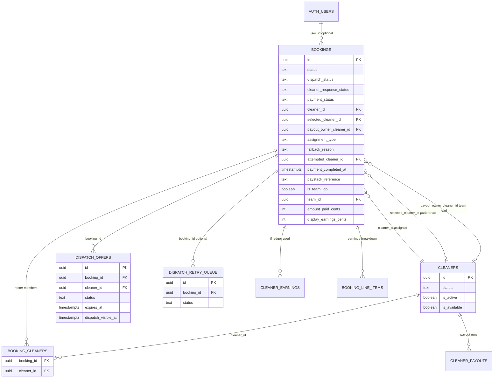

# Shalean booking system — read-only architecture

Documentation-only overview of how the current booking stack fits together. **No business logic lives in this file.**

---

## 1. Full booking flow

End-to-end path from the customer funnel through payment, dispatch, and the three main dashboards.

```mermaid
flowchart TB
  subgraph customer [Customer browser]
    BF[Booking flow UI<br/>StepSchedule / checkout steps]
    CS[Cleaner selection<br/>optional browse / best available]
    PY[Paystack checkout<br/>hosted payment page]
  end

  subgraph apis [Next.js API routes]
    LOCK[/api/booking/lock/]
    CLEAN[/api/booking/cleaners/]
    INIT[/api/paystack/initialize/]
    VERIFY[/api/paystack/verify/]
    WH[/api/paystack/webhook/<br/>or /api/webhooks/paystack/]
    ADM[/api/admin/bookings/*]
    DSUM[/api/dashboard/summary/]
    CJOBS[/api/cleaner/jobs/]
    COFF[/api/cleaner/offers/]
  end

  subgraph core [Server libs]
    PAY[paystackInitializeCore<br/>insertPendingPaymentBookingRow]
    FIN[finalizePaidBooking →<br/>upsertBookingFromPaystack]
    OFF[createDispatchOfferRow]
    ASG[assignBestCleaner /<br/>smartAssignCleaner]
    ACC[acceptDispatchOffer /<br/>cleaner job actions]
  end

  subgraph db [Postgres via Supabase]
    B[(bookings)]
    DO[(dispatch_offers)]
  end

  BF --> LOCK
  BF --> CLEAN
  BF --> CS
  BF --> INIT
  INIT --> PAY
  PAY --> B
  PY --> VERIFY
  PY --> WH
  VERIFY --> FIN
  WH --> FIN
  FIN --> B
  FIN --> OFF
  FIN --> ASG
  OFF --> DO
  ASG --> B
  COFF --> DO
  COFF --> B
  CJOBS --> B
  DSUM --> B
  ADM --> B
  ACC --> B
  ACC --> DO
```

**Explanation:** Customers lock a slot, optionally load cleaners from `/api/booking/cleaners`, pay via Paystack after `/api/paystack/initialize` creates a **`pending_payment`** row. Success hits **verify** and/or **webhook**, both funneling to **`finalizePaidBooking`** → **`upsertBookingFromPaystack`**, which updates the booking and either creates a **dispatch offer** (user-selected cleaner path) or runs **auto-assignment**. Cleaners interact via **offers** and **jobs** APIs; admins via **admin bookings**; customers via **dashboard summary** (and related booking routes).

**Based on:**  
`apps/web/components/booking/**/*`, `apps/web/app/api/booking/lock/**/*`, `apps/web/app/api/booking/cleaners/route.ts`, `apps/web/lib/booking/paystackInitializeCore.ts`, `apps/web/lib/booking/insertPendingPaymentBooking.ts`, `apps/web/app/api/paystack/initialize/route.ts`, `apps/web/app/api/paystack/verify/route.ts`, `apps/web/app/api/paystack/webhook/route.ts`, `apps/web/app/api/webhooks/paystack/route.ts`, `apps/web/lib/booking/bookingOperations.ts`, `apps/web/lib/booking/upsertBookingFromPaystack.ts`, `apps/web/lib/dispatch/dispatchOffers.ts`, `apps/web/lib/marketplace-intelligence/assignBestCleaner.ts`, `apps/web/lib/dispatch/smartAssignCleaner.ts`, `apps/web/app/api/dashboard/summary/route.ts`, `apps/web/app/api/cleaner/jobs/route.ts`, `apps/web/app/api/cleaner/offers/route.ts`, `apps/web/app/api/admin/bookings/**/*`

**Uncertainties:**  
Exact production entry for Paystack callbacks (two webhook route files exist — confirm which is wired in Paystack dashboard). Some flows (widget, monthly invoice) reuse Paystack initialize with different wrappers.

---

## 2. Cleaner eligibility flow

How the system decides which cleaners can serve a given slot, and how that compares to checkout and dispatch.



**Explanation:** The booking form calls **`/api/booking/cleaners`**, which loads cleaners and runs **`getEligibleCleaners`** (calendar windows, service area, capability, weekdays, account gate, and **occupying** bookings including **`pending_assignment`** and **`selected_cleaner_id`** holds). Checkout **revalidates** the picked UUID via the same pool helper. **smartAssignCleaner** builds its candidate set from **`getEligibleCleaners`** before ranking and offers.

**Based on:**  
`apps/web/components/booking/useCleaners.ts`, `apps/web/app/api/booking/cleaners/route.ts`, `apps/web/lib/booking/availabilityEngine.ts`, `apps/web/lib/booking/getEligibleCleaners.ts`, `apps/web/lib/booking/cleanerSlotEligibility.ts`, `apps/web/lib/booking/bookingCleanerSlotOccupyingStatuses.ts`, `apps/web/lib/booking/checkoutCleanerEligibility.ts`, `apps/web/lib/dispatch/smartAssignCleaner.ts`

**Uncertainties:**  
Legacy/alternate conflict checks (e.g. **`assignCleaner.ts` slot checks**) may still diverge from this path for some admin operations — not shown on this diagram.

---

## 3. Assignment lifecycle

Fields on **`bookings`** and **`dispatch_offers`** through the customer-choice → offer → accept pipeline.



**Field cheat sheet (typical behavior — see code for edge cases)**

| Field | Often set | Often cleared |
|--------|-----------|----------------|
| **selected_cleaner_id** | Paystack finalize when user picked or fallback pick; admin PATCH | Cleared on some checkout “no pick” / fallback patches (`postPayAssignmentClear` logic in finalize) |
| **cleaner_id** | On accept, auto-assign success, admin assign | Explicitly null on user-selected finalize until accept |
| **attempted_cleaner_id** | User-selected checkout branches | Part of same patch family as finalize |
| **assignment_type** | `user_selected` vs auto tags via finalize / patches | Guarded updates (e.g. `.is('assignment_type', null)`) on auto patch |
| **fallback_reason** | When checkout honor→fallback | — |
| **payout_owner_cleaner_id** | Team dispatch, offer rows, admin team assign | Team-specific repairs |
| **dispatch_offers.status** | `pending` → `accepted` / `rejected` / `expired` | Row retained for audit |

**Explanation:** **Preference** is **`selected_cleaner_id`**; **actual worker** for solo jobs is **`cleaner_id`** after acceptance or auto-assign. **Offers** live in **`dispatch_offers`** until accept/decline/timeout.

**Based on:**  
`apps/web/lib/booking/upsertBookingFromPaystack.ts`, `apps/web/lib/dispatch/dispatchOffers.ts`, `apps/web/lib/dispatch/resolveDispatchOfferForCleanerReply.ts` (and related accept routes), `apps/web/lib/dispatch/redispatchAfterOfferReject.ts`, `apps/web/lib/booking/assignCleaner.ts`, `apps/web/lib/marketplace-intelligence/assignBestCleaner.ts`

**Uncertainties:**  
Exact mutations inside every accept/decline handler variant (mobile vs API) — treat **`describeBookingOperationalState`** + DB as ground truth for odd rows.

---

## 4. Payment lifecycle



**Explanation:** Initialize persists a **`pending_payment`** booking so the reference is stable. **Verify** and **webhook** both call **`finalizePaidBooking`**, which wraps **`upsertBookingFromPaystack`**. The DB update is conditional on **`status = pending_payment`** so duplicate delivery yields a **skipped/race-safe** outcome. After persistence, **offers** or **auto-assignment** run in-process.

**Based on:**  
`apps/web/lib/booking/paystackInitializeCore.ts`, `apps/web/lib/booking/insertPendingPaymentBooking.ts`, `apps/web/app/api/paystack/initialize/route.ts`, `apps/web/app/api/paystack/verify/route.ts`, `apps/web/app/api/paystack/webhook/route.ts`, `apps/web/lib/booking/runPaystackVerifyFinalizePipeline.ts`, `apps/web/lib/booking/bookingOperations.ts`, `apps/web/lib/booking/upsertBookingFromPaystack.ts`

**Uncertainties:**  
Whether both webhook and verify always fire for the same charge in production (ordering can affect metrics side-effects).

---

## 5. Dashboard visibility map

```mermaid
flowchart TB
  subgraph admin [Admin dashboard]
    AT[(bookings)]
    ADM_Q[Wide selects in<br/>GET /api/admin/bookings<br/>PATCH /api/admin/bookings/id]
    ADM_F[Filters: ops filters,<br/>payment_status helpers,<br/>assignment display]
  end

  subgraph cleaner_offers [Cleaner offers API]
    DO[(dispatch_offers)]
    BO[(bookings)]
    CF["dispatch_offers:<br/>cleaner_id = viewer<br/>status = pending<br/>expires_at > now"]
    CB["bookings join:<br/>hide stale offer if<br/>already assigned to viewer<br/>or team roster match"]
  end

  subgraph cleaner_jobs [Cleaner jobs / dashboard]
    BM[fetchCleanerVisibleBookingsMerged]
    B1["Branch: cleaner_id OR<br/>payout_owner_cleaner_id"]
    B2["Branch: team_id IN cleaner teams"]
    B3["Branch: booking_cleaners roster ids"]
    PF[cleanerJobsListRowPostFilter<br/>hide payment_expired, failed<br/>hide one-off pending_payment<br/>allow recurring pending_payment"]
  end

  subgraph customer [Customer dashboard]
    DS[/api/dashboard/summary/]
    CBK[(bookings)]
    CF2["user_id = viewer<br/>exclude status pending_payment<br/>exclude payment_expired"]
    SEL[CUSTOMER_BOOKING_SELECT fields]
  end

  ADM_Q --> AT
  cleaner_offers --> DO
  cleaner_offers --> BO
  BM --> B1
  BM --> B2
  BM --> B3
  BM --> PF
  DS --> CBK
```

**Summary table**

| Dashboard | Primary tables | Filters / rules | Appears when | Hidden when |
|-----------|----------------|-----------------|--------------|-------------|
| **Admin bookings list/detail** | `bookings` (+ joins as in route selects) | Route-specific (status, payment, search) | Matches admin query | Outside filter |
| **Cleaner offers** | `dispatch_offers`, `bookings`, `booking_cleaners` | `dispatch_offers.status = pending`, `expires_at > now`, visibility timing | Pending offer for this cleaner | Expired/rejected/accepted; filtered if booking already assigned to cleaner/team roster |
| **Cleaner jobs / dashboard** | `bookings`, `team_members`, `booking_cleaners` | Merged branches then **`cleanerJobsListRowPostFilter`** | In merged visibility set | `failed`, `payment_expired`; one-off **`pending_payment`**; missing recurring columns can drop recurring unpaid incorrectly |
| **Customer dashboard** | `bookings`, optional `cleaners`, `monthly_invoices` | **`user_id` match**; **`status NOT pending_payment`**, **`NOT payment_expired`** | Paid / active lifecycle rows for user | Unpaid checkout rows hidden from list (customer pays in funnel) |

**Based on:**  
`apps/web/app/api/dashboard/summary/route.ts`, `apps/web/lib/dashboard/customerBookingSelect.ts`, `apps/web/app/api/cleaner/offers/route.ts`, `apps/web/app/api/cleaner/jobs/route.ts`, `apps/web/app/api/cleaner/dashboard/route.ts`, `apps/web/lib/cleaner/cleanerBookingAccess.ts`, `apps/web/app/api/admin/bookings/route.ts`

**Uncertainties:**  
Other customer-facing routes (e.g. booking detail) may use slightly different selects; admin list has many optional filters not enumerated here.

---

## 6. Database relationship diagram (conceptual ER)

Shows **primary** relationships relevant to booking operations. Not every FK or index is listed.



**Explanation:** **`bookings`** is the hub: payment fields, lifecycle **`status`**, dispatch **`dispatch_status`**, cleaner **`cleaner_response_status`**, assignment IDs, earnings snapshots. **`dispatch_offers`** ties pending offers to **`bookings`** and **`cleaners`**. **`booking_cleaners`** models team roster visibility. Payout/earnings entities (`cleaner_earnings`, `cleaner_payouts`, line items) hang off **`bookings`** for money reconciliation.

**Based on:**  
Supabase migrations under `supabase/migrations/*bookings*`, `*dispatch*`, `*payout*`, `*earnings*`; TypeScript types in `apps/web/lib/payout/*`, `apps/web/lib/dashboard/types.ts`

**Uncertainties:**  
Exact optional tables per environment (e.g. `user_events`, WhatsApp logs); **`auth.users`** vs app **`user_profiles`** linkage not fully modeled here.

---

## Top architecture risks (from structural review)

1. **Dual finalize ingress** (verify + webhook) — must stay idempotent; side-effects outside the conditional update need scrutiny.  
2. **User-selected path:** offer insert failure does not automatically fall back to auto-assign in the same block — risk of **paid + pending_assignment + no offer**.  
3. **Multiple conflict/eligibility concepts** — canonical **`getEligibleCleaners`** vs legacy **`assignCleaner`** slot checks may disagree.  
4. **Operational phase collapse:** **`pending_assignment`** maps to generic **“pending”** phase in **`deriveBookingOperationalPhase`** — customer/cleaner copy can mislead.  
5. **Cleaner jobs merge** — three-query merge + post-filter; missing select columns can hide recurring **`pending_payment`** incorrectly.  
6. **Customer list excludes `pending_payment`** — correct for “paid dashboard” but easy to misread as “booking disappeared.”  
7. **Team vs solo:** **`cleaner_id`**, **`payout_owner_cleaner_id`**, **`booking_cleaners`** must stay aligned for payouts and visibility.

---

## Document metadata

- **Purpose:** Onboarding and safe refactoring planning.  
- **Does not replace:** Runtime traces, Supabase RLS policies, or Paystack dashboard configuration.  
- **Last aligned to codebase:** 2026-05 (approximate; re-verify after large refactors).
