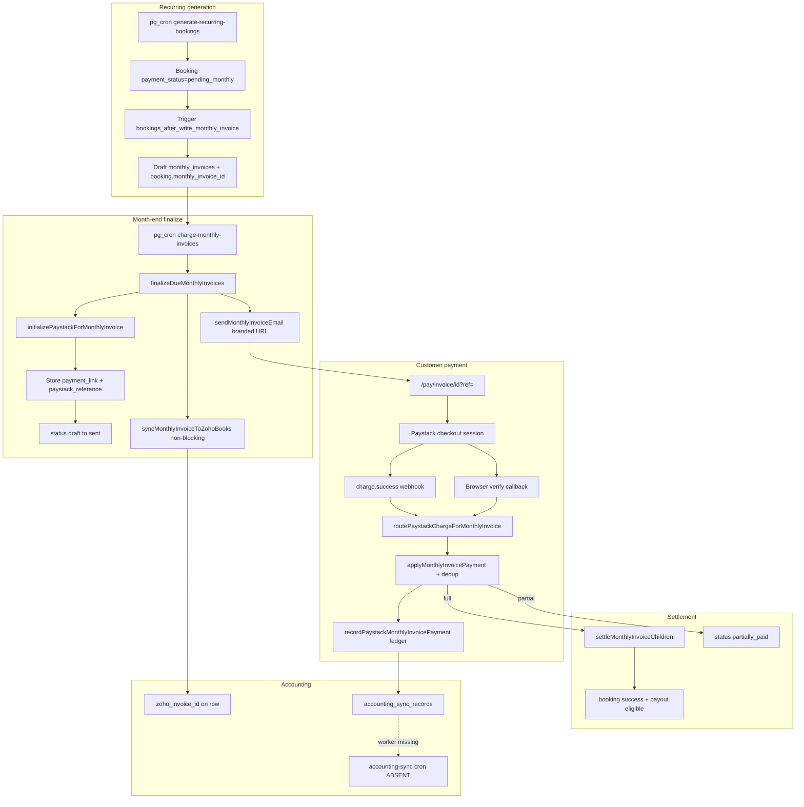
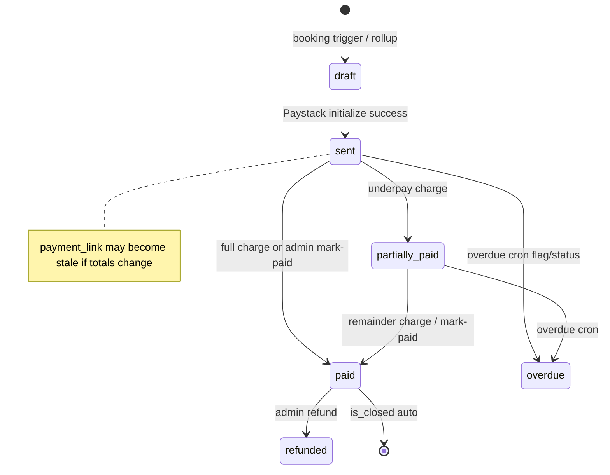
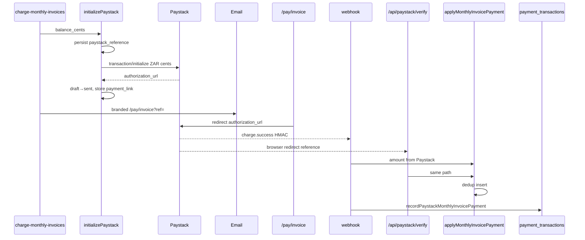
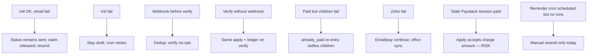

# 03 — End-to-End Architecture

## Production identity

| Layer | Verified value |
|-------|----------------|
| App | `shalean.co.za` → Vercel production |
| SHA | `c2c04d42acff0e60e7b09cc604a7d042b56a2b10` |
| DB | Supabase `tchayecuvzssixyxlvfu` |
| Paystack | live |
| Cron transport | `cron_http_targets.app_base_url` host = `shalean.co.za`; pg_cron → `invoke_nextjs_cron` |

## Current end-to-end billing architecture



## Invoice and payment-link state machine



## Paystack initialize / callback / webhook sequence



## Payment reconciliation and Zoho synchronization flow

```mermaid
flowchart LR
  A[Invoice paid locally] --> B{zoho_invoice_id?}
  B -->|yes| C[markZohoInvoicePaid best-effort]
  B -->|no| D[Office Zoho sync / sync-zoho API]
  E[payment_transactions] --> F[accounting_sync_records pending]
  F --> G{accounting-sync cron}
  G -->|absent in prod pg_cron| H[Queue stagnates]
  D --> I[/office/billing missing_zoho tab]
```

## Failure and recovery paths



## Primary code map

| Concern | Path |
|---------|------|
| Office invoices UI | `apps/web/app/(ui-redesign)/office/invoices/` |
| Office Zoho billing | `apps/web/app/(ui-redesign)/office/billing/page.tsx` |
| Finalize | `lib/monthlyInvoice/finalizeAndSendMonthlyInvoice.ts` |
| Paystack init | `lib/monthlyInvoice/initializePaystackForMonthlyInvoice.ts` |
| Apply payment | `lib/monthlyInvoice/applyMonthlyInvoicePayment.ts` |
| Public pay | `lib/pay/loadPayMonthlyInvoiceLanding.ts` |
| Webhook | `app/api/paystack/webhook/route.ts` |
| Ledger | `lib/payments/recordPaystackSettlement.ts` |
| Zoho | `lib/monthlyInvoice/syncMonthlyInvoiceToZohoBooks.ts` |
| Reminders | `lib/monthlyInvoice/runSendInvoiceReminders.ts` |
