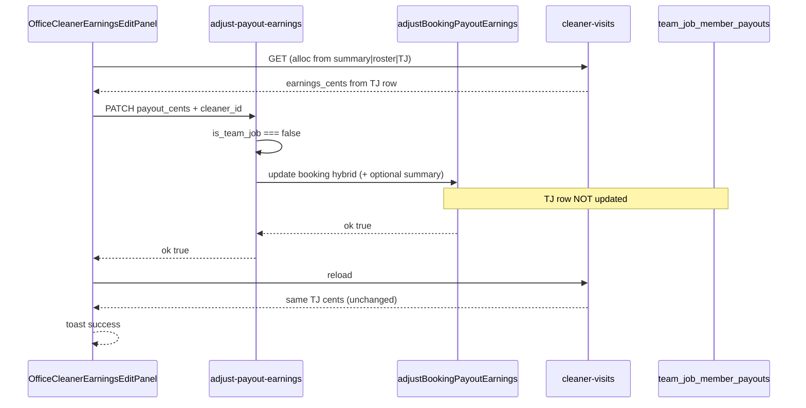
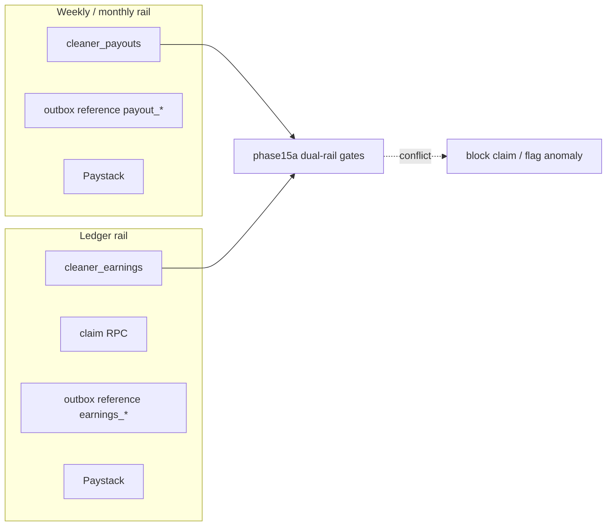

# PAYOUT-E2E-001 — Architecture and Data-Flow Map

## 1. High-level lifecycle

```text
Booking created / paid
  → canonical earnings engine (v3)
  → persistCleanerPayoutIfUnset
  → bookings.(display|hybrid|earnings_summary)
     + team_job_member_payouts | booking_roster_member_payouts
  → cleaner dashboard / office report (per-cleaner resolve)
  → manual edit / remove (admin APIs)
  → freeze eligible (monthly settle / cron)
  → generateWeeklyPayouts → cleaner_payouts
  → optional amount adjust / freeze run
  → approve (maker–checker optional)
  → payout_transfer_outbox → Paystack /transfer
  → webhook|reconcile → paid
  → (separate) accounting-sync for invoices/expenses — not cleaner transfers
```

## 2. Mermaid — end-to-end

```mermaid
flowchart TD
  B[Booking completed / paid]
  E[canonicalCleanerPayout v3]
  P[persistCleanerPayoutIfUnset]
  BK[bookings earnings columns + earnings_summary]
  TJ[team_job_member_payouts]
  BR[booking_roster_member_payouts]
  CD[Cleaner dashboard API]
  OF[Office period report / cleaner-visits]
  ADJ{adjust-payout-earnings}
  ITJ{is_team_job only?}
  SOLO[adjustBookingPayoutEarnings]
  TEAM[adjustBookingTeamMemberPayoutEarnings]
  GEN[generateWeeklyPayouts]
  CP[cleaner_payouts]
  SYNC[syncPayoutBatchFromBookings]
  AP[approve]
  OB[payout_transfer_outbox]
  PS[Paystack transfer]
  WH[/api/webhooks/paystack]
  PAID[paid state]

  B --> E --> P
  P --> BK
  P --> TJ
  P --> BR
  BK --> CD
  BK --> OF
  TJ --> OF
  BR --> GEN
  TJ --> GEN
  OF -->|editCleaner save| ADJ
  ADJ --> ITJ
  ITJ -->|false| SOLO
  ITJ -->|true| TEAM
  SOLO --> BK
  TEAM --> BK
  TEAM --> TJ
  SOLO --> SYNC
  TEAM --> SYNC
  GEN --> CP
  SYNC --> CP
  CP --> AP --> OB --> PS
  PS --> WH --> PAID
  OB -->|cron reconcile| PAID
```

## 3. Mermaid — edit false-success class



## 4. Database objects

### Booking money / attribution

| Object | Role |
|--------|------|
| `bookings.cleaner_payout_cents` | Solo hybrid base; team persist forces 0 |
| `bookings.cleaner_bonus_cents` | Explicit bonus |
| `bookings.display_earnings_cents` | Cleaner-visible visit basis |
| `bookings.cleaner_earnings_total_cents` | Line-ledger finalize / total |
| `bookings.payout_frozen_cents` | Settlement lock |
| `bookings.earnings_summary` | JSONB v3 breakdown + `per_cleaner_earnings` |
| `bookings.is_team_job` | Formal team flag (edit router) |
| `bookings.payout_owner_cleaner_id` | Team owner |
| `bookings.cleaner_id` | Primary / lead assignment |
| `bookings.payout_id` / `payout_status` / `payout_paid_at` | Batch linkage |
| `booking_cleaners` | Roster |
| `team_job_member_payouts` | Formal team member batch lines |
| `booking_roster_member_payouts` | Paired-solo non-lead batch lines |

### Batch / transfer

| Object | Role |
|--------|------|
| `cleaner_payouts` | Weekly/monthly batch per cleaner |
| `cleaner_payout_runs` | Disbursement run |
| `payout_transfer_outbox` | Insert-before-send |
| `payout_transfers` | Transfer audit |
| `payout_audit_events` | Lifecycle audit |
| `admin_earnings_actions` | Best-effort visit tool audit |
| `admin_money_action_proposals` | Maker–checker |

### Alternate ledger rail

| Object | Role |
|--------|------|
| `cleaner_earnings` (+ adjustments / disbursements) | Line-item ledger + alternate Paystack path |
| Phase15a anomaly APIs | Dual-rail diagnostics |

### Accounting

| Object | Role |
|--------|------|
| Zoho sync queue / cron | Invoices, expenses, vendors — **not** cleaner Paystack transfers |

## 5. Application surfaces

| Layer | Paths |
|-------|-------|
| Office UI | `app/(ui-redesign)/office/payouts/page.tsx`, `OfficeCleanerEarningsEditPanel.tsx` |
| Cleaner web | `CleanerEarningsScreen.tsx`, `/api/cleaner/earnings` |
| Mobile | `apps/mobile/app/(cleaner)/(tabs)/earnings.tsx` |
| Admin APIs | `/api/admin/payouts/*`, `/api/admin/bookings/[id]/adjust-payout-earnings`, `remove-cleaner-payout` |
| Crons | `generate-payouts`, `freeze-payouts`, `create-payout-run`, `process-payout-transfer-outbox`, `reconcile-paystack-transfers`, `cleaner-earnings-auto-payout`, `payout-integrity-daily` |
| Webhooks | `/api/webhooks/paystack` (transfers only) |

## 6. Calculation libraries

| Module | Role |
|--------|------|
| `canonicalCleanerPayout.ts` | v3 formula SoT |
| `resolveBookingCanonicalPayout.ts` | Hydrated resolve |
| `persistCleanerPayout.ts` | First write |
| `pairedRosterPayout.ts` | Paired solo splits |
| `teamRosterPayoutAllocation.ts` | Team participants |
| `bookingEarningsSummary.ts` | JSON summary build/patch |
| `generateWeeklyPayouts.ts` | Batch build |
| `syncPayoutBatchFromBookings.ts` | Re-sum open batches |
| `paystackTransferExecutor.ts` | Outbox send |
| `paystackTransferStatus.ts` | Webhook/reconcile apply |
| `resolveCleanerEarnings.ts` | Cleaner/office read hierarchy |

## 7. Duplicated amount surfaces

The same economic fact can appear in:

1. `display_earnings_cents`
2. `cleaner_payout_cents + cleaner_bonus_cents`
3. `cleaner_earnings_total_cents`
4. `payout_frozen_cents`
5. `earnings_summary.per_cleaner_earnings[].total_cents`
6. `earnings_summary.total_cleaner_earnings_cents`
7. `team_job_member_payouts.payout_cents`
8. `booking_roster_member_payouts.payout_cents (+ bonus)`
9. `cleaner_payouts.calculated_amount_cents` / `total_amount_cents`
10. Ledger `cleaner_earnings` rows
11. Transfer / outbox amount
12. Office report totals vs cleaner dashboard period totals

**Any multi-write path without a single post-condition check is a drift source.**

## 8. Dual rails


