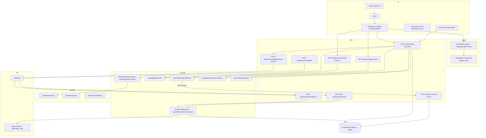
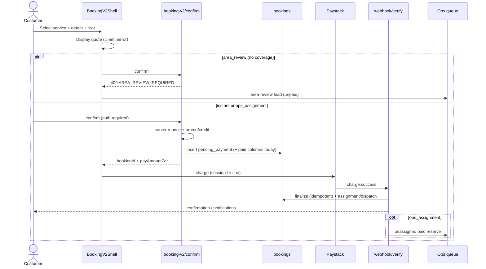

# SEOS Engineering Audit — Shalean Customer Booking Journey

| Field | Value |
|-------|-------|
| **Audit ID** | SEOS-BOOK-2026-07-13 |
| **Date** | 2026-07-13 |
| **Mode** | AUDIT ONLY — no production code, migrations, config, dependencies, tests, or docs mutated except this report |
| **Branch inspected** | `main` (aligned with `origin/main`) |
| **Repo** | `C:\Users\info\shalean-platform` |
| **Auditor role** | Principal Software Engineer (governed SEOS audit) |
| **Verification run** | `npm run test:critical` in `apps/web` — **34/34 passed** (9 files) |

---

## 1. Executive Summary

The live customer booking funnel is **booking-v2** (`/book` → `/book/[serviceSlug]` → `POST /api/booking-v2/confirm` → Paystack → webhook/verify finalize). Legacy `/booking/*` checkout steps mostly redirect into v2. Soft fulfilment (`BOOKING_SOFT_FULFILLMENT`, default ON) correctly converts demand when no instant cleaner exists via `ops_assignment` (paid) and `area_review` (unpaid lead).

**Payment finalize is relatively strong:** server-derived charge amounts, HMAC webhook verification, amount-mismatch quarantine, and idempotent finalize on non-`pending_payment` rows. Critical tests for Paystack upsert/finalize/mismatch pass.

**The highest-leverage defect is semantic corruption of cash columns on the v2 confirm path:** unpaid `pending_payment` bookings are written with `amount_paid_cents` / `total_paid_*` equal to the *payable* amount *before* Paystack success. Downstream “paid” detectors treat those columns as collected cash, which can suppress payment recovery, pollute reporting, and confuse operational gates.

Secondary high risks: cleaning credit / promo redemption before payment success; R0 (fully covered) settlement that sets `payment_status=success` with zero cents against a DB check requiring `amount_paid_cents > 0` without checking the update error; admin equipment edits rewriting paid columns; ops SLA misalignment for soft-fulfilment `unassigned` reserves; dual pricing engines (v2 vs legacy) and stale architecture docs.

**Formal SEOS artefacts** (Engineering Principles, Audit Playbook, standalone Risk/Debt registers, DoD, Observability standard) are **missing** from the repo. Closest substitutes: `docs/PLATFORM_ISSUES.md`, prior audits under `docs/audits/`, `docs/runbook-payments.md`.

**Production readiness score: 68 / 100** (see §25).

**Phase A remediation (2026-07-13):** BK-001, BK-002, BK-003 implemented on branch `fix/bk-001-confirm-cash-columns-before-payment` — see [`phase-a-bk001-bk003-remediation-2026-07-13.md`](./phase-a-bk001-bk003-remediation-2026-07-13.md) and staging matrix [`phase-a-bk001-bk003-staging-verification.md`](./phase-a-bk001-bk003-staging-verification.md).

| Finding | Audit status |
|---------|--------------|
| BK-001 | **Resolved pending release verification** |
| BK-002 | **Resolved pending migration and staging verification** |
| BK-003 | **Resolved pending release verification** |
| BK-004+ | **Open** (not in Phase A) |

**Begin remediation at:** stop writing cash SoT columns before payment success on `booking-v2/confirm`, then align paid-signal helpers and R0 settlement.

---

## 2. Audit Scope

### In scope (customer journey)

Service selection → `/book/[serviceSlug]` → details → address/serviceability → quote → promotions/membership/rewards/referral credits → availability → review → Paystack init/session → verify/webhook → booking persistence → confirmation → notifications → customer account → admin ops → cleaner assignment → invoice/financial records.

### Surfaces inspected

| Area | Paths |
|------|-------|
| Web UI | `apps/web/app/(ui-redesign)/book/**`, `(marketing)/quote`, `booking/**` (legacy), `booking/success`, `booking/recover`, `account/success`, `track/**`, `rebook/**`, `office/bookings/**` |
| APIs | `api/booking-v2/**`, `api/booking/**`, `api/bookings/**`, `api/paystack/**`, `api/promotions/**`, `api/referrals/**`, `api/customer/bookings/**`, notifications, cleaner lifecycle |
| Domain libs | `apps/web/lib/booking/**`, `booking-v2/**`, `pricing/**`, `payments/**`, `promotions/**`, `referrals/**`, `dispatch/**` |
| Packages | `@shalean/pricing`, `api-client`, `types`, `utils`, `validation` |
| Mobile | `apps/customer-mobile` (customer book); `apps/mobile` (cleaner only) |
| DB | `supabase/migrations` (~427 files) related to bookings/payments/pricing/availability/promos/credits/invoices/notifications/audit |
| Docs | architecture, PLATFORM_ISSUES, prior audits, payment runbook |

### Out of scope for this pass

Implementation, dependency installs, migration edits, production writes, real payments/notifications, lockfile changes.

### Evidence classes

- **Verified** — code path + symbols/routes/schema observed
- **Hypothesis** — plausible but not runtime-proven (env, production data, crawler cache)
- **Missing information** — explicitly recorded

---

## 3. Current Architecture



**Server is intended SoT for charge amounts.** Client pricing is display-only; confirm recomputes. Legacy lock/`paystack/initialize` still exists for residual paths.

---

## 4. Booking Flow Diagram



---

## 5. API Inventory

### Booking-v2 (canonical)

| Route | Auth | Role |
|-------|------|------|
| `POST /api/booking-v2/confirm` | Bearer required | Create/reuse pending booking; server pricing; Paystack handoff |
| `GET /api/booking-v2/services` | Public | Catalog |
| `GET /api/booking-v2/available-cleaners` | Public | Eligibility |
| `GET /api/booking-v2/team-availability` | Public | Teams |
| `POST /api/booking-v2/equipment-quote` | Public | Equipment add-on |
| `GET /api/booking-v2/resolve-location` | Public | Service area |
| `POST /api/booking-v2/area-review` | Bearer | Unpaid expansion lead |
| `GET /api/booking-v2/cleaners/[id]/public-profile` | Public | Profile |

### Legacy booking / bookings

| Route | Notes |
|-------|-------|
| `POST /api/booking/lock` | Legacy; 410 unless flag |
| `POST /api/booking/quote`, `price`, `checkout`, `validate`, `time-slots`, `cleaners` | Legacy/support surfaces |
| `POST /api/booking/complete` | Paystack verify for UI only — **does not persist** |
| `GET /api/booking/status` | Unauth by reference — returns PII |
| `POST /api/booking/recovery-capture` | No rate limit; email continue URL |
| `POST /api/bookings/payment-precheck` | Unauth; epsilon **2 ZAR** |
| `POST /api/bookings/[id]/payment-session` | Amount from booking row |
| `GET /api/bookings/me` | Retired → customer bookings |
| `POST /api/bookings` / flow-intake | Retired / deprecated |

### Paystack

| Route | Auth | Notes |
|-------|------|-------|
| `POST /api/paystack/initialize` | Guest OK; rate limited | Server `amountCents` |
| `GET/POST /api/paystack/verify` | Public; rate limited | Finalize fallback |
| `POST /api/paystack/webhook` | HMAC-SHA512 | Authoritative charge path |
| `POST /api/webhooks/paystack` | Transfers; soft-skip signature if secret missing outside production | Not charge finalize |

### Growth / credits / notifications

| Area | Routes |
|------|--------|
| Promotions | `api/promotions`, `promotions/validate` (preview may use client subtotal) |
| Referrals | `referrals/validate-checkout`, `credit`, `me`, `submit` |
| Rewards | `api/account/rewards` (no `api/rewards/*`) |
| Customer bookings | `api/customer/bookings/**` (ownership enforced) |
| Notifications | customer + admin retry + idempotency claims |

---

## 6. Database Inventory

### Core objects (booking journey)

| Object | Purpose | Money | Writers (app) | Readers | Integrity notes |
|--------|---------|-------|---------------|---------|-----------------|
| `bookings` | Lifecycle + payment + assignment SoT | `amount_paid_cents` (cents SoT); legacy `total_paid_zar` | confirm, initialize, finalize, admin, crons | All surfaces | Constraints: paid requires timestamp/amount; unique active customer/cleaner/team slots; price_snapshot |
| `price_snapshot` (jsonb on bookings) | Quote/pay expectation | ZAR fields in JSON | confirm / lock | finalize mismatch gate | Required check |
| `payment_transactions` | Gateway ledger | `amount_cents` | finalize, R0 settlement | Finance/metrics | Unique gateway ref |
| `booking_line_items` / `booking_totals` | Breakdown | cents | post-pay / admin | payouts | |
| `booking_cleaners` | Team roster | — | assign team sync | cleaner jobs | |
| `dispatch_offers` | Offer state | earnings snapshot | finalize / dispatch | cleaner accept | |
| `cleaners`, `cleaner_availability`, `cleaner_locations` | Eligibility inputs | — | admin | `getEligibleCleaners` | Indexes on `(cleaner_id, date)` |
| `promotions`, `promotion_redemptions`, `customer_memberships`, `birthday_rewards` | Campaigns | numeric ZAR discounts | confirm | validate | Parallel decimal money model |
| `referrals`, `cleaning_credit_transactions` | Credits | `amount_zar` numeric | spend/earn RPC | wallet | Unique earn-per-referral; **no unique spend-per-booking** |
| `monthly_invoices`, adjustments, events | Accrual | cents | billing jobs | admin | Closed/paid immutability patterns |
| `system_logs`, `booking_events`, `booking_changes`, `notification_logs` | Audit / notify | — | writers | ops | Idempotency claims table exists |
| `user_notifications` | Customer inbox | — | notify | account | RLS owner policies |

### Money representation summary

| Domain | Representation |
|--------|----------------|
| Booking cash collected | **Integer cents** (`amount_paid_cents`) — documented SoT in `bookingPaidAmountColumns.ts` |
| Legacy display | `total_paid_zar` / `total_paid_cents` via same helper |
| Promotions / referral credits | **Numeric ZAR** (decimal) — parallel model |
| Paystack charge | Cents at gateway; ZAR in app (`* 100`) |

### RLS pattern

Customer APIs use **service role** (`getSupabaseAdmin`) → RLS bypassed; **app-layer ownership** is the real gate. RLS still protects direct authenticated client access (`bookings_user_select_own`, etc.).

### Constraint of special interest

```sql
-- supabase/migrations/20260850_bookings_payment_invariants_dedupe.sql
bookings_paid_requires_amount:
  payment_status IS DISTINCT FROM 'success'
  OR (amount_paid_cents IS NOT NULL AND amount_paid_cents > 0)
```

R0 settlement sets `payment_status='success'` with `amount_paid_cents=0` — **conflicts with this check** (Finding BK-002).

---

## 7. Shared Module Inventory

| Package | Role | Booking relevance |
|---------|------|-------------------|
| `@shalean/pricing` | Property factors, fees, VIP, duration | Shared primitives for v2 calculator |
| `@shalean/api-client` | Thin HTTP clients (`bookingV2`, paystack) | No money math |
| `@shalean/types` | Ownership, VIP, enums | `customerCanAccessBookingRow` |
| `@shalean/utils` | Format helpers | Display |
| `@shalean/validation` | Precheck epsilon **2 ZAR**, extras | **Diverges** from payment mismatch **1 ZAR** |
| `@shalean/mobile-ui` | Mobile UI | Not pricing SoT |

**Authoritative money math for charges lives in `apps/web/lib/pricing` + `apps/web/lib/booking(-v2)`, not packages.**

---

## 8. Legacy versus Booking V2 Comparison

| Concern | Legacy | Booking-v2 (canonical) |
|---------|--------|------------------------|
| Entry UI | `/booking/*` → redirects | `/book`, `/book/[serviceSlug]` |
| Confirm | lock + `paystack/initialize` | `POST /api/booking-v2/confirm` |
| Pricing engine | `pricingEngine` + snapshot + `quoteCheckoutZarWithSnapshot` | `calculateCustomerTotal` + `resolveBookingV2Quote` |
| Pending cash columns | `amount_paid_cents: 0` until finalize | **Writes payable as paid columns early** |
| Soft fulfilment | Lock eligibility + flags | `fulfillment_mode` + area-review path |
| Docs | `booking-system-architecture.md` still lock-centric | Code + promotions docs are v2-first |
| Mobile | N/A in cleaner app | `apps/customer-mobile` uses v2 APIs |

---

## 9. Strengths

1. **Server-authoritative charge amounts** on initialize and payment-session; client amounts not trusted for charge.
2. **HMAC webhook** with timing-safe compare; mismatch → `payment_mismatch` quarantine.
3. **Idempotent finalize** when row is no longer `pending_payment`.
4. **Canonical eligibility** via `getEligibleCleaners` shared across picker, lock, dispatch, admin assign (documented in `PLATFORM_ISSUES.md`).
5. **Soft fulfilment** preserves conversion (`ops_assignment` / `area_review`) instead of silently dropping all demand when soft is ON.
6. **Confirm requires auth**; customer booking detail/track use ownership + 404-on-deny.
7. **Paid admin reprice (edit-details)** preserves gateway cash and flags mismatch (maker–checker available).
8. **Critical vitest slice green** (34 tests) covering upsert, finalize, mismatch, recovery enqueue, referral validate, verify IP limit.
9. **Notification idempotency** claims reduce double-send from verify+webhook.
10. **Live `/quote` metadata is correct** on `https://shalean.co.za/quote` (title: *Get a Free Cleaning Quote | Shalean Cape Town*).

---

## 10. Findings by Severity

### Critical

#### BK-001 — Unpaid v2 bookings write cash SoT columns before Paystack success

| Field | Content |
|-------|---------|
| **Severity** | Critical |
| **Category** | Revenue integrity / data semantics |
| **Verified evidence** | `confirm/route.ts` spreads `bookingPaidAmountColumnsFromZar(payAmountZar)` into insert/update while `status=pending_payment`, `payment_status=pending`. Helper docs: “Booking collected-cash SoT: `amount_paid_cents`”. `bookingPaidCustomerSignalsPresent` treats `amount_paid_cents > 0` as paid. Tests assert `hasSuccessfulPaystackPayment({ status: "pending_payment", amount_paid_cents: 12000 }) === true`. |
| **File paths** | `apps/web/app/api/booking-v2/confirm/route.ts`; `apps/web/lib/booking/bookingPaidAmountColumns.ts`; `apps/web/lib/payout/adminBookingAssignmentEarningsGate.ts`; `apps/web/lib/booking/paymentRecoveryEmailGuards.ts` |
| **Symbols** | `bookingPaidAmountColumnsFromZar`, `persistPricing`, `bookingPaidCustomerSignalsPresent`, `hasSuccessfulPaystackPayment` |
| **DB objects** | `bookings.amount_paid_cents`, `total_paid_cents`, `total_paid_zar` |
| **Current behavior** | Payable amount stored as if collected before payment. |
| **Expected behavior** | Cash columns remain 0 until finalize / mark-paid / intentional R0 settlement; payable lives in `total_price` / `price_snapshot.pay_total_zar`. |
| **Business impact** | False “paid” signals; skipped payment recovery; corrupted revenue reporting; ops confusion; possible cleaner/earnings gate misfires. |
| **Security/data impact** | Financial record integrity compromised (semantic). |
| **Root cause** | Confirm reuses cash helper for “amount due” persistence. |
| **Recommended remediation** | Stop spreading paid columns on unpaid inserts; set zeros; write cash only in finalize/R0/mark-paid; fix paid-signal helpers to require `payment_status` success (or equivalent) before trusting cents. |
| **Dependencies** | BK-002, paid-signal consumers, reporting queries |
| **Backward compatibility** | Readers filtering `payment_status` only remain OK; readers using cents alone need dual-read during transition |
| **Testing** | Unit: confirm insert shape; recovery guards; reporting fixtures; regression that finalize still writes cents |
| **Observability** | Metric: pending_payment rows with `amount_paid_cents > 0` |
| **Rollback** | Feature flag or revert confirm patch; backfill script for open pendings |
| **Effort** | M |
| **Release type** | Hotfix / controlled minor (revenue) |
| **Risk Register** | Yes |
| **Tech Debt Register** | Yes |
| **Product Backlog** | Yes |

#### BK-002 — R0 fully-covered settlement conflicts with `bookings_paid_requires_amount` and ignores update errors

| Field | Content |
|-------|---------|
| **Severity** | Critical |
| **Category** | Revenue integrity / payment success path |
| **Verified evidence** | `settleFullyCoveredBookingV2` sets `payment_status: "success"` without raising `amount_paid_cents`; insert used `bookingPaidAmountColumnsFromZar(0)` → 0 cents. Constraint requires success ⇒ `amount_paid_cents > 0`. Update result is not checked. |
| **File paths** | `apps/web/app/api/booking-v2/confirm/route.ts` (`settleFullyCoveredBookingV2`); `apps/web/lib/payments/recordCoveredSettlement.ts`; `supabase/migrations/20260850_bookings_payment_invariants_dedupe.sql` |
| **Symbols** | `settleFullyCoveredBookingV2`, `recordCoveredSettlement` |
| **DB objects** | `bookings_paid_requires_amount`, `payment_transactions` (allows 0 for R0 ledger) |
| **Current behavior** | R0 may fail DB update silently; client told `requiresPayment: false` while row stays unpaid. |
| **Expected behavior** | Explicit R0 policy: either allow success with 0 cents (constraint change + ledger) **or** store sentinel paid cents + gross/cover audit; always check update errors and fail confirm if settle fails. |
| **Business impact** | “Free” bookings appear confirmed to customer but remain `pending_payment`; fulfilment/notifications diverge. |
| **Root cause** | Ledger allows 0; bookings constraint does not; error handling omitted. |
| **Recommended remediation** | Align constraint + settlement semantics; check Supabase errors; add critical tests for R0 path. |
| **Dependencies** | BK-001 |
| **Effort** | M |
| **Release type** | Hotfix |
| **Risk / Debt / Backlog** | Yes / Yes / Yes |

#### BK-003 — Admin equipment route rewrites paid cash columns

| Field | Content |
|-------|---------|
| **Severity** | Critical |
| **Category** | Revenue integrity / admin authz side effect |
| **Verified evidence** | `apps/web/app/api/admin/bookings/[id]/equipment/route.ts` sets `total_paid_zar` and `amount_paid_cents` from fee delta without paid-guard (unlike `adminEditBookingDetails` which preserves cash). |
| **Current vs expected** | Current: gateway cash overwritten. Expected: preserve cash; adjust `total_price` / mismatch / top-up like edit-details. |
| **Business impact** | Historical financial corruption; invoice/payout basis drift. |
| **Effort** | S |
| **Release type** | Hotfix |
| **Risk / Debt / Backlog** | Yes / Yes / Yes |

### High

#### BK-004 — Cleaning credit spent at confirm before Paystack success; spend not uniquely idempotent per booking

| Field | Content |
|-------|---------|
| **Severity** | High |
| **Category** | Revenue integrity / credits |
| **Evidence** | `spendCleaningCredit` called from confirm before payment; RPC `apply_cleaning_credit_transaction` has unique index for **earn** per referral only (`20261059_referral_financial_integrity.sql`), not spend-per-booking. No auto-restore on payment abandon/expire found. |
| **Impact** | Credit overspend / loss on abandoned checkouts; retry double-spend risk. |
| **Remediation** | Spend after finalize (or hold+capture); unique `(booking_id, type=spend)`; reverse on expire/cancel. |
| **Effort** | L |
| **Release** | Minor |
| **Registers** | Risk Yes, Debt Yes, Backlog Yes |

#### BK-005 — Promotion redemptions applied at confirm before payment

| Field | Content |
|-------|---------|
| **Severity** | High |
| **Category** | Promotions |
| **Evidence** | `applyPromotionRedemptions` on confirm; mitigated by idempotency key `bv2:{promotionId}:{bookingId}` but still burns budget on abandon. |
| **Remediation** | Redeem on payment success; or soft-reserve until paid. |
| **Effort** | M–L |
| **Registers** | Yes / Yes / Yes |

#### BK-006 — Soft-fulfilment paid reserves miss dispatch SLA breach detection

| Field | Content |
|-------|---------|
| **Severity** | High |
| **Category** | Fulfilment / ops visibility |
| **Evidence** | Confirm sets `dispatch_status: "unassigned"` for `ops_assignment`. SLA breach (`isSlaBreachRow`) requires `searching`/`offered`. Ops queue lists them, but timer SLA does not. |
| **Impact** | Paid unassigned demand without SLA escalation. |
| **Remediation** | Include `unassigned`+`ops_assignment` in SLA; alert ops. |
| **Effort** | S–M |
| **Registers** | Yes / No / Yes |

#### BK-007 — Unauthenticated booking status by Paystack reference exposes PII

| Field | Content |
|-------|---------|
| **Severity** | High |
| **Category** | Security / privacy |
| **Evidence** | `GET /api/booking/status` returns `userId`, `customerEmail`, `customerName`, snapshot by reference. Verify also returns email/metadata (intentional finalize fallback, rate-limited). |
| **Remediation** | Minimize status payload; bind to session or short-lived signed token; keep verify finalize but redact PII. |
| **Effort** | M |
| **Registers** | Yes / Yes / Yes |

#### BK-008 — No rate limit on `booking-v2/confirm` or `recovery-capture`

| Field | Content |
|-------|---------|
| **Severity** | High |
| **Category** | Security / abuse |
| **Evidence** | Initialize/verify limited; confirm and recovery-capture are not. |
| **Impact** | Booking spam, email spam, credit/promo burn amplification with BK-004/005. |
| **Effort** | S |
| **Registers** | Yes / Yes / Yes |

#### BK-009 — Soft fulfilment OFF rejects ops-capable demand; API soft-off gate incomplete

| Field | Content |
|-------|---------|
| **Severity** | High (if flag off in prod) / Medium (default ON) |
| **Category** | Availability / conversion |
| **Evidence** | `availabilityEngine`: soft off ⇒ `available = instant` only. `assessBookingFulfillment` with soft off never counts ops-assignable cleaners. Confirm does not fully re-enforce empty pool when soft off. |
| **Missing info** | Live `BOOKING_SOFT_FULFILLMENT` value in production. |
| **Effort** | M |
| **Registers** | Yes / Yes / Yes |

### Medium

#### BK-010 — Precheck epsilon 2 ZAR vs finalize mismatch 1 ZAR

| Evidence | `packages/validation/.../bookingPaymentPrecheckLogic.ts` `MISMATCH_EPS_ZAR = 2`; `paymentAmountMismatch.ts` `PAYMENT_AMOUNT_MISMATCH_EPS_ZAR = 1` |
| Impact | Pass precheck then quarantine (or converse edge). |
| Effort | S |
| Category | Revenue integrity |

#### BK-011 — Dual pricing engines (v2 vs legacy/widget) + mobile display fork

| Evidence | `calculateCustomerTotal` vs `pricingEngine`/`quoteCheckoutZarWithSnapshot`; `customer-mobile/lib/booking/displayPricing.ts` mirrors without HMAC |
| Impact | Drift / maintainability; wrong display vs charge if engines diverge |
| Effort | L (consolidation later) |
| Category | Architecture / debt |

#### BK-012 — Architecture docs stale vs booking-v2

| Evidence | `docs/architecture/booking-system-architecture.md` lock/flow-intake centric; code is v2 |
| Effort | S |
| Category | Documentation |

#### BK-013 — Formal SEOS standards missing

| Evidence | No Engineering Principles, Audit Playbook, DoD, Observability standard, standalone Risk/Debt registers |
| Effort | M |
| Category | Governance |

#### BK-014 — Observability gaps (no Sentry; weak request correlation on payment logs)

| Evidence | `paymentStructuredLog`, `system_logs`, funnel events exist; no `@sentry` in web tree; payment logs lack end-to-end request IDs |
| Effort | M |
| Category | Observability |

#### BK-015 — Assignment concurrency: admin assign updates by id without conditional claim

| Evidence | Direct assign / offer paths update by booking id; rely on unique slot indexes |
| Effort | M |
| Category | Fulfilment |

#### BK-016 — ESLint debt (REV-008) still open

| Evidence | `PLATFORM_ISSUES.md` — hundreds of lint errors; not revenue-specific |
| Effort | XL |
| Category | Quality |

#### BK-017 — `/quote` “shalean-cleaner-sync” title (external report)

| Verified | Repo has **zero** `shalean-cleaner-sync` string. Quote page metadata is correct. Live `https://shalean.co.za/quote` title is correct. Vercel project name is `shalean-platform`. |
| Hypothesis | Wrong host/preview, crawler cache, or non-this-repo deployment artifact. Closest in-repo names: `shalean-cleaner-notifications`, `shalean-cleaner-offer`, `shalean-cleaner-payout-*`. |
| Severity | Low (if only external stale cache) / Medium if another host still serves wrong title |
| Effort | S investigation |
| Category | SEO / public site |

### Low

#### BK-018 — Legacy residual payment page and dual success URLs

| Evidence | `/booking/payment` still live for UUID; success at `/booking/success` and `/account/success` |
| Impact | Maintenance / UX inconsistency |
| Effort | S |

#### BK-019 — Transfer webhook signature soft-skip outside production when secret missing

| Evidence | `api/webhooks/paystack` |
| Impact | Non-prod confusion; misconfig risk |
| Effort | S |

---

## 11. Revenue Integrity Assessment

| Control | Status |
|---------|--------|
| Final totals calculated on server | **Pass** (confirm / initialize) |
| Paid amounts immutable after success | **Partial** — edit-details preserves; equipment overwrites (BK-003); no DB freeze trigger |
| Currency conversion deterministic | **Pass** (ZAR×100 rounding helpers) |
| Promotions applied once | **Partial** — booking-scoped idempotency; pre-pay burn (BK-005) |
| Credits cannot be overspent | **Fail risk** — pre-pay spend + no spend unique (BK-004) |
| Referral/membership server-enforced | **Pass** at confirm |
| Payment init uses authoritative amount | **Pass** |
| Verify matches booking + amount | **Pass** (1 ZAR epsilon) |
| Duplicate callbacks idempotent | **Pass** (critical tests) |
| Success vs booking state cannot diverge silently | **Fail risk** — BK-001/BK-002 |
| Failed side effects retried | **Partial** — failed jobs / recovery enqueue exist |
| Invoices use immutable paid values | **Partial** — sales docs / monthly closed paths; booking Zoho display separate |
| Refund/cancel consistency | **Not fully re-audited this pass** — prior backend audit covers chargebacks |
| Admin changes cannot corrupt historical cash | **Fail** on equipment path (BK-003); **Pass** on edit-details |

---

## 12. Availability and Fulfilment Assessment

| Question | Answer |
|----------|--------|
| Where slots disappear at zero eligible? | Soft **OFF**: `available = instant` only in `getAvailableTimeSlots`. Soft **ON**: slots remain with `ops_assignment`/`area_review`. |
| Serviceable demand rejected unnecessarily? | Yes when soft OFF (ops-capable demand excluded). Soft ON converts. |
| Unassigned bookings accepted safely? | Paid `ops_assignment` yes (by design). `area_review` unpaid lead only. |
| Ops actionable queue? | Yes (`admin/ops-queue`) — paid ops + area review. |
| Assignment SLA tracking? | **Weak** for `unassigned` soft reserves (BK-006). |
| Assignment atomic + audited? | Partial — unique indexes; audit logs on some paths; race windows remain (BK-015). |
| Availability query efficiency? | Indexes present on cleaner availability and active slots; N+1/perf not measured in this pass (see §17). |

**Naming clarity:** UI “Pending Assignment” badge maps to `fulfillment_mode=ops_assignment`, **not** lifecycle `status=pending_assignment` (selected-cleaner/ack path).

---

## 13. Security Assessment

| Control | Status |
|---------|--------|
| Auth on protected confirm | **Pass** |
| Ownership on customer booking APIs | **Pass** (app-layer) |
| Admin/cleaner role checks | Present on admin/cleaner routes (not fully enumerated) |
| RLS aligned with app auth | **Partial** — service role bypass; app checks required |
| Server input validation | Zod schemas on confirm |
| Rate limiting | Initialize/verify yes; confirm/recovery **no** (BK-008) |
| Recovery tokens | **None** — URL allowlist only |
| Paystack webhook signature | **Pass** (charge webhook) |
| Replay/idempotency | **Pass** on finalize |
| CSRF | Cookie/session patterns not fully audited; bearer APIs less exposed |
| Secrets server-only | **Pass** (static review) |
| Logs / error PII | Status-by-reference PII (BK-007); some admin DB messages leaked |

---

## 14. Data Governance Assessment

| Topic | Status |
|-------|--------|
| Clear data owners | **Partial** — bookings SoT clear; cash column semantics polluted (BK-001) |
| PII minimization | Status/verify payloads overshare |
| Sensitive duplication | Address on booking + saved addresses (intentional) |
| Audit trails | `system_logs`, `booking_changes`, `booking_events`, promo audit — uneven coverage |
| Retention/deletion docs | **Missing** as SEOS artefact |
| Synthetic test data | Unit tests use fixtures; E2E env-gated |
| Logging minimization | Structured payment logs avoid secrets; references present |
| Deletion vs financial audit | **Missing documentation** |

---

## 15. Observability Assessment

| Capability | Present? |
|------------|----------|
| Structured logger (payments) | Yes — `paymentStructuredLog` |
| Error monitoring (Sentry) | **Not found** in web app |
| Request correlation IDs | Partial (analytics/session/metadata) |
| Booking funnel metrics | Yes — `bookingAnalyticsTruth` / `trackBookingFunnelEvent` |
| Payment metrics | Yes — ledger metrics + system_metrics |
| Availability / assignment metrics | Partial (dispatch metrics, ops snapshot) |
| Notification delivery metrics | Logs + idempotency claims |
| Alerting / dashboards / runbooks | Payment runbook exists; formal observability standard missing |

Critical events that should be guaranteed (gap notes):

| Event | Coverage |
|-------|----------|
| Quote generated | Funnel / pricing paths |
| Price changed | Admin reprice / mismatch metrics |
| Promo applied/rejected | Confirm + promo events |
| Availability / no slot | Soft fulfilment modes; demand events |
| Booking created | Confirm |
| Payment initialized / verified / mismatch | Structured payment logs |
| Confirmation failed | Partial |
| Assignment attempted/failed | Partial |
| Cancel / refund | Prior audit territory |
| Notification failed | Logs / retry admin |

---

## 16. Testing Maturity Assessment

### Inventory

| Layer | Evidence |
|-------|----------|
| Unit (booking lib) | ~106 test files under `apps/web/lib/booking` |
| Pricing | ~7 under `lib/pricing` |
| booking-v2 confirm | `app/api/booking-v2/confirm/__tests__/route.test.ts` |
| Critical CI slice | 34 tests — **passed this audit** |
| E2E | ~18 under `apps/web/e2e` (Paystack suite env-gated) |
| Full vitest | PLATFORM_ISSUES claims 2701 passed (2026-07-04) — **not re-run fully this pass** |

### Coverage gaps (should add in remediation — do not create now)

| Scenario | Gap |
|----------|-----|
| Confirm insert does not set cash columns when unpaid | **Missing** (would catch BK-001) |
| R0 settlement vs DB constraint + error handling | **Missing** (BK-002) |
| Credit spend after abandon / expire restore | **Missing** (BK-004) |
| Promo redeem only after payment | **Missing** (BK-005) |
| Equipment admin cannot rewrite paid cash | **Missing** (BK-003) |
| Soft ops SLA includes unassigned | **Missing** (BK-006) |
| Precheck epsilon aligns with mismatch | **Missing** (BK-010) |
| Soft-off API rejects empty pool | **Missing** (BK-009) |
| Deep/move/office/carpet/airbnb E2E funnel | Weak / env-gated |
| Payment success then DB failure recovery | Partial (failed jobs tests) |
| Unauthorized customer IDOR | Some ownership tests; expand |
| Concurrent admin assign race | Weak |

---

## 17. Performance Assessment

| Topic | Evidence / method |
|-------|-------------------|
| Requests per booking step | Not measured — **propose** Playwright + network HAR on `/book/[slug]` |
| Availability query count | `getAvailableTimeSlots` calls `getEligibleCleaners` per slot — **N×slot risk**; measure with logging/counters |
| Pricing query count | Catalog + equipment + promo eval on confirm — inspect confirm span |
| Indexes | Present for availability/slots (see §6) |
| API latency instrumentation | Limited — add timing around confirm/eligibility |
| Client bundle booking routes | Not measured — `next build` / bundle analyzer available (`@next/bundle-analyzer`) |
| Re-renders / client components | Wizard is client-heavy (`BookingV2Shell`) — expected; measure React profiler if UX lag |
| Caching / stale price | Signed quote + soft accept of stale client quote on confirm — **stale UX risk**, charge uses server recompute |

**Do not optimize without measurement.** Proposed: add temporary counters for eligibility calls per availability request; Lighthouse on `/book`; confirm p95 via logs.

---

## 18. Duplicate Logic Map

| Domain | Implementations | Recommended canonical (do not consolidate in this audit) |
|--------|-----------------|----------------------------------------------------------|
| Shared fee/VIP/property math | `@shalean/pricing` | Keep package |
| V2 visit quote | `calculateCustomerTotal` + `resolveBookingV2Quote` | **Canonical for `/book` + mobile charge** |
| V2 client display | `useBookingV2Pricing`, mobile `displayPricing.ts` | Display-only mirrors of v2 |
| Legacy quote | `pricingEngine` + `quoteCheckoutZarWithSnapshot` | Canonical for residual legacy/widget |
| Checkout tip−discount | `computeCheckoutTotalZar` | Legacy initialize only |
| Cash columns | `bookingPaidAmountColumns*` | **Only at settlement/finalize** |
| Eligibility | `getEligibleCleaners` | Already canonical |
| Payment finalize | `finalizePaidBooking` → `upsertBookingFromPaystack` | Already canonical |
| Paid detection | `payment_status` + signals using cents | **Must stop treating unpaid cents as cash** |
| Precheck vs mismatch epsilons | validation 2 ZAR vs payments 1 ZAR | Unify to 1 ZAR |

---

## 19. Risk Register Recommendations

| Risk ID | Finding | Likelihood | Impact | Proposed owner |
|---------|---------|------------|--------|----------------|
| RISK-BOOK-001 | BK-001 false paid signals | High | High | Payments / Booking |
| RISK-BOOK-002 | BK-002 R0 settle failure | Medium | High | Payments |
| RISK-BOOK-003 | BK-003 admin cash overwrite | Medium | Critical | Admin / Finance |
| RISK-BOOK-004 | BK-004 credit pre-spend | Medium | High | Growth / Payments |
| RISK-BOOK-005 | BK-005 promo pre-redeem | Medium | Medium | Growth |
| RISK-BOOK-006 | BK-006 ops SLA blind spot | High | Medium | Ops / Dispatch |
| RISK-BOOK-007 | BK-007 PII by reference | Medium | High | Security |
| RISK-BOOK-008 | BK-008 confirm abuse | Medium | Medium | Security |

---

## 20. Technical Debt Register Recommendations

| Debt ID | Item | Finding |
|---------|------|---------|
| DEBT-BOOK-001 | Dual pricing engines | BK-011 |
| DEBT-BOOK-002 | Cash helper misuse on unpaid rows | BK-001 |
| DEBT-BOOK-003 | Stale architecture doc | BK-012 |
| DEBT-BOOK-004 | Missing SEOS formal standards | BK-013 |
| DEBT-BOOK-005 | Epsilon divergence | BK-010 |
| DEBT-BOOK-006 | ESLint volume | BK-016 / REV-008 |
| DEBT-BOOK-007 | Legacy `/booking` residual surfaces | BK-018 |

---

## 21. Product Backlog Recommendations

| Backlog theme | Findings | Outcome |
|---------------|----------|---------|
| Revenue cash SoT hardening | BK-001, BK-002, BK-003 | Trustworthy paid amounts |
| Post-payment credit/promo settlement | BK-004, BK-005 | Wallet integrity |
| Ops SLA for soft fulfilment | BK-006 | Faster assignment |
| Booking API abuse + PII minimization | BK-007, BK-008 | Trust / compliance |
| Availability product policy | BK-009 | Conversion vs hard gate clarity |
| SEO host verification for quote title | BK-017 | Brand trust |
| Doc + SEOS bootstrap | BK-012, BK-013 | Governed engineering |

---

## 22. Prioritized Remediation Plan

### Phase A — Immediate Critical containment

| | |
|--|--|
| **Objective** | Stop false cash / R0 / admin overwrite corruption |
| **Findings** | BK-001, BK-002, BK-003 |
| **Files likely** | `booking-v2/confirm/route.ts`, `bookingPaidAmountColumns.ts`, paid-signal helpers, `admin/.../equipment/route.ts`, possibly constraint migration (**new** migration only) |
| **DB** | Optional: clarify R0 vs `bookings_paid_requires_amount`; backfill open `pending_payment` rows with erroneous cents → 0 |
| **Tests** | Confirm unpaid insert shape; R0 settle; equipment paid-guard; recovery guard regression |
| **Monitoring** | Count `pending_payment AND amount_paid_cents > 0`; R0 settle failures |
| **Rollback** | Revert PR; restore prior confirm write if needed |
| **Exit criteria** | Unpaid rows have zero cash columns; R0 either succeeds atomically or fails confirm; equipment cannot rewrite paid cash |

### Phase B — High-risk revenue and booking remediation

| | |
|--|--|
| **Objective** | Credits/promos after payment; epsilon unify; rate limits |
| **Findings** | BK-004, BK-005, BK-008, BK-010 |
| **Files** | confirm, credits RPC/migrations, promotions server, rate limit modules, validation precheck |
| **DB** | Unique spend-per-booking; optional hold table |
| **Exit criteria** | No credit/promo burn on unpaid abandon; precheck eps = 1 ZAR; confirm rate limited |

### Phase C — Availability and fulfilment improvements

| | |
|--|--|
| **Objective** | SLA + soft-off policy clarity |
| **Findings** | BK-006, BK-009, BK-015 |
| **Files** | opsSnapshot, confirm dispatch_status, assessBookingFulfillment, admin assign commands |
| **Exit criteria** | Soft ops reserves in SLA; soft-off API enforces empty pool; assign claim semantics documented/tested |

### Phase D — Logic consolidation

| | |
|--|--|
| **Objective** | One quote path per funnel; deprecate legacy safely |
| **Findings** | BK-011, BK-018 |
| **Exit criteria** | Documented canonical map; legacy routes 410 or thin adapters; mobile display imports shared calculator |

### Phase E — Testing and observability

| | |
|--|--|
| **Objective** | Close critical scenario gaps; correlation + alerting |
| **Findings** | BK-014 + §16 gaps |
| **Exit criteria** | New critical tests in CI; payment logs have correlation id; alert on mismatch/R0 fail/pending cash anomaly |

### Phase F — Documentation and cleanup

| | |
|--|--|
| **Objective** | SEOS bootstrap + architecture refresh |
| **Findings** | BK-012, BK-013, BK-017 |
| **Exit criteria** | Architecture doc matches v2; Risk/Debt registers created; quote title mystery closed with host evidence |

### Phase G — Verification audit and staged release

| | |
|--|--|
| **Objective** | Prove remediations; staged rollout |
| **Actions** | Re-run critical + revenue vitest; Paystack E2E staging; soft-fulfilment flag matrix; production readiness re-score |
| **Exit criteria** | Score ≥ 85; no open Critical; Risk register updated |

---

## 23. Release and Rollback Strategy

| Phase | Release type | Rollout | Rollback |
|-------|--------------|---------|----------|
| A | Hotfix / controlled minor | Feature flag for confirm cash write behavior; canary | Revert PR; SQL backfill if needed |
| B | Minor | Flag credit/promo post-pay | Revert to pre-pay redeem temporarily with monitoring |
| C | Minor | Flag SLA inclusion | Revert SLA predicate |
| D–F | Minor / docs | Incremental | N/A for docs |
| G | Verification | Staging → prod | Standard deploy rollback |

**Never edit historical migrations.** New forward migrations only.

---

## 24. Verification Plan

1. Re-run `npm run test:critical` and revenue vitest slice.
2. Add then run unit tests for BK-001/002/003 (post-approval implementation).
3. Staging: booking with promo+credit covering full amount (R0); abandon path with partial credit; Paystack webhook replay; equipment edit on paid booking.
4. Query prod (read-only): count `pending_payment` with `amount_paid_cents > 0`.
5. Confirm live metadata on all public booking/quote hosts (shalean.co.za + www + any previews).
6. Soft fulfilment matrix: flag on/off × zero eligible cleaners × ops coverage.
7. Security: confirm rate limit; status payload minimization spot-check.
8. Re-score production readiness.

---

## 25. Production Readiness Score: **68 / 100**

| Dimension | Score | Notes |
|-----------|-------|-------|
| Conversion / soft fulfilment | 14/15 | Soft ON is strong |
| Pricing accuracy (server charge) | 12/15 | Dual engines; display drift risk |
| Payment success / idempotency | 12/15 | Finalize strong; R0/cash semantics weak |
| Fulfilment / ops visibility | 8/10 | Queue exists; SLA gap |
| Customer trust / SEO | 7/10 | Live quote OK; PII by reference |
| Revenue integrity semantics | 5/15 | BK-001/002/003 dominate |
| Security / abuse | 7/10 | Auth strong; rate limit/PII gaps |
| Testing / observability | 8/10 | Critical tests green; Sentry/correlation thin |

---

## Appendix A — Public `/quote` investigation

| Check | Result |
|-------|--------|
| Code metadata | `Get a Free Cleaning Quote \| Shalean Cape Town` |
| Repo string `shalean-cleaner-sync` | **0 matches** |
| Live fetch `https://shalean.co.za/quote` | Correct title |
| Vercel project name | `shalean-platform` (team shalean-cleaning-services) |
| Conclusion | **Not caused by current Next.js metadata in this monorepo.** Treat external “shalean-cleaner-sync” report as **hypothesis**: wrong host, stale crawler, or out-of-repo deployment. |

Booking/service URL metadata (sample): `/book` and `/book/[slug]` use Shalean titles with **noindex**; marketing `/quote` is indexable with canonical + OG via `buildMarketingSocialMetadata`.

---

## Appendix B — Commands run (read-only)

| Command | Result |
|---------|--------|
| `git status -sb` / branch | `main...origin/main` |
| Repo inventory / searches | Completed |
| Live fetch `/quote` | Title correct |
| Vercel `list_teams` / `list_projects` | Project `shalean-platform` |
| `npm run test:critical` (`apps/web`) | **34 passed** |

Not run (scope/time): full vitest, lint, build, Playwright E2E, production DB queries.

---

## Appendix C — Missing information (do not guess)

1. Production value of `BOOKING_SOFT_FULFILLMENT`, `USE_STRICT_AVAILABILITY`, workload flags.
2. Paystack dashboard webhook URL configuration (charge vs transfer).
3. Whether `bookings_paid_requires_amount` is `NOT VALID` in live DB (migration adds it without NOT VALID; a later comment claims NOT VALID — **verify in prod**).
4. Volume of open `pending_payment` rows with `amount_paid_cents > 0`.
5. Exact external URL that showed title `shalean-cleaner-sync`.
6. Full production bundle secret scan.
7. Formal SEOS standards content (not in repo).

---

*End of audit report. No remediation implemented.*
