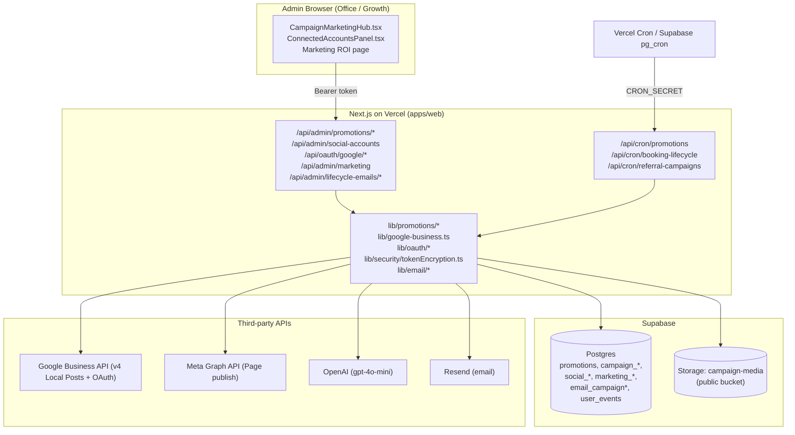
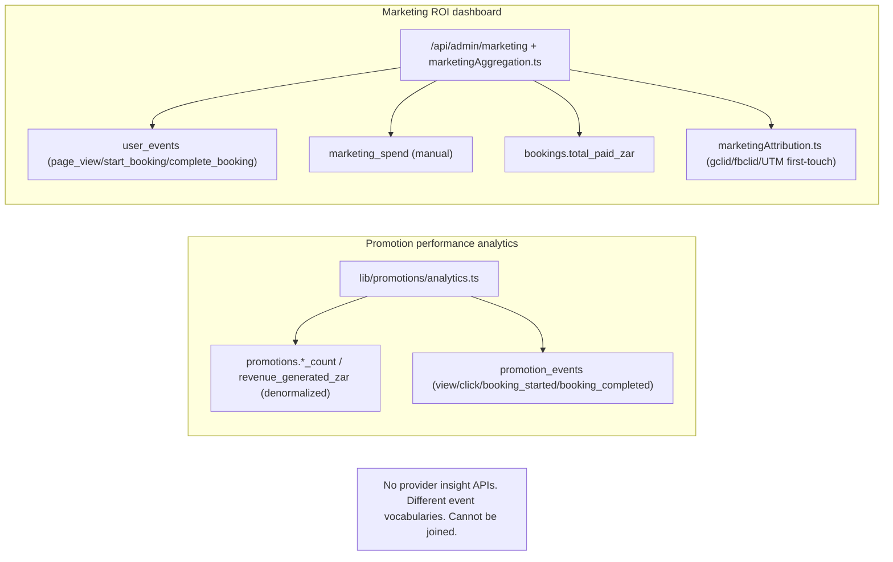
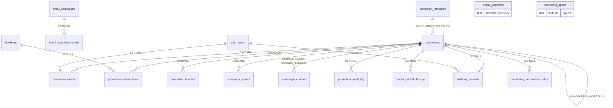

# MKT-001 — Marketing Platform Engineering Audit

**Project:** Shalean Cleaning Services
**Audit ID:** MKT-001
**Type:** Read-only engineering audit (no code changed, no PRs, no migrations)
**Date:** 2026-07-16
**Scope:** Entire Marketing Platform — Connected Accounts, Social Publishing, Campaign Management, Media Library, Google Business Profile, Meta (Facebook/Instagram), Email Marketing, Analytics, Database, APIs, Background Jobs, Notifications, Security, Performance, UX, Architecture.
**Codebase:** `apps/web` (Next.js App Router, TypeScript) + Supabase (Postgres) + Vercel + third-party APIs (Google Business, Meta Graph, OpenAI, Resend).

> Constraint compliance: This document is analysis only. No source files, migrations, or configuration were modified during this audit.

---

## 1. Executive Summary

The Shalean "Marketing Platform" is a **single-tenant, admin-operated content and promotions system** bolted onto the core booking product. It is significantly less capable than the audit brief implies. Of the six social providers named in the brief (Facebook, Instagram, Google Business Profile, LinkedIn, Pinterest, X), only **two are functionally implemented**: **Google Business Profile** (full OAuth + publish) and **Facebook** (env-configured Page token, no OAuth). Instagram is surfaced in the UI as "available" with **zero** implementation; LinkedIn, Pinterest and X are `coming_soon` placeholders.

The platform's real, working core is the **promotions/campaign engine** (`promotions` table + `campaign_content`/`campaign_assets`), which has solid CRUD, a status lifecycle, an audit log, AI-assisted copy generation (OpenAI `gpt-4o-mini`), template scaffolding, and per-channel image/asset generation. Around this core, the "publishing", "email campaigns", "media library" and "analytics" capabilities are shallow: publishing is **synchronous one-click with no queue/scheduler/retry/idempotency/video**; the "Email Campaigns" page **cannot send email at all** (it generates copy-paste HTML); there is **no reusable media library** (only per-campaign uploads with no compression/dedup); and analytics is **100% local** (no provider insights ingested) and split across two disconnected, incompatible event vocabularies.

**Highest-severity engineering concerns:**

1. **SSRF** — publish endpoints server-side-`fetch` admin-supplied image URLs with `redirect: "follow"` and no host/IP allowlist (Facebook + Google).
2. **Stored XSS** — the public campaign landing page renders admin-supplied `terms_html` via `dangerouslySetInnerHTML` with no sanitization.
3. **Encryption key coupling** — social token encryption key falls back to a SHA-256 of `GOOGLE_CLIENT_SECRET`, with no rotation support; rotating the OAuth secret silently bricks all stored tokens.
4. **No idempotency / duplicate prevention** on publishing — a double-click double-posts to Facebook/Google.
5. **No operational notifications** for failed publishes, expiring/revoked tokens, OAuth failures, provider 429/outage, or budget exhaustion.
6. **No proactive token refresh** — Google refresh is lazy-only; a revoked/stale refresh token is discovered only at publish time.
7. **Single-tenant hard cap** — `social_accounts` has `UNIQUE(provider)`; the platform supports exactly one account/location per provider globally (no multi-brand/multi-location beyond one selected GBP location).

**Overall Marketing Platform Production-Readiness Score: 44 / 100** (see §14). The promotions/campaign data model and lifecycle are production-grade; almost everything labelled "platform" (multi-provider publishing, scheduling, media library, email campaigns, provider analytics, notifications) is either a stub, a manual workaround, or missing.

**Recommendation:** Do not market this as a multi-channel "Marketing Platform" in its current state. Treat it as (a) a working promotions/campaign content generator, plus (b) two brittle single-account publish integrations. Prioritise the Phase 1 security hardening (SSRF/XSS/key/idempotency) before any feature expansion, then decide whether to build the real platform behind a **Provider Adapter architecture** (§16).

---

## 2. Current Architecture

### 2.1 Component map

- **UI (Next.js, client components)** — All marketing admin pages live under the `(ui-redesign)` route group at `apps/web/app/(ui-redesign)/office/marketing/*`. Every leaf page except the ROI dashboard and Connected Accounts is a thin wrapper rendering the shared `CampaignMarketingHub` component (`apps/web/components/admin/promotions/CampaignMarketingHub.tsx`, ~2,117 lines) with a different `view` prop.
- **API layer (Next.js route handlers, `runtime="nodejs"`, `dynamic="force-dynamic"`)** — `apps/web/app/api/admin/promotions/**`, `/api/admin/social-accounts`, `/api/oauth/google/**`, `/api/admin/marketing`, `/api/admin/campaign-templates`, `/api/admin/marketing-automation`, `/api/admin/lifecycle-emails/**`, `/api/admin/templates/**`.
- **Business logic (server libs)** — `apps/web/lib/promotions/*` (campaign content, publish, evaluate, analytics, media storage), `apps/web/lib/google-business.ts`, `apps/web/lib/oauth/googleBusinessOAuth.ts`, `apps/web/lib/security/tokenEncryption.ts`, `apps/web/lib/email/*`, `apps/web/lib/admin/marketingAggregation.ts` + `marketingAttribution.ts`.
- **Data (Supabase Postgres)** — promotions cluster, campaign_* tables, social_* tables, marketing_spend, marketing_automation_rules, email_campaign*, birthday_rewards, referral cluster. All RLS-enabled.
- **Background jobs** — Vercel Cron (5 registered) + Supabase pg_cron/pg_net (~46 more). Marketing-relevant: `/api/cron/promotions` (status sync + birthday), `/api/cron/booking-lifecycle` (lifecycle emails), `/api/cron/referral-campaigns`.
- **Third parties** — Google Business (OAuth + Local Posts v4), Meta Graph API (Page publish only), OpenAI (copy), Resend (email), Supabase Storage (`campaign-media` public bucket).

### 2.2 Architectural characterisation

- **Not** a provider-adapter architecture. Provider logic is ad-hoc and per-provider: Google in `lib/google-business.ts` (734+ lines), Facebook in `lib/promotions/facebookPublish.ts`, wired directly into route handlers with `if/else` branching. There is no `Provider` interface, no polymorphism, no shared lifecycle contract (`connect/disconnect/refreshToken/publish/schedule/healthCheck/sync/validatePermissions/getAccounts`).
- **Campaign == Promotion.** There is no separate "campaign" entity; a campaign is a `promotions` row with `campaign_content`/`campaign_assets` children. The discount engine and the social-content engine are two layers over one record (bridge: `apps/web/lib/promotions/offerCopy.ts`).
- **Synchronous publishing.** No queue/worker; publishing runs inside the HTTP request and returns the provider result directly.
- **Single-tenant by schema.** `social_accounts UNIQUE(provider)` (one row per provider) and env-configured Facebook Page.

---

## 3. System Diagrams

### 3.1 High-level system context



### 3.2 Provider support reality matrix

| Provider | UI state | OAuth | Publish | Insights | Webhooks | Multi-account/location |
|---|---|---|---|---|---|---|
| Google Business | connected | ✅ full (offline refresh) | ✅ Local Post (photo only) | ❌ | ❌ | ⚠️ one selected location |
| Facebook | env token | ❌ (env Page token) | ✅ photo/link/feed | ❌ | ❌ | ❌ single Page |
| Instagram | `available: true` | ❌ | ❌ | ❌ | ❌ | ❌ |
| LinkedIn | `coming_soon` | ❌ | ❌ | ❌ | ❌ | ❌ |
| Pinterest | `coming_soon` | ❌ | ❌ | ❌ | ❌ | ❌ |
| X (Twitter) | `coming_soon` | ❌ | ❌ | ❌ | ❌ | ❌ |

Evidence: `apps/web/app/api/admin/social-accounts/route.ts` (provider list ~lines 57–140); `social_accounts` CHECK constraint `provider ∈ {google_business, facebook, instagram, linkedin, pinterest, twitter}` (baseline).

---

## 4. Data Flow Diagrams

### 4.1 Google Business publish (most complete path)

```mermaid
sequenceDiagram
  participant Admin
  participant Hub as CampaignMarketingHub
  participant API as /api/admin/promotions/publish-google-business
  participant Media as campaignMediaStorage + campaign-media bucket
  participant GB as lib/google-business.ts
  participant Google as Google Business API v4
  participant DB as Postgres

  Admin->>Hub: click "Upload to Google Business"
  Hub->>Hub: captureNodeAsPngDataUrl(card) OR custom imageUrl
  Hub->>API: POST {message, imageDataUrl|imageUrl, link, promotionId} + Bearer
  API->>API: requireAdminApi (token + email allowlist)
  API->>Media: ensurePublicImageUrlForGooglePost (upload -> public HTTPS URL)
  API->>GB: createGoogleBusinessLocalPost({summary, imageUrl, callToActionUrl})
  GB->>GB: getValidGoogleBusinessAccessToken (decrypt; refresh if <60s to expiry)
  GB->>Google: POST .../localPosts (mediaFormat PHOTO)
  Google-->>GB: 200 {name} OR error
  alt success
    API->>DB: social_publish_history(status=published) + promotion_event(click) + audit + campaign_content.status=published
  else failure
    API->>DB: social_publish_history(status=failed, error) ; return provider status
  end
  API-->>Hub: {postName} or {error}
  Hub-->>Admin: toast
```

### 4.2 Facebook publish (parallel path, weaker audit)

Same shape as 4.1 but: env Page token (no OAuth/refresh), **no retry**, **writes only `promotion_audit_log` on success**, and **never writes `social_publish_history`** (failures unrecorded). SSRF exposure via `publishFacebookPagePhotoFromUrl` (`facebookPublish.ts` ~298–311).

### 4.3 Lifecycle/marketing email (queue-based)

```mermaid
sequenceDiagram
  participant Cron as /api/cron/booking-lifecycle (daily 02:00)
  participant Q as booking_lifecycle_jobs (DB queue)
  participant Proc as processLifecycleJob.ts
  participant Send as lib/email/lifecycleEmails.ts
  participant Resend

  Cron->>Q: enqueue rebook_reminder (+14d); auto-complete past bookings
  Cron->>Q: SELECT pending jobs WHERE scheduled_for <= now LIMIT 50
  loop each job
    Cron->>Proc: claim (pending->processing, atomic)
    Proc->>Proc: re-check freshness + unsubscribe guard + outbound pause
    Proc->>Send: sendReminder/Review/Rebook via safeResendSend
    Send->>Resend: emails.send (no idempotency key)
    Proc->>Q: mark sent (guarded WHERE sent_at IS NULL) OR failed_retryable/terminal
  end
```

### 4.4 Analytics (two disconnected systems)



---

## 5. Integration Inventory

| Integration | Purpose | Auth model | Config (env) | Status | Notes |
|---|---|---|---|---|---|
| Google Business API (v4 Local Posts + Account/Business Info) | Publish local posts | OAuth 2.0 auth-code + offline refresh; tokens AES-256-GCM in `social_accounts` | `GOOGLE_CLIENT_ID/SECRET/REDIRECT_URI` | ✅ working | Lazy refresh; one location; no reviews/insights/photos sync |
| Meta Graph API (Facebook Pages) | Publish Page photo/link/feed | Static Page access token from env | `FACEBOOK_PAGE_ID`, `FACEBOOK_PAGE_ACCESS_TOKEN`, `FACEBOOK_GRAPH_API_VERSION` | ⚠️ partial | No OAuth, no Business Manager, no Instagram, no insights, no webhooks |
| Instagram Graph API | — | — | — | ❌ not implemented | UI shows "available" |
| LinkedIn / Pinterest / X | — | — | — | ❌ placeholders | `coming_soon` |
| OpenAI | Campaign copy generation | API key | `OPENAI_API_KEY` | ✅ optional | `gpt-4o-mini`, temp 0.7, JSON mode; template fallback if absent |
| Resend | Transactional/lifecycle + referral campaign email | API key | `RESEND_API_KEY`, `RESEND_FROM*` | ✅ working | No bounce/open/click webhook; no List-Unsubscribe |
| Supabase Storage | Campaign media | Service role | `campaign-media` public bucket | ✅ working | Public bucket, 8 MB, image MIME only; no cleanup of `gbp-publish/` |
| Supabase Postgres | All marketing data | Service role / RLS | `SUPABASE_SERVICE_ROLE_KEY` | ✅ working | See §6 |

---

## 6. Database Review

### 6.1 ER diagram (marketing subgraph)



### 6.2 Tables (authoritative source: `supabase/migrations/20260714010000_production_baseline.sql`)

**Promotions cluster:** `promotions` (PK `id`, UNIQUE `slug`, UNIQUE `upper(promo_code)` partial; CHECKs on `discount_type/status/promotion_type`; denormalized counters `views_count/clicks_count/bookings_started_count/bookings_completed_count/redemptions_count`, `revenue_generated_zar`, `budget_spent_zar`); `promotion_events` (CHECK event_type 14 values); `promotion_redemptions` ("immutable-ish" ledger, UNIQUE `idempotency_key` partial); `promotion_bundles`; `promotion_audit_log` (free-text `action`, no CHECK).

**Campaign tables:** `campaign_content` (UNIQUE `(promotion_id, channel)`, CHECK channel 13 values, status `draft/ready/published/archived`, `generated_by template/ai/manual`); `campaign_assets` (CHECK asset_type); `campaign_templates` (UNIQUE `key`, **no FK** to promotions — soft `template_key` link).

**Social:** `social_accounts` (**UNIQUE `provider`** — single-tenant cap; CHECK provider/status/health; token columns documented "must be encrypted"); `social_publish_history` (CHECK status `published/failed`; **no metrics columns**).

**Other marketing:** `birthday_rewards` (UNIQUE `(user_id, reward_year)`); `marketing_spend` (**no promotion FK**, channel CHECK `google_ads/facebook_ads/organic_seo/direct`); `marketing_automation_rules`; `email_campaigns` + `email_campaign_sends` (UNIQUE `(campaign_id, recipient_email, month)`); referral cluster (`referrals`, `referral_events`, `referral_discount_redemptions`, `referral_submissions`, `referral_program_settings`).

### 6.3 Indexes

Good coverage on `promotion_id`, `provider`, `created_at`, `status` across the cluster (e.g. `promotions_status_dates_idx`, `promotion_events_promo_type_idx`, `social_accounts_provider_status_idx`, `social_publish_history_provider_created_idx`).

**Missing/weak indexes:** `campaign_templates(enabled/category)` (public RLS filters `enabled=true` → scan); `email_campaigns(campaign_type, enabled)` (cron selection); `social_publish_history(status)` (surfacing failures); `promotion_redemptions(customer_email)` (guest lookup done in app).

### 6.4 RLS

All marketing tables have RLS enabled. Service-role-only (deny-by-default, safe): `social_accounts`, `social_publish_history`, `promotion_events`, `promotion_redemptions`, `promotion_audit_log`, `marketing_spend`, `marketing_automation_rules`, `email_campaigns`, `email_campaign_sends`. Owner-scoped: `birthday_rewards`, referral tables.

**Risk:** `promotions_public_read_active` grants **anon `SELECT *` on all active promotions**, exposing commercially sensitive columns (`budget_zar`, `budget_spent_zar`, `revenue_generated_zar`, `usage_limit_total`, counters, `created_by`) to unauthenticated browser clients. Similarly `campaign_content`/`campaign_assets`/`campaign_templates` are publicly readable. Recommend a column-restricted view or narrowed policy.

### 6.5 Triggers / functions / views

- `sync_promotion_statuses()` (SECURITY DEFINER) — scheduled↔active↔expired transitions.
- `increment_promotion_redemption_counters(...)` (SECURITY DEFINER) — **atomic** budget/usage guard.
- `referral_discount_redemptions_enforce_limits()` trigger.
- **No `updated_at` trigger on any marketing table** — `updated_at` is maintained in app/RPC code; direct writes leave it stale.
- **`recordPromotionEvent()` (`server.ts` ~503–547) bumps `promotions.*_count` via non-atomic read-then-write** — race-prone under concurrency (unlike the atomic redemption RPC).
- Views: `admin_booking_promo_costs`, `admin_referrer_monthly_profitability_rollups` (referral cost analytics only).

### 6.6 Integrity concerns

- Enums modeled as text+CHECK (adding a value requires migrating every CHECK).
- `promotion_redemptions` (a financial ledger) CASCADE-deletes with its promotion — deleting a promo erases redemption history.
- `campaign_templates.key` ↔ `promotions.template_key` has no referential integrity.
- Denormalized counters can drift from `promotion_events`.

---

## 7. API Review

**Common shape:** `runtime="nodejs"`, `dynamic="force-dynamic"`; `requireAdminApi` (Bearer token + email allowlist) → `getSupabaseAdmin()` (503 if null) → try/catch returning `{ error }`.

| Route | Methods | Auth | Validation | Gaps |
|---|---|---|---|---|
| `/api/admin/promotions` | GET/POST | `requireAdminApi` | manual (`name`+`promotion_type`) | no zod; `syncPromotionStatuses` on every GET |
| `/api/admin/promotions/[id]` | GET/PATCH/DELETE/POST | `requireAdminApi` | manual | hard delete cascade |
| `/api/admin/promotions/[id]/generate` | POST/GET | `requireAdminApi` | path param | OpenAI call, no timeout guard visible |
| `/api/admin/promotions/publish-facebook` | GET/POST | `requireAdminApi` | `message` req | **SSRF** via `imageUrl`; best-effort/swallowed audit; no `social_publish_history` |
| `/api/admin/promotions/publish-google-business` | GET/POST | `requireAdminApi` | `message` req | **SSRF** via `imageUrl` |
| `/api/admin/promotions/analytics` | GET | `requireAdminApi` | query | — |
| `/api/admin/promotions/assets/image` | POST/DELETE | `requireAdminApi` | MIME+size+assetType | no compression/resize |
| `/api/admin/social-accounts` | GET/POST | `requireAdminApi` | action switch | tokens sanitized from response ✅ |
| `/api/oauth/google` + `/callback` | GET | Bearer OR cookie+`isAdmin`; state hash | state | fixed redirect path (no open redirect) ✅ |
| `/api/admin/marketing` | GET/POST | **local `assertAdmin`** (divergent) | channel/amount/date | duplicate auth helper; leaks DB errors |
| `/api/admin/campaign-templates` | GET/POST | `requireAdminApi` | `templateKey` | — |
| `/api/admin/marketing-automation` | GET/PATCH | `requireAdminApi` | `id` only | **blind body→DB field mapping** (no whitelist) |
| `/api/admin/lifecycle-emails/*` | GET/POST | `requireAdminApi` | job_type enum | good monitoring surface |

**Cross-cutting:** No zod anywhere in marketing routes; **no rate limiting** on any route (incl. publish → provider throttle risk); **no idempotency** on publish/generate (double-post risk); inconsistent logging (`console.info` vs `logSystemEvent`); some routes leak raw DB error strings; PostgREST `.or("name.ilike.%...%")` uses untrimmed/unescaped search input.

---

## 8. OAuth Review

**Google Business (good foundation):**
- Auth URL uses `access_type=offline` + `prompt=consent` to guarantee a refresh token (`googleBusinessOAuth.ts:45–56`).
- CSRF state: random 24-byte hex, stored as SHA-256 hash in `httpOnly`, `sameSite=lax`, `secure`(prod only) cookie, verified on callback; callback also re-checks `isAdmin` on the cookie user.
- Redirect target is a fixed internal path (`/office/marketing/connected-accounts`) — **no open redirect**.
- Token exchange/refresh implemented correctly with error surfacing.

**Weaknesses:**
- State is **not bound to the user/session** (any admin's cookie satisfies callback).
- `secure` cookie only in production (dev/preview over HTTP acceptable, but note for non-prod HTTPS).
- **No rate limiting** on OAuth start/callback.
- **Lazy-only refresh** (§11); no proactive health check; revoked refresh token only detected at publish.
- **Single connection** per provider (`UNIQUE(provider)`); no multi-account/multi-brand discovery beyond listing GBP locations for one connected Google account.

**Facebook:** No OAuth at all — a static env Page token. No long-lived-token exchange in-app, no Business Manager/System User flow, no per-Page selection. Documented manual token minting in `docs/CAMPAIGN_SOCIAL_PUBLISHING.md`.

---

## 9. Security Review

| Area | Finding | Severity |
|---|---|---|
| SSRF | `publish-facebook` (`facebookPublish.ts:298–311`, `redirect:"follow"`) and `publish-google-business` fetch/forward admin-supplied `imageUrl` with no host/private-IP/metadata blocking | **Critical** |
| Stored XSS | `terms_html` rendered via `dangerouslySetInnerHTML` on public `/(marketing)/campaigns/[slug]/page.tsx:277–285`, no sanitize (blog sanitizer exists but unused here) | **Critical** |
| Token encryption | AES-256-GCM (random IV + tag, `v1:` envelope) — algorithm sound. But key falls back to `sha256("shalean-social:"+GOOGLE_CLIENT_SECRET)`; no rotation; `decryptSecret` passes non-prefixed input through as plaintext | **High** |
| Secrets handling | Service-role key server-only; `lib/supabase/admin.ts` itself lacks `import "server-only"` (defense-in-depth gap) | Medium |
| AuthZ model | Env email allowlist, not DB RBAC; no per-action least privilege; UI gate (DB role) can drift from API gate (allowlist) | High |
| Auth consistency | `/api/admin/marketing` uses divergent local `assertAdmin`; `/api/cron/promotions` uses hand-rolled non-constant-time secret compare (not shared `verifyCronSecret`) | Medium |
| Webhook validation | No social/email provider webhooks exist → no signature verification surface, but also no bounce/moderation ingestion | High (functional) |
| CSRF | Low — Bearer-token mutating routes; OAuth GET protected by state cookie | Low |
| Injection | Supabase client parameterized; PostgREST `.or()` search input unescaped (low) | Low |
| Audit logging | Good on promotion CRUD/publish-success; **missing** for OAuth connect/disconnect/location-select, marketing spend, automation-rule edits; publish audit inserts are swallowed on error | Medium |
| Rate limiting | Absent platform-wide on marketing APIs | High |

---

## 10. Performance Review

- **Rendering:** All marketing pages are client components fetching on mount; only Connected Accounts has a route-level `Suspense` fallback. `force-dynamic` everywhere (no caching of read endpoints).
- **API latency:** `requireAdminApi` calls `auth.getUser(token)` (network round-trip to Supabase) on **every** request with no caching. `GET /api/admin/promotions` runs `syncPromotionStatuses` on every load.
- **DB queries:** Non-atomic counter updates (`recordPromotionEvent`) risk lost updates and extra round-trips; missing indexes noted in §6.3. No pagination on campaign list (`listPromotions` returns all) or content lists (capped 200/300).
- **Publishing:** Synchronous provider calls inside the request; a slow Meta/Google response blocks the admin request thread. No queue offload.
- **Images:** Uploaded raw (no `sharp`/resize/compress); PNG export at `pixelRatio: 1` (not high-DPI); public bucket relies on Supabase edge cache only (no cache-control set, no CDN layer, no signed URLs); `gbp-publish/` objects accumulate (no cleanup).
- **Bundle:** `CampaignMarketingHub.tsx` is a ~2,117-line client component doing everything for 8 views — large client bundle, no code-splitting per view.

---

## 11. UX Review

**Strengths:** Consistent loading/error/empty states in the campaign hub and ROI dashboard; toasts on mutations; genuinely helpful config guidance (Facebook token setup, Google connect prompt); destructive delete confirm describing cascade; wide responsive utilities.

**Weaknesses:**
- **Accessibility is very poor.** Near-zero `aria-*`/`role`/`sr-only` across `office/marketing/*`; icon-only action buttons (up to ~8 per campaign row) rely on `title` only; native `window.confirm` for delete; unlabeled `<select>` (visual `<Label>` only, no `htmlFor/id`); ROI charts are raw inline `<svg>` polylines with no `<title>/<desc>`, axis labels or tooltips.
- **Two divergent toast + styling systems** in the same feature (ROI page uses `rounded-2xl`/blue-600 + `showToast`; hub uses shadcn `Button` + `emitAdminToast`).
- **No pagination** on lists (degrades at scale); mobile campaign table only scrolls (does not collapse to cards).
- **Naming inconsistency:** "Growth" nav group vs "Marketing" pages vs "Campaigns"/"Promotions" used interchangeably.
- **Misleading affordances:** the "Email Campaigns" page implies sending but only generates copy-paste HTML; Instagram appears "available" but does nothing; content `draft/ready/published/archived` status exists in the model with no UI to transition it.

---

## 12. Technical Debt Register

| ID | Debt | Business impact | Engineering impact | Priority | Recommended remediation |
|---|---|---|---|---|---|
| TD-01 | No provider-adapter abstraction; per-provider `if/else` in routes | Slow, risky to add providers | Duplication, no shared lifecycle/tests | High | Introduce `SocialProvider` interface (§16); refactor Google/Facebook behind it |
| TD-02 | `social_accounts UNIQUE(provider)` single-tenant cap | Cannot support multiple brands/pages/locations | Schema rework needed later | High | Model accounts as many-per-provider with an active-selection flag |
| TD-03 | Synchronous publishing (no queue/worker) | Slow admin UX; can't scale/schedule | Blocks scheduling, retry, DLQ | High | Add publish queue table + cron worker |
| TD-04 | No idempotency on publish | Duplicate posts, customer trust | — | High | Idempotency key + unique constraint on `social_publish_history` |
| TD-05 | Facebook not written to `social_publish_history` | Incomplete audit trail; failures invisible | Inconsistent history model | Medium | Unify publish-history writes across providers |
| TD-06 | Encryption key coupled to `GOOGLE_CLIENT_SECRET`, no rotation | Secret rotation bricks tokens | Ops fragility | High | Mandatory `SOCIAL_TOKEN_ENCRYPTION_KEY` + key-id in envelope |
| TD-07 | Non-atomic `promotions.*_count` updates | Inaccurate analytics | Lost updates under load | Medium | Atomic RPC (mirror `increment_promotion_redemption_counters`) |
| TD-08 | Two disconnected analytics systems + incompatible event vocab | Unreliable ROI reporting | Cannot reconcile | Medium | Unify event taxonomy; single funnel source |
| TD-09 | No reusable media library (no compress/resize/dedup/metadata/CDN) | Poor asset reuse; storage bloat | Manual per-campaign uploads | Medium | Build media library service; add `sharp` pipeline + hashing |
| TD-10 | Email "campaigns" page can't send | Feature appears broken | Misleading surface | Medium | Wire to a real send pipeline or relabel as "draft generator" |
| TD-11 | No unsubscribe write path / List-Unsubscribe / physical address | Compliance (POPIA/CAN-SPAM) | — | High | Unsubscribe route + token, header, footer address |
| TD-12 | No zod validation; blind body mapping in `marketing-automation` | Bad data reaches DB/emails | — | Medium | Add zod schemas to all marketing routes |
| TD-13 | Divergent auth helpers (`assertAdmin` vs `requireAdminApi`) and cron secret check | Drift, subtle authz bugs | — | Medium | Consolidate to shared helpers |
| TD-14 | 2,117-line `CampaignMarketingHub` monolith | Hard to maintain/test; large bundle | — | Medium | Split per-view components + code-split |
| TD-15 | Accessibility debt across marketing UI | Excludes users; legal risk | — | Medium | aria-labels, labeled inputs, accessible charts, replace `window.confirm` |
| TD-16 | `terms_html` unsanitized | Stored XSS | — | Critical | Reuse `sanitize-blog-html` |
| TD-17 | No cleanup of `gbp-publish/` storage objects | Cost creep | — | Low | Cleanup cron |
| TD-18 | No pagination on lists | UX/perf at scale | — | Low | Server pagination |

---

## 13. Risk Register

| ID | Risk | Severity | Likelihood | Business impact | Mitigation |
|---|---|---|---|---|---|
| R-01 | SSRF via publish `imageUrl` (internal network/metadata access) | Critical | Medium (admin-triggerable) | Data exfiltration, infra compromise | Host allowlist, block private/loopback/metadata IPs, disable redirects |
| R-02 | Stored XSS via `terms_html` on public landing page | Critical | Medium | Customer account/session compromise, brand damage | Server-side sanitize HTML |
| R-03 | Rotating `GOOGLE_CLIENT_SECRET` bricks all social tokens | High | Medium | All Google publishing breaks silently | Dedicated encryption key + rotation |
| R-04 | Duplicate publishes (no idempotency) | High | High (double-click) | Spammy posts, customer trust | Idempotency key + unique constraint |
| R-05 | Revoked/expired Google refresh token undetected until publish | High | Medium | Failed publishing during campaign, revenue loss | Proactive refresh cron + expiry notifications |
| R-06 | No operational notifications (failed publish, OAuth failure, budget) | High | High | Silent failures, missed campaigns | Wire events to `office_notifications` + alerts |
| R-07 | Sensitive promotion financials exposed to anon via RLS | High | Medium | Competitive/financial leakage | Column-restricted view / narrowed policy |
| R-08 | Analytics inaccuracy (non-atomic counters + dual systems) | Medium | High | Bad spend decisions | Atomic counters + unified taxonomy |
| R-09 | Email compliance gap (no unsubscribe/address) | High | High | POPIA/CAN-SPAM penalties, deliverability harm | Unsubscribe flow + compliant footer + bounce webhook |
| R-10 | No rate limiting → provider 429 / abuse | Medium | Medium | Provider throttling/bans | Add rate limiting |
| R-11 | Single-tenant caps block business growth | Medium | High (as business scales) | Cannot onboard multiple brands/locations | Schema + adapter rework |
| R-12 | Env allowlist authz drift / over-broad admin power | Medium | Medium | Unauthorized marketing actions | DB RBAC + least privilege |

---

## 14. Production Readiness Score

| Area | Score /100 | Rationale |
|---|---|---|
| Connected Accounts | 40 | Solid Google OAuth; single-tenant cap; only 2/6 providers; no webhooks; lazy refresh |
| Social Publishing | 30 | Synchronous only; no queue/schedule/retry/idempotency/video; 2/13 channels |
| Meta Integration | 25 | Env Page token only; no OAuth/Instagram/insights/webhooks |
| Google Business Profile | 50 | Full OAuth + publish; no reviews/insights/photos sync; lazy refresh |
| Campaign Management | 55 | Good CRUD/lifecycle/audit + AI copy; no approval/archiving; vestigial content status |
| Email Marketing | 35 | Strong transactional/lifecycle; "campaigns" can't send; no unsubscribe write/tracking/compliance |
| Analytics | 40 | Local-only; two disconnected systems; non-atomic counters; no provider insights |
| APIs | 50 | Consistent auth; no zod/rate-limit/idempotency; divergent helpers; error leakage |
| Database | 60 | Well-indexed, RLS on, good FKs; anon exposure of financials; no updated_at triggers |
| Security | 40 | AES-GCM + CSRF good; SSRF, XSS, key coupling, no rotation, no webhook sig, no rate limit |
| UX | 50 | Good states; poor a11y; icon-dense; two toast systems; misleading affordances |
| Performance | 50 | Sync publish; force-dynamic; per-request auth round-trip; no pagination; raw images |
| Testing | 35 | Unit tests for publish/evaluate/content exist; no route/integration/e2e for pipeline |
| Documentation | 55 | Good `CAMPAIGN_SOCIAL_PUBLISHING.md`/JSDoc; gaps on analytics, email, ops |

**Overall Marketing Platform Score: 44 / 100** (simple mean 44.3; weighted toward critical security/publishing gaps).

---

## 15. Prioritized Findings

### Critical (fix before further feature work)
- **C-1 SSRF** in publish endpoints (`facebookPublish.ts:298–311`; `google-business.ts` `imageUrl` pass-through). → R-01, TD (security)
- **C-2 Stored XSS** via `terms_html` (`campaigns/[slug]/page.tsx:277–285`). → R-02, TD-16
- **C-3 No idempotency / duplicate prevention** on publish (double-post). → R-04, TD-04
- **C-4 Encryption key coupled to `GOOGLE_CLIENT_SECRET`, no rotation** (`tokenEncryption.ts:13–30`). → R-03, TD-06
- **C-5 Anon RLS exposure** of sensitive `promotions` financial columns. → R-07

### High
- **H-1** No operational notifications (failed publish, OAuth failure, expiring token, budget). → R-06
- **H-2** Lazy-only Google token refresh; no proactive refresh/health cron. → R-05
- **H-3** Email compliance: no unsubscribe write path, no `List-Unsubscribe`, no physical address; no bounce/complaint webhook. → R-09, TD-11
- **H-4** No rate limiting on marketing/publish APIs. → R-10
- **H-5** Single-tenant hard cap (`UNIQUE(provider)`, env FB page). → R-11, TD-02
- **H-6** No provider-adapter architecture (per-provider `if/else`). → TD-01
- **H-7** No publishing queue/scheduler/retry/DLQ. → TD-03
- **H-8** Facebook publishes not recorded in `social_publish_history`; failures invisible. → TD-05
- **H-9** Env allowlist authz (no RBAC / least privilege); auth-helper divergence. → R-12, TD-13

### Medium
- **M-1** Non-atomic promotion counters. → TD-07
- **M-2** Two disconnected analytics systems + incompatible event vocab. → TD-08
- **M-3** No reusable media library (no compress/resize/dedup/metadata/CDN). → TD-09
- **M-4** "Email Campaigns" page cannot send. → TD-10
- **M-5** No zod validation; blind body mapping in `marketing-automation`. → TD-12
- **M-6** Accessibility debt across marketing UI. → TD-15
- **M-7** Missing audit coverage (OAuth, spend, automation edits); swallowed publish audit.
- **M-8** 2,117-line hub monolith / large client bundle. → TD-14

### Low
- **L-1** No cleanup of `gbp-publish/` storage. → TD-17
- **L-2** No pagination on lists. → TD-18
- **L-3** PNG export not high-DPI (`pixelRatio: 1`).
- **L-4** Naming inconsistency (Growth/Marketing/Campaigns/Promotions).
- **L-5** Hashtags stored but not appended at publish.

---

## 16. Engineering Recommendations

1. **Adopt a Provider Adapter architecture.** Define a `SocialProvider` interface and implement per-provider adapters behind a registry:

```ts
interface SocialProvider {
  key: "google_business" | "facebook" | "instagram" | "linkedin" | "pinterest" | "x";
  connect(ctx): Promise<ConnectResult>;
  disconnect(accountId): Promise<void>;
  refreshToken(account): Promise<TokenSet>;
  getAccounts(account): Promise<ProviderAccount[]>;      // pages/locations/brands
  validatePermissions(account): Promise<PermissionReport>;
  healthCheck(account): Promise<HealthStatus>;
  publish(account, post): Promise<PublishResult>;         // images + video
  schedule(account, post, when): Promise<ScheduledRef>;
  sync(account): Promise<InsightsSnapshot>;               // reviews/insights
}
```
This satisfies SOLID (open/closed, dependency inversion), isolates provider quirks, and makes each provider independently testable. Route handlers become thin: resolve provider → call interface.

2. **Introduce a durable publish pipeline.** A `social_publish_jobs` table (status, scheduled_for, attempts, idempotency_key, dead-letter) + a cron worker (mirror the mature `booking_lifecycle_jobs` pattern already in the codebase). This delivers scheduling, retry/backoff, idempotency, and DLQ in one move.

3. **Security hardening (Phase 1):** central SSRF guard (allowlist + private-IP/metadata block + no redirects) for all outbound image fetches; sanitize `terms_html`; make `SOCIAL_TOKEN_ENCRYPTION_KEY` mandatory with key-id rotation; narrow the anon `promotions` RLS policy to non-sensitive columns via a view.

4. **Multi-tenant data model:** replace `UNIQUE(provider)` with per-account rows + an `is_active`/`is_default` selection; support multiple Pages/locations/brands.

5. **Operational observability:** emit `office_notifications` + alerts for failed publish, OAuth failure, expiring/revoked token, provider 429/outage, budget/usage exhaustion; add a proactive token-refresh + health cron.

6. **Email marketing:** add Resend webhook (bounce/complaint/open/click), a real unsubscribe route + token + `List-Unsubscribe` header + compliant footer (physical address), and either wire the "Email Campaigns" page to a send pipeline or relabel it.

7. **Analytics unification:** single event taxonomy; atomic counter RPC; ingest provider insights via `sync()` into `social_publish_history` metric columns; reconcile promotion analytics and ROI dashboard.

8. **API standardization:** zod validation on every route; shared `requireAdminApi` + `verifyCronSecret`; rate limiting; stop leaking DB errors; move toward DB RBAC with least privilege.

9. **Media library:** dedicated service with `sharp` (resize/compress/format), perceptual-hash dedup, metadata/alt-text, cleanup cron, and signed URLs where public exposure isn't required.

10. **UX/maintainability:** split the hub monolith per view with code-splitting; accessibility pass (aria-labels, labeled inputs, accessible charts, replace `window.confirm`); unify toast/styling; add pagination.

---

## 17. Remediation Roadmap

Effort estimates in engineer-days (ed), assuming one mid/senior full-stack engineer; ranges reflect discovery/test overhead.

### Phase 1 — Security & Integrity Hardening (must precede feature work) — ~10–14 ed
- C-1 SSRF guard for all outbound image fetches — 2–3 ed
- C-2 Sanitize `terms_html` (reuse blog sanitizer) — 0.5 ed
- C-4 Mandatory encryption key + key-id rotation envelope + migration/reconnect plan — 2–3 ed
- C-3 Publish idempotency key + unique constraint — 1.5 ed
- C-5 Narrow anon `promotions` RLS (view/policy) — 1–2 ed
- H-4 Rate limiting on marketing/publish APIs — 1.5 ed
- M-5 zod validation + fix `marketing-automation` blind mapping + stop error leakage — 1.5 ed

### Phase 2 — Reliability & Operations — ~12–16 ed
- H-7 Durable publish queue + cron worker (scheduling, retry/backoff, DLQ) — 5–6 ed
- H-2 Proactive Google token-refresh + health cron — 1.5 ed
- H-1/H-6-notifications Operational notifications via `office_notifications` (failed publish, OAuth failure, expiring token, budget) — 3–4 ed
- H-8 Unify publish-history writes across providers — 1 ed
- M-1 Atomic promotion counter RPC — 1 ed
- H-9 Consolidate auth helpers + `verifyCronSecret` + broaden audit coverage — 1.5 ed

### Phase 3 — Provider Adapter Architecture & Multi-tenant — ~16–22 ed
- H-6 `SocialProvider` interface + registry; refactor Google + Facebook behind it — 6–8 ed
- H-5/TD-02 Multi-account/location/brand data model (drop `UNIQUE(provider)`, selection flags) + migration — 4–5 ed
- Facebook OAuth (Business Manager/System User, long-lived + Page tokens, Page selection) — 4–5 ed
- `validatePermissions()` + `healthCheck()` + `getAccounts()` per provider — 2–3 ed

### Phase 4 — Feature Completion — ~20–30 ed
- Instagram Graph publishing adapter — 4–5 ed
- Video publishing support (FB/IG/GBP) — 4–6 ed
- Email marketing compliance + campaign sending (unsubscribe, List-Unsubscribe, footer, Resend webhook, open/click) — 5–7 ed
- Analytics unification + provider insight ingestion (`sync()`) — 4–6 ed
- Reusable media library (sharp pipeline, dedup, metadata, cleanup, signed URLs) — 4–6 ed
- Campaign approval workflow + content status transitions + archiving (soft delete) — 3–4 ed

### Phase 5 — UX, Performance & Additional Providers — ~12–18 ed
- Accessibility pass + unify toast/styling + pagination — 4–6 ed
- Split hub monolith + per-view code-splitting; cache/read-endpoint tuning; auth caching — 4–6 ed
- LinkedIn / Pinterest / X adapters (as business requires) — 4–6 ed each (incremental via the adapter interface)

**Total (Phases 1–5, excl. optional extra providers): ~70–100 ed (~14–20 weeks single engineer).**

---

## 18. Verification Checklist

Use post-remediation to confirm each item closed.

**Security**
- [ ] Outbound image fetches reject private/loopback/link-local/metadata IPs and follow no redirects (test with `http://169.254.169.254`, `http://localhost`).
- [ ] `terms_html` sanitized server-side; XSS payload in a promotion does not execute on the public landing page.
- [ ] `SOCIAL_TOKEN_ENCRYPTION_KEY` mandatory; rotating it (with key-id) does not break existing tokens; rotating `GOOGLE_CLIENT_SECRET` no longer affects encryption.
- [ ] Anon client cannot read `budget_zar/budget_spent_zar/revenue_generated_zar` from `promotions`.
- [ ] Rate limiting returns 429 on publish/generate flooding.
- [ ] Audit rows written for OAuth connect/disconnect/location-select, spend, automation edits; publish audit failures are not silently swallowed.

**Publishing reliability**
- [ ] Double-submitting a publish produces exactly one post (idempotency key enforced).
- [ ] Scheduled posts publish at the scheduled time via the queue worker.
- [ ] Transient provider failures retry with backoff; terminal failures land in DLQ.
- [ ] Facebook publishes (success + failure) appear in `social_publish_history`.
- [ ] Revoked Google token surfaces a notification before the next scheduled publish.

**Data & analytics**
- [ ] Promotion counters updated atomically (no lost updates under concurrent events).
- [ ] Promotion analytics and ROI dashboard share one event taxonomy and reconcile.
- [ ] `updated_at` maintained on marketing tables (trigger or verified app path).

**Email compliance**
- [ ] Unsubscribe link sets `marketing_emails_unsubscribed_at`; suppressed on next send.
- [ ] `List-Unsubscribe` header + physical address present on marketing emails.
- [ ] Resend bounce/complaint webhook suppresses future sends.

**Architecture**
- [ ] Adding a new provider requires implementing only the `SocialProvider` interface (no route `if/else`).
- [ ] Multiple accounts/locations/brands per provider supported and selectable.

**UX/Perf**
- [ ] Icon-only controls have `aria-label`; inputs labeled; charts have accessible text.
- [ ] Lists paginated; hub split per view; publish requests do not block on provider latency (queued).

---

### Evidence appendix (key files)
- OAuth: `apps/web/lib/oauth/googleBusinessOAuth.ts`, `apps/web/app/api/oauth/google/{route.ts,callback/route.ts}`
- Providers: `apps/web/lib/google-business.ts`, `apps/web/lib/promotions/facebookPublish.ts`
- Publish routes: `apps/web/app/api/admin/promotions/{publish-facebook,publish-google-business}/route.ts`
- Accounts: `apps/web/app/api/admin/social-accounts/route.ts`, `apps/web/components/admin/promotions/ConnectedAccountsPanel.tsx`
- Encryption: `apps/web/lib/security/tokenEncryption.ts`
- Campaign engine: `apps/web/lib/promotions/{server.ts,campaignContent.ts,generateCampaignContent.ts,evaluate.ts,analytics.ts,campaignMediaStorage.ts,socialExport.ts,campaignChannels.ts,offerCopy.ts,birthday.ts}`
- Hub UI: `apps/web/components/admin/promotions/CampaignMarketingHub.tsx`; pages under `apps/web/app/(ui-redesign)/office/marketing/*`
- Email: `apps/web/lib/email/*`, `apps/web/lib/referrals/referralCampaignEmail.ts`, `apps/web/app/api/cron/{booking-lifecycle,referral-campaigns}/route.ts`
- Analytics/ROI: `apps/web/lib/admin/{marketingAggregation.ts,marketingAttribution.ts}`, `apps/web/app/api/admin/marketing/route.ts`
- Auth/cron: `apps/web/lib/auth/{requireAdminApi.ts,admin.ts}`, `apps/web/lib/cron/verifyCronSecret.ts`, `apps/web/vercel.json`
- Schema: `supabase/migrations/20260714010000_production_baseline.sql`
- Public landing (XSS sink): `apps/web/app/(marketing)/campaigns/[slug]/page.tsx`
- Docs: `docs/CAMPAIGN_SOCIAL_PUBLISHING.md`, `docs/PROMOTIONS_ENGINE.md`
