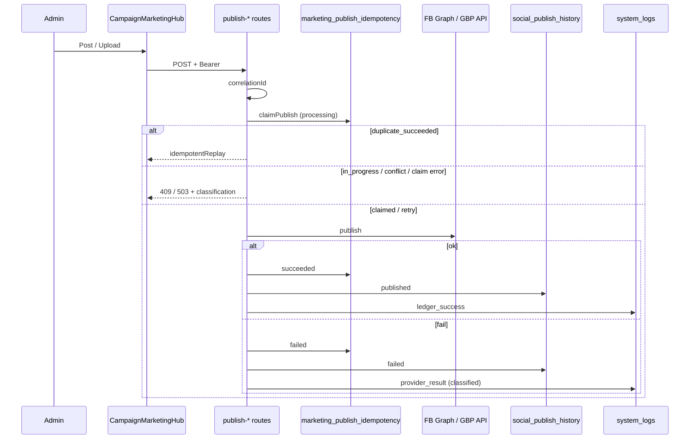

# MKT-001B — Publishing Reliability

**Project:** Shalean Cleaning Services  
**Phase:** MKT-001B — Publishing Reliability  
**Date:** 2026-07-17  
**Branch:** `feature/mkt-001b-publishing-reliability`  
**Base:** `staging`  
**Type:** Reliability audit + hardening (no new product features)

---

## Governance

| Constraint | Status |
|---|---|
| MKT-001A-PROD remains **OPEN / NO-GO** (Google Business Profile API external approval) | Respected — not modified |
| Do not merge to `main` | Respected |
| Do not deploy to production | Respected |
| Do not reopen or modify MKT-001A security/encryption work | Respected |
| May merge to `staging` after review | Intended path |

**Release rule:** MKT-001B may land on staging and remain staging-only until MKT-001A-PROD is formally closed. No production release activities for this phase.

---

## 1. Executive Summary

Social publishing today is a **synchronous, admin-triggered, two-provider** pipeline (Facebook Page + Google Business Profile). MKT-001A delivered the idempotency ledger and security hardening. MKT-001B audited reliability end-to-end and closed the highest-severity operational gaps in that sync model.

**What exists:** content-hash / explicit-key idempotency, history + audit logging, OAuth (GBP) / env token (Facebook), Connected Accounts UI.

**What did not exist (and still does not as a full product):** durable publish queue, scheduled social posts, automatic worker retries with exponential backoff, DLQ UI, Instagram / LinkedIn / X publish adapters.

**What MKT-001B fixed on this branch:**

1. **Stuck `processing` reclaim** — abandoned claims older than 10 minutes are reclaimable (no permanent 409 after crash).
2. **Fail-closed idempotency** — publish refuses with 503 if the ledger is unavailable (was fail-open → duplicate risk).
3. **Attempt counters** — `attempts` incremented on every reclaim / failed→retry.
4. **Provider failure taxonomy** — HTTP 4xx/5xx + transport failures classified with `retryable`, `retryAfterMs`, recovery guidance.
5. **Structured observability** — correlation IDs, publish phases, latency, classification in `system_logs` (no tokens / secrets).
6. **Recovery cron** — `/api/cron/recover-stuck-publish` every 15 minutes.
7. **Stronger Facebook / GBP error copy** for auth, rate limit, and provider outages.
8. **Connected Accounts UX** — degraded/error health messaging + retry guidance on publish history.

| Score | Value |
|---|---|
| **Reliability Score** | **72 / 100** (was ~48 for sync-path reliability post-MKT-001A) |
| **Observability Score** | **68 / 100** (was ~35) |
| **Operational Readiness (staging)** | **GO for staging merge** |
| **Production readiness** | **NO-GO** until MKT-001A-PROD closes + remaining Medium items |

---

## 2. Architecture Review

### 2.1 Current publish architecture



### 2.2 Provider reality

| Channel | Publish path | Reliability posture |
|---|---|---|
| Facebook Page | Sync one-click | Hardened (idempotency + fail-closed + errors) |
| Google Business | Sync one-click | Hardened (same) — **prod API access still gated by MKT-001A-PROD** |
| Instagram | Manual export only | N/A — no API publish |
| LinkedIn / X / Pinterest | Coming soon / manual | N/A |
| Scheduled publish | Absent | Deferred (requires queue — Phase MKT-001C) |
| Queue workers / DLQ | Absent | Deferred |

### 2.3 State machine (ledger)

```
(new) → processing → succeeded
                  ↘ failed → processing (retry / reclaim)
processing (stuck > 10m) → processing (reclaim) OR failed (cron)
```

Illegal transitions prevented by UNIQUE(provider, idempotency_key) + CAS updates on status.

Campaign content statuses (`draft` / `ready` / `published` / `archived`) remain a content lifecycle, not a job queue SM.

---

## 3. Findings

### Critical (addressed in this PR)

| ID | Finding | Remediation |
|---|---|---|
| C-1 | Stuck `processing` after deploy/crash → permanent 409 for that key | TTL reclaim in `claimPublish` + cron `recover-stuck-publish` |
| C-2 | Idempotency claim errors / missing admin client **fail-open** → duplicate posts under DB outage | Fail-closed 503 on both publish routes |

### High (addressed)

| ID | Finding | Remediation |
|---|---|---|
| H-1 | `attempts` column never incremented | Increment on reclaim |
| H-2 | Facebook errors lacked 401/429/5xx branching | Expanded `formatFacebookGraphError` |
| H-3 | No correlation IDs / structured publish logs | `publishObservability` + route wiring |
| H-4 | Provider failures lacked retry policy / recovery guidance | `publishProviderErrors` taxonomy on API responses |

### Medium (remaining — not blocking staging)

| ID | Finding | Recommendation |
|---|---|---|
| M-1 | No durable `social_publish_jobs` queue / worker / DLQ | MKT-001C — mirror `booking_lifecycle_jobs` |
| M-2 | No scheduled social publish / timezone / DST handling | Depends on M-1 |
| M-3 | No automatic retry with exponential backoff (manual retry only) | Depends on M-1 |
| M-4 | Provider success then ledger mark-succeeded failure → possible orphan post + retry risk | Outbox / confirm-before-ack pattern with M-1 |
| M-5 | UI does not surface `retryable` / `recoveryGuidance` from API | Wire toast/detail in CampaignMarketingHub |
| M-6 | No publish rate limiting | Add admin rate limit before queue era |

### Low

| ID | Finding | Recommendation |
|---|---|---|
| L-1 | Instagram / LinkedIn / X not implemented | Future provider adapters |
| L-2 | Facebook Connected Account is env-based (not OAuth row) | Optional OAuth parity |
| L-3 | History insert is best-effort (swallowed errors) | Alert on history write failure |

### Security (verified unchanged)

| Control | Status |
|---|---|
| Token encryption (MKT-001A) | Unchanged |
| SSRF safe remote media | Unchanged |
| Admin session on publish routes | Intact |
| Tokens never logged | Intact (fingerprints / correlation only) |
| RLS service-role on ledger | Intact |

---

## 4. Risk Matrix

| Risk | Likelihood | Impact | After MKT-001B | Residual mitigation |
|---|---|---|---|---|
| Duplicate Facebook/GBP post | Low | High | Lower (fail-closed + ledger) | Queue + outbox (M-1/M-4) |
| Stuck claim blocks republish | Low | Medium | Mitigated (TTL + cron) | Monitor cron recovered count |
| Provider 429 spam | Medium | Medium | Better messaging; still manual retry | Queue backoff (M-1) |
| Deploy mid-publish orphan | Low | Medium | Partial (stuck reclaim) | Confirm-before-ack (M-4) |
| GBP prod blocked on Google approval | Certain until external | High | Out of scope | MKT-001A-PROD gate |
| Scheduled post missed | N/A | — | Feature absent | MKT-001C |

---

## 5. Reliability Score — 72 / 100

| Dimension | Weight | Score | Notes |
|---|---|---|---|
| Idempotency / duplicate prevention | 20 | 18 | Strong for sync path; fail-closed |
| Retry / recovery | 15 | 11 | Manual + stuck reclaim; no auto backoff |
| Provider failure handling | 15 | 13 | Taxonomy + improved formatters |
| State machine integrity | 10 | 8 | Ledger SM solid; no job SM |
| Queue / ordering / DLQ | 15 | 3 | Not built |
| Scheduler | 10 | 2 | Not built |
| Concurrent safety | 10 | 9 | UNIQUE + CAS |
| Partial failure / outbox | 5 | 2 | Residual M-4 |

---

## 6. Observability Score — 68 / 100

| Dimension | Weight | Score | Notes |
|---|---|---|---|
| Structured logs | 25 | 20 | `logPublishEvent` phases |
| Correlation / publish IDs | 25 | 22 | UUID correlationId + ledger id |
| Provider response IDs | 15 | 12 | Logged on success paths |
| Latency | 15 | 10 | Provider + end-to-end ms |
| Failure classification counters | 10 | 4 | Classification in logs; no metrics sink yet |
| Operator alerts | 10 | 0 | No office_notifications on publish fail |

---

## 7. Operational Readiness

### Staging

| Gate | Result |
|---|---|
| Feature branch from `staging` | Pass |
| Unit tests for idempotency / errors | Pass (30 targeted) |
| MKT-001A encryption / SSRF untouched | Pass |
| Cron route + vercel.json entry | Added (`*/15`) |
| Production deploy | **Not started (by design)** |

### Production

| Gate | Result |
|---|---|
| MKT-001A-PROD closed | **NO — still OPEN** |
| GBP API access approved | External dependency |
| Queue/schedule required for “marketing platform” claim | Not yet |
| **Production GO/NO-GO** | **NO-GO** |

---

## 8. Recommended Fixes (prioritized)

### Done in this PR (Critical / High)

- [x] Stuck processing TTL reclaim  
- [x] Fail-closed ledger  
- [x] Attempt counters  
- [x] Provider error taxonomy + FB/GBP formatters  
- [x] Correlation / structured publish logs  
- [x] Recovery cron  
- [x] Connected Accounts degraded/error messaging  

### Next (Medium) — candidate MKT-001C

1. Durable `social_publish_jobs` + cron worker (retry, backoff, DLQ)  
2. Scheduled publish + timezone/DST  
3. Surface `retryable` / `recoveryGuidance` in hub toasts  
4. Outbox / confirm-before-ack for provider→ledger races  
5. Publish failure → ops notification  

---

## 9. GO / NO-GO Decision

| Decision | Verdict |
|---|---|
| **Merge to `staging`** | **GO** — reliability hardening is complete for the current sync publish model |
| **Release to `main` / production** | **NO-GO** — blocked by open MKT-001A-PROD gate; do not begin production release until that gate is formally closed |
| **Claim “fully reliable multi-provider publishing platform”** | **NO-GO** — queue/schedule/Instagram/LinkedIn/X still absent |

**Success criteria (phase):** The Facebook + Google Business sync publish path is now deterministic under double-click and concurrent races, fail-closed when the ledger is down, recoverable after interrupted requests, classified on provider failures, and observable via correlation IDs — without compromising the open MKT-001A production gate.

---

## 10. Test Evidence

```
vitest run \
  lib/promotions/__tests__/publishIdempotency.test.ts \
  lib/promotions/__tests__/publishProviderErrors.test.ts \
  lib/promotions/__tests__/facebookPublish.test.ts \
  lib/promotions/__tests__/googleBusinessPublish.test.ts

Test Files  4 passed
Tests       30 passed
```

Evidence file: `docs/audits/marketing/evidence/mkt-001b-publishing-reliability-tests-2026-07-17.txt`

---

## 11. Files Touched (this phase)

| Path | Change |
|---|---|
| `apps/web/lib/promotions/publishIdempotency.ts` | Stuck TTL, attempts, recoverStuckPublishClaims |
| `apps/web/lib/promotions/publishProviderErrors.ts` | **New** failure taxonomy |
| `apps/web/lib/promotions/publishObservability.ts` | **New** correlation logging |
| `apps/web/app/api/admin/promotions/publish-facebook/route.ts` | Fail-closed + observability + classification |
| `apps/web/app/api/admin/promotions/publish-google-business/route.ts` | Same |
| `apps/web/lib/promotions/facebookPublish.ts` | Richer Graph error mapping |
| `apps/web/lib/google-business.ts` | Richer GBP error mapping |
| `apps/web/app/api/cron/recover-stuck-publish/route.ts` | **New** recovery cron |
| `apps/web/vercel.json` | Register cron `*/15` |
| `apps/web/components/admin/promotions/ConnectedAccountsPanel.tsx` | Degraded/error UX |
| `apps/web/lib/promotions/__tests__/*` | Expanded coverage |
| `docs/audits/marketing/MKT-001B-publishing-reliability.md` | This audit |

---

*End of MKT-001B audit.*
