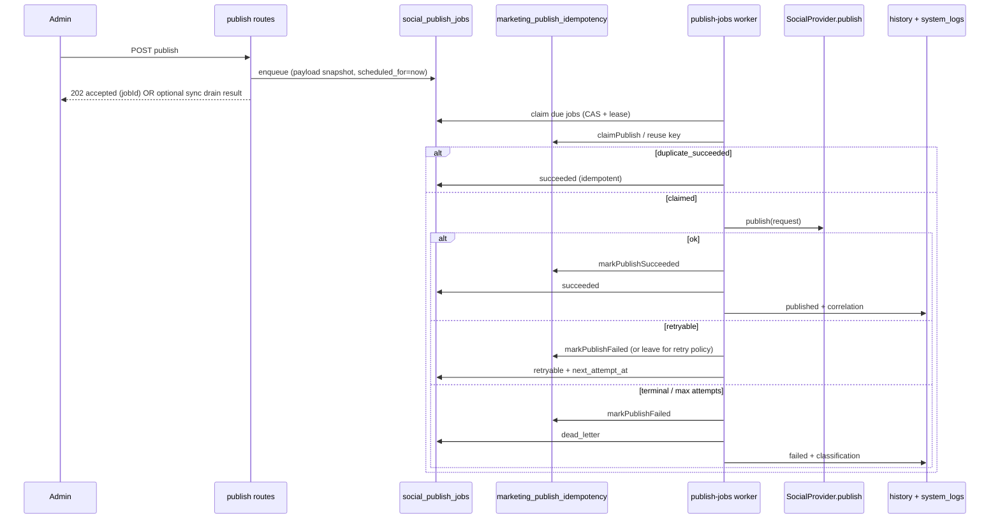

# MKT-001B.2 — Durable Publish Queue, Retry & Dead-Letter Architecture

**Project:** Shalean Cleaning Services  
**Phase:** MKT-001B.2 — Durable Publishing Queue  
**Date:** 2026-07-17  
**Branch:** `feature/mkt-001b2-durable-publishing-queue`  
**Base:** `staging` @ `32cc7c50` (post MKT-001D staging verification merge)  
**Type:** Architecture + remediation plan (implementation gated on decision below)  
**Document:** `docs/audits/marketing/MKT-001B.2-durable-publishing-queue-plan.md`

---

## Governance

| Constraint | Status |
|---|---|
| Base branch = current verified `staging` | Respected (`32cc7c50`) |
| Do not merge to `main` | Respected |
| Do not deploy to production | Respected |
| MKT-001A-PROD remains **OPEN / NO-GO** release blocker | Unchanged |
| Preserve MKT-001A security (encryption, SSRF, RLS) | Required |
| Preserve MKT-001B idempotency + observability | Required |
| Preserve MKT-001C `SocialProvider.publish` boundary | Required |
| Preserve MKT-001D Connected Accounts UX | Required |
| May merge to `staging` after review + verification | Intended path only |

**Release rule (unchanged):** no `staging → main` and no production deploy until MKT-001A-PROD is formally closed. MKT-001B.2 is staging-only engineering.

**Release train (unchanged):**

```text
MKT-001A-PROD
        │
        ├── Waiting for Google Business Profile API approval
        │
        ▼
Final GBP connection smoke
        ▼
Combined Release Assessment (A + B + C + D [+ B.2 if staging-merged])
        ▼
staging → main
        ▼
Production Verification
```

---

## 1. Executive Summary

MKT-001A–D delivered a **secure, idempotent, provider-abstracted, operator-visible synchronous publish path**. Recovery today is **reclaim-based** (`marketing_publish_idempotency` stuck TTL + daily `recover-stuck-publish` cron). That model stops duplicate posts and recovers crashed requests; it does **not** provide durable async delivery, scheduled execution, automatic exponential retry, dead-letter operations, or poison-job controls.

**MKT-001B.2** introduces a durable `social_publish_jobs` execution queue that:

1. Enqueues publish work independently of the HTTP request lifetime  
2. Claims work with concurrency protection (run lease + per-job lease)  
3. Retries with exponential backoff + jitter, honoring provider `retryAfterMs`  
4. Dead-letters exhausted / permanent failures with operator replay  
5. Keeps `SocialProvider.publish` as the **only** provider I/O boundary  
6. Leaves the idempotency ledger as the **logical dedupe** source of truth  

**Out of scope for this phase:** Instagram/LinkedIn/X adapters, full scheduling UX/timezone product, production release, changes to MKT-001A encryption/SSRF.

---

## 2. Problem Statement

### 2.1 What exists (post MKT-001D)

| Layer | Role today | Limitation |
|---|---|---|
| Admin publish routes | Sync `runPublish()` | Request must stay alive for provider I/O |
| `marketing_publish_idempotency` | Logical claim / dedupe / stuck reclaim | Not a work queue; no `next_attempt_at` |
| `social_publish_history` | Best-effort audit | Not durable execution SoT; write errors swallowed |
| `SocialProvider.publish` | Provider execution | Correct boundary; no scheduling capability used |
| `recover-stuck-publish` | Daily failed-mark of stuck ledger rows | No automatic republish |
| Connected Accounts (MKT-001D) | History + health UX | No job queue / DLQ views |

### 2.2 Gaps this phase must close

| Requirement | Gap today |
|---|---|
| Durable enqueueing | Publish is in-request only |
| Worker claiming | No job rows to claim |
| Retry policy | Manual admin retry only |
| Exponential backoff | Taxonomy has `retryAfterMs`; nothing schedules it |
| Dead-letter handling | Ledger `failed` ≠ operable DLQ |
| Replay safety | Relies on ledger reclaim; no job-level replay contract |
| Poison-job controls | No max-attempts / quarantine |
| Concurrency protection | Ledger CAS only; no per-job lease / worker ownership |
| Operational visibility | Correlation logs exist; no queue depth / DLQ metrics |
| Recovery tooling | Cron marks stuck claims failed; no replay/cancel APIs |

---

## 3. Design Principles

1. **Separate concerns:** ledger = logical identity; jobs = execution; history = audit; provider = I/O.  
2. **Reuse proven patterns, improve known weaknesses:**
   - From `booking_lifecycle_jobs`: status machine, CAS claim, attempt counters, terminal vs retryable  
   - From `whatsapp_queue`: `next_attempt_at`, exponential backoff + jitter, dead status, stale-processing recovery  
   - From H-15 `cron_run_leases`: whole-run overlap prevention (`withCronLock`)  
   - **Improve on lifecycle:** add per-job leases (`lease_holder`, `lease_expires_at`) — lifecycle leaves orphaned `processing` rows  
3. **Do not weaken prior phases:** fail-closed ledger, SSRF/encryption, provider registry, MKT-001D UX remain.  
4. **Provider boundary is sacred:** workers call `SocialProvider.publish` (via a thin queue executor), never Facebook Graph / GBP clients directly.  
5. **Hobby-safe Vercel + real scheduler:** Vercel Hobby rejects sub-daily crons; sub-daily drain must use Supabase `pg_cron` → HTTP invoke (existing platform pattern).  
6. **Staging-first:** schema + worker ship to staging only; production remains NO-GO.

---

## 4. Target Architecture

### 4.1 Component diagram

```text
┌─────────────────────┐
│ Admin Hub / API     │  enqueue (durable) + optional await
└──────────┬──────────┘
           │
           ▼
┌─────────────────────┐     UNIQUE(provider, idempotency_key)
│ social_publish_jobs │◄──── references / cooperates with
└──────────┬──────────┘
           │                    ┌──────────────────────────────┐
           │ claim + lease      │ marketing_publish_idempotency │
           ▼                    │ (logical dedupe SoT)         │
┌─────────────────────┐         └──────────────────────────────┘
│ publish queue worker│
│ + cron_run_leases   │
└──────────┬──────────┘
           │ SocialProvider.publish
           ▼
┌─────────────────────┐
│ FB / GBP adapters   │
└──────────┬──────────┘
           │
           ▼
┌─────────────────────┐     ┌──────────────────┐
│ ledger success/fail │────►│ history + logs   │
└─────────────────────┘     └──────────────────┘
           │
           ▼ (exhausted / permanent)
┌─────────────────────┐
│ dead_letter + admin │  replay / cancel / inspect
│ recovery tooling    │
└─────────────────────┘
```

### 4.2 Layer ownership (non-negotiable)

| Concern | Owner | Must not become |
|---|---|---|
| Logical dedupe / content identity | `marketing_publish_idempotency` | Mutable work queue |
| Execution scheduling / retries / DLQ | `social_publish_jobs` | Provider adapter concern |
| Provider I/O | `SocialProvider.publish` | Route handlers / cron SQL |
| Operator audit trail | `social_publish_history` + `logPublishEvent` | Source of truth for retries |
| Connection UX | Connected Accounts (MKT-001D) | Broken by queue rollout |

### 4.3 Request flow (target)



---

## 5. Data Model — `social_publish_jobs`

### 5.1 Proposed table

New migration (staging-first). **Do not** overload `marketing_publish_idempotency` or `social_publish_history`.

| Column | Type | Purpose |
|---|---|---|
| `id` | `uuid` PK | Job id |
| `provider` | `text` | `facebook` \| `google_business` (ledger-compatible) |
| `idempotency_key` | `text` | Same key family as MKT-001A/B |
| `request_hash` | `text` | Content identity (conflict detection) |
| `target_ref` | `text` null | Page / location at enqueue time |
| `promotion_id` | `uuid` null | Optional promotion link |
| `campaign_name` | `text` null | Operator context |
| `payload` | `jsonb` | Durable `PublishRequest` snapshot (no secrets) |
| `published_by` | `uuid` / text | Admin actor |
| `correlation_id` | `text` | Propagates MKT-001B observability |
| `status` | `text` | See state machine |
| `scheduled_for` | `timestamptz` | Earliest eligible time (supports future schedule foundation) |
| `next_attempt_at` | `timestamptz` null | Backoff gate |
| `attempts` | `int` | Execution attempts |
| `max_attempts` | `int` | Poison threshold (default 5) |
| `last_error` | `text` null | Safe error string |
| `failure_class` | `text` null | MKT-001B taxonomy |
| `retryable` | `boolean` null | Last classification |
| `external_post_id` | `text` null | Provider success id |
| `ledger_id` | `uuid` null | FK-ish link to idempotency row when known |
| `lease_holder` | `text` null | Worker instance id |
| `lease_expires_at` | `timestamptz` null | Per-job lease expiry |
| `dead_lettered_at` | `timestamptz` null | When moved to DLQ |
| `replayed_from_job_id` | `uuid` null | Replay lineage |
| `cancelled_at` | `timestamptz` null | Operator cancel |
| `processed_at` | `timestamptz` null | Terminal success/dead/cancel time |
| `created_at` / `updated_at` | `timestamptz` | Audit |

### 5.2 Constraints & indexes

- `UNIQUE (provider, idempotency_key)` where status ∈ active set (`queued`, `leased`, `retryable`) — **or** unique on key for non-terminal rows via partial unique index (preferred).  
  - Terminal `succeeded` / `dead_letter` / `cancelled` may coexist with a later deliberate repost only via **new explicit idempotency key** (existing MKT-001A contract).  
- Check constraint on `status` enum values.  
- Check: when `status = 'leased'`, `lease_holder` and `lease_expires_at` are NOT NULL.  
- Indexes:
  - `(status, next_attempt_at, scheduled_for)` for due work  
  - partial index on `leased` where `lease_expires_at < now()` for reclaim  
  - `(provider, created_at desc)` for admin lists  
  - `(status)` where `dead_letter` for DLQ console  

### 5.3 RLS

- Enable RLS; **service_role only** (mirror idempotency ledger). No anon/authenticated grants.

### 5.4 Payload rules

- Store message, image URL / storage path references, link, promotion/campaign metadata.  
- **Do not** store OAuth tokens, encryption keys, or raw image bytes if avoidable (prefer already-public/safe media URL after existing SSRF-safe fetch path at publish time).  
- Re-validate content via `SocialProvider.validateContent` at worker execution (defense in depth).

---

## 6. State Machine

```text
                  enqueue
                     │
                     ▼
                 queued ──────────────────────────────┐
                     │ claim (CAS + lease)            │ cancel
                     ▼                                ▼
                  leased ──────────────────────► cancelled
                     │
        ┌────────────┼────────────┐
        │            │            │
   provider ok   retryable    permanent / max
        │            │            │
        ▼            ▼            ▼
   succeeded     retryable    dead_letter
                     │
                     │ next_attempt_at due
                     └──► queued/leased (re-claim)
```

| Status | Meaning |
|---|---|
| `queued` | Eligible when `scheduled_for <= now` and (`next_attempt_at` null or due) |
| `leased` | Claimed by a worker; lease must be heartbeatable / expirables |
| `retryable` | Failed transiently; waiting on `next_attempt_at` |
| `succeeded` | Provider + ledger success (or idempotent replay of prior success) |
| `dead_letter` | Exhausted attempts or non-retryable failure; needs operator action |
| `cancelled` | Operator cancelled before success |

Illegal transitions (e.g. `succeeded → leased`) must be rejected by CAS updates.

---

## 7. Enqueue Contract

### 7.1 API behaviour (staging)

Admin publish routes remain the entrypoint. Target behaviour:

1. Authenticate via `requireAdminApi` (unchanged).  
2. Resolve provider from registry; `validateContent`.  
3. Compute `request_hash` / `idempotency_key` (existing helpers).  
4. **Insert** `social_publish_jobs` row (`queued`, `scheduled_for = now()` by default).  
5. Return:
   - **Default (recommended):** `202 Accepted` with `{ jobId, correlationId, status: "queued" }` and let the worker finish.  
   - **Compatibility mode (slice 1):** after enqueue, optionally run an **inline drain** of that job (same executor as worker) so the Hub keeps near-sync UX during transition.  
6. Duplicate active job for same `(provider, idempotency_key)` → return existing job (`200` / `409` per existing conflict semantics), never double-enqueue active work.

### 7.2 Compatibility with sync path

| Mode | When | Notes |
|---|---|---|
| `enqueue + inline drain` | Slice 1 (default ship) | Preserves MKT-001D UX latency expectations |
| `enqueue only` | Feature flag / later | True async; Hub polls job status |
| Legacy sync-only `runPublish` | Escape hatch temporarily | Must not be the long-term path |

**Decision in this plan:** implement a shared `executePublishJob(jobId)` used by both inline drain and cron worker so behaviour cannot diverge.

---

## 8. Worker Claiming, Concurrency & Leases

### 8.1 Run-level concurrency

- Cron route: `/api/cron/process-social-publish-jobs`  
- Wrap with `withCronLock` / new `CRON_LOCK_KEYS.processSocialPublishJobs`  
- Same pattern as booking lifecycle + retry-failed-jobs (H-15)

### 8.2 Per-job claim

Atomic transition:

```text
UPDATE social_publish_jobs
SET status = 'leased',
    lease_holder = :holder,
    lease_expires_at = now() + interval '2 minutes',
    attempts = attempts + 1,
    updated_at = now()
WHERE id = :id
  AND status IN ('queued', 'retryable')
  AND scheduled_for <= now()
  AND (next_attempt_at IS NULL OR next_attempt_at <= now())
  AND attempts < max_attempts
RETURNING *
```

Prefer a SQL RPC (`claim_social_publish_jobs(limit, holder, lease_seconds)`) for multi-row safe claim under concurrency (mirror WhatsApp `get_pending_whatsapp_jobs` spirit).

### 8.3 Lease expiry / crash recovery

- Worker must finish or release before lease expiry; choose lease ≥ worst-case provider timeout.  
- Reclaim path: `leased` rows with `lease_expires_at < now()` → reset to `queued` (or re-claimable) **without** incrementing attempts again if reclaim is ownership recovery only — **or** increment once with clear telemetry. Prefer: reclaim does **not** increment attempts; only successful claim-to-execute increments.  
- Keep existing ledger `STUCK_PROCESSING_TTL_MS` reclaim as a secondary safety net during dual-write period.

### 8.4 Batching

- Process up to N jobs per run (start `N=10`, sequential per provider to reduce 429 storms).  
- Optional later: per-provider concurrency caps.

---

## 9. Retry Policy & Backoff

### 9.1 Classification source

Reuse MKT-001B / MKT-001C:

- `SocialProvider.classifyError` → `ClassifiedPublishFailure`  
- Fields: `retryable`, `retryAfterMs`, `classification`, `recoveryGuidance`

### 9.2 Backoff formula

Align with WhatsApp queue spirit:

```text
delayMs = max(
  classified.retryAfterMs ?? 0,
  baseMs * 2^(attemptsAfterFailure) * jitter(0.9–1.1)
)
cap delay at e.g. 60 minutes
```

Suggested defaults:

| Parameter | Value |
|---|---|
| `baseMs` | 60_000 |
| `max_attempts` | 5 |
| `max_backoff` | 60 minutes |
| Jitter | ±10% |

### 9.3 Permanent vs retryable

| Outcome | Job status | Ledger |
|---|---|---|
| Success | `succeeded` | `markPublishSucceeded` |
| Retryable & attempts < max | `retryable` + `next_attempt_at` | `markPublishFailed` (allows later reclaim) **or** leave ledger processing carefully — see §10 |
| Non-retryable | `dead_letter` | `markPublishFailed` |
| Attempts ≥ max | `dead_letter` (poison) | `markPublishFailed` |

---

## 10. Ledger Interaction & Replay Safety

### 10.1 Ordering rules

1. Enqueue job **before** or **with** ledger claim — never publish without both identities.  
2. Preferred worker sequence:
   - Claim job lease  
   - `claimPublish` on ledger (fail-closed)  
   - On `duplicate_succeeded` → mark job `succeeded` (idempotent), no provider call  
   - On `in_progress` (fresh) → wait / requeue shortly (another worker)  
   - On `claimed` / `retry` → `provider.publish`  
   - On provider success → `markPublishSucceeded` **then** job `succeeded`  
   - On provider failure → ledger failed + job retryable/dead_letter  

### 10.2 Provider-success / ack-failure (outbox residual)

Known residual from MKT-001B (M-4): provider succeeds, ledger update fails → external orphan risk.

**MKT-001B.2 minimum mitigation:**

1. Treat ledger `duplicate_succeeded` / existing `external_post_id` as success on replay.  
2. Persist `external_post_id` on the job as soon as provider returns ok, **before** final ledger ack when possible.  
3. If ledger ack fails after provider ok: mark job `retryable` with failure_class `unknown` / special `ack_pending`, and **never** call provider again if `external_post_id` is set — only retry ledger confirmation.

Full transactional outbox can be a follow-on; this phase must at least be **replay-safe** (no double post when external id known).

### 10.3 Deliberate reposts

Unchanged: client supplies explicit idempotency key → new logical publish. Queue enforces the same rule.

---

## 11. Dead-Letter, Poison Jobs & Recovery Tooling

### 11.1 Dead-letter criteria

- `retryable = false` (auth, permission, validation, conflict, not_found)  
- `attempts >= max_attempts`  
- Payload / schema corruption detected at worker start  
- Repeated lease abandon storms (optional poison flag after K reclaim cycles — slice 2)

### 11.2 Operator APIs (admin-auth)

| Action | Behaviour |
|---|---|
| List DLQ | Filter `dead_letter`, pagination, classification |
| Inspect job | Payload fingerprint (not raw secrets), errors, attempts, lineage |
| Replay | Create new job **or** reset same job to `queued` with attempts reset **only if** ledger allows; always new `correlation_id`; set `replayed_from_job_id` |
| Cancel | Active `queued`/`retryable` → `cancelled` |
| Force-fail | Operator terminal without provider call |

### 11.3 UX

- Extend Connected Accounts / Marketing Hub with a **Publish jobs** strip: queued depth, retryable, dead_letter count (24h).  
- Preserve existing history/health UX; do not regress MKT-001D.  
- Surface `recoveryGuidance` already produced by taxonomy.

### 11.4 Alerts (minimum)

- Structured `logPublishEvent` for enqueue / claim / retry / dead_letter / succeed.  
- Optional: `office_notifications` on dead_letter (nice-to-have in slice 2; not blocking).

---

## 12. Scheduler Strategy (critical platform constraint)

| Scheduler | Cadence | Role in MKT-001B.2 |
|---|---|---|
| Vercel Hobby cron | Daily only | Keep `/api/cron/recover-stuck-publish` as ledger sweep; optional daily queue sweep |
| Supabase `pg_cron` + HTTP | Minute / 5-minute | **Primary** worker invoke for `/api/cron/process-social-publish-jobs` |
| Admin inline drain | On request | Hot path UX during transition |
| Manual invoke + `CRON_SECRET` | On demand | Staging verification |

**Plan decision:** implement the route for both Vercel (daily backup) and Supabase pg_cron (operational cadence). Document staging pg_cron registration in verification evidence (same ops pattern as `retry-failed-jobs`).

---

## 13. Code Map (planned)

| Area | Path (planned / existing) |
|---|---|
| Migration | `supabase/migrations/YYYYMMDDHHMMSS_mkt_001b2_social_publish_jobs.sql` |
| Claim RPC | same migration |
| Enqueue + executor | `apps/web/lib/promotions/publishJobs.ts` (new) |
| Backoff helpers | `apps/web/lib/promotions/publishJobBackoff.ts` (new) |
| Keep provider boundary | `publishingService.ts` refactored to enqueue/execute or thin wrapper |
| Cron worker | `apps/web/app/api/cron/process-social-publish-jobs/route.ts` |
| Admin recovery | `apps/web/app/api/admin/promotions/publish-jobs/*` |
| Lock key | `cronLockKeys.ts` += `processSocialPublishJobs` |
| Tests | `lib/promotions/__tests__/publishJobs*.test.ts` |
| UX strip | Connected Accounts / hub (minimal) |
| Docs | this plan + later staging verification doc |

**Must not change:** encryption key handling, SSRF guard internals, provider adapter Graph/GBP call sites (except via existing `publish()`).

---

## 14. Remediation / Implementation Slices

### Slice 0 — Plan acceptance (this document)

- Architecture + GO decision  
- No runtime changes

### Slice 1 — Foundation (implementation start)

1. Migration: table, indexes, RLS, claim RPC  
2. Enqueue helpers + unique active-job semantics  
3. `executePublishJob` calling `SocialProvider.publish` + ledger  
4. Cron route + `withCronLock`  
5. Inline drain compatibility on existing publish routes  
6. Unit tests: claim CAS, backoff, replay-safe external id, dead_letter, cancel  
7. Staging migration apply + pg_cron registration notes

### Slice 2 — Operations

1. Admin DLQ list / replay / cancel APIs  
2. Connected Accounts queue visibility strip  
3. Lease reclaim cron path + metrics counters  
4. Optional `office_notifications` on dead_letter  
5. Staging verification doc + regression suite expansion

### Slice 3 — Hardening (if needed before staging merge)

1. Per-provider rate caps  
2. Ack-pending reconciliation job  
3. Load / concurrency soak on staging  
4. Remove or feature-flag pure sync path

**Scheduled publishing product UX / timezone / DST** is explicitly **deferred** (schema supports `scheduled_for`; Hub schedule UI is a later phase).

---

## 15. Test Plan (implementation acceptance)

| Suite | Must prove |
|---|---|
| Enqueue idempotency | Double POST → one active job |
| Claim concurrency | Two workers → one winner |
| Lease expiry | Abandoned lease becomes reclaimable |
| Retryable backoff | `next_attempt_at` honors classification + exponential cap |
| Poison | `max_attempts` → `dead_letter` |
| Permanent fail | auth/validation → immediate DLQ |
| Replay safety | `external_post_id` set → no second provider call |
| Ledger duplicate success | Job completes succeeded without republish |
| Fail-closed | Ledger down → no provider call |
| Provider boundary | Executor uses registry `publish` only |
| Cron lock | Overlap short-circuits safely |
| UX regression | Connected Accounts still loads history/health |
| Prior suites | MKT-001A/B/C/D targeted publish tests remain green |

Staging verification gates (later): migration applied, worker invoke with `CRON_SECRET`, DLQ replay smoke, no production actions.

---

## 16. Risks & Mitigations

| Risk | Severity | Mitigation |
|---|---|---|
| Vercel-only cron too slow | High | Primary pg_cron dispatch |
| Double publish on ack race | High | Persist external id; skip provider if present |
| Divergent inline vs worker paths | High | Single `executePublishJob` |
| Breaking Hub UX latency | Medium | Inline drain in slice 1 |
| Orphaned `leased` rows | Medium | Lease TTL + reclaim |
| Scope creep into full scheduler product | Medium | Defer schedule UI; keep `scheduled_for` only |
| Accidental production release | Critical | Governance: no main merge / no prod deploy |

---

## 17. Explicit Non-Goals

- Production deploy or `main` merge  
- Closing MKT-001A-PROD / GBP API approval work  
- New social providers  
- Full campaign scheduler UX / timezone picker  
- Replacing `social_publish_history`  
- Weakening fail-closed idempotency  
- Sub-daily Vercel Hobby cron expressions  

---

## 18. Effort Estimate

| Slice | Estimate |
|---|---|
| Slice 1 foundation | 3–5 engineer-days |
| Slice 2 operations | 2–3 engineer-days |
| Slice 3 hardening | 1–2 engineer-days (optional) |
| Staging verification + docs | 1 engineer-day |

---

## 19. Success Criteria

MKT-001B.2 is **staging-complete** when:

1. Publish requests durable-enqueue into `social_publish_jobs`  
2. Worker claims with run lock + per-job lease  
3. Retryable failures use exponential backoff + `next_attempt_at`  
4. Poison / permanent failures land in `dead_letter` with replay tooling  
5. `SocialProvider.publish` remains the sole provider execution boundary  
6. Idempotency ledger + observability + MKT-001D UX remain intact  
7. Targeted + expanded tests pass; staging verification documented  
8. Production remains **NO-GO** with MKT-001A-PROD still the release blocker  

---

## 20. Implementation Decision

| Gate | Verdict |
|---|---|
| Architecture clarity | Pass — layers, state machine, and reuse boundaries are defined |
| Pattern reuse feasibility | Pass — lifecycle + WhatsApp queue + H-15 locks map cleanly |
| Preservation of A/B/C/D | Pass — no required regressions identified |
| Scheduler constraint handled | Pass — pg_cron primary, Vercel daily backup |
| Production risk contained | Pass — staging-only governance explicit |
| Residual design risks | Managed — ack-race mitigated to replay-safe minimum; full outbox optional |

### Decision: **CONDITIONAL GO**

**CONDITIONAL GO to begin Slice 1 implementation** on `feature/mkt-001b2-durable-publishing-queue`, subject to accepting these conditions:

1. **Scheduler:** Supabase `pg_cron` is the primary sub-daily worker; Vercel remains daily backup / Hobby-safe only.  
2. **Compatibility:** Slice 1 ships `enqueue + shared executor + inline drain` so Hub UX does not regress; pure-async Hub polling is optional later.  
3. **Ledger remains SoT for logical dedupe;** jobs never replace `marketing_publish_idempotency`.  
4. **Replay safety minimum:** if `external_post_id` is known, workers must not call the provider again.  
5. **Governance unchanged:** no `main` merge, no production deploy, MKT-001A-PROD stays the release blocker.  
6. **Scope freeze:** schedule UI / new providers / production cutover are out of scope.

If any condition is rejected, decision reverts to **NO-GO** until the plan is revised.

**Not a production GO.** Staging merge remains a later verification gate after Slice 1–2 land.

---

## 21. Immediate Next Step

Upon acceptance of the **CONDITIONAL GO** conditions above:

1. Implement Slice 1 (migration + enqueue + executor + cron + tests).  
2. Keep work on `feature/mkt-001b2-durable-publishing-queue` based at `staging` @ `32cc7c50` (rebase if staging moves).  
3. Produce staging verification evidence only after worker + DLQ basics are test-green.  

---

*End of MKT-001B.2 architecture & remediation plan.*
