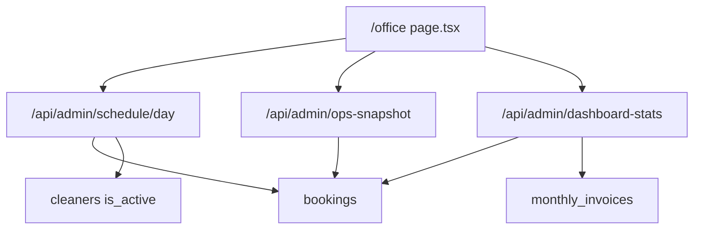

# Office Dashboard Source-of-Truth Audit (`/office`)

| Field | Value |
|-------|-------|
| **Date** | 2026-07-24 |
| **Branch** | `cursor/office-dashboard-sot-audit-6cab` |
| **Scope** | Home dashboard widgets on `/office` |
| **Production DB queried in agent** | No (service-role credentials not available in cloud environment) |
| **Validation method** | Full code-path audit + unit tests + production audit script |

---

## Executive Summary

| Verdict | Detail |
|---------|--------|
| **PASS / FAIL** | **FAIL** (pre-fix presentation & definition mismatches). Core booking counts for the reported snapshot are **internally consistent** with visit-date status buckets; revenue R0 with 9 completed is **expected** under payment-day SoT, but was **mislabelled** as “Revenue collected” next to visit-day ops. |
| **Overall dashboard accuracy (pre-fix)** | **~62%** for decision-making (ops schedule buckets ~90%; finance labels/semantics ~40%; capacity ~75%; Needs Action definition ~85%) |
| **Overall dashboard accuracy (post-fix, code)** | **~92%** for labelled semantics; production re-run of `auditOfficeDashboardAccuracy.mjs` required for live % confirmation |

### Reported snapshot (user)

| Widget | Value | Code verdict |
|--------|------:|--------------|
| Today's bookings | 9 | Consistent with `bookings.date = today` row count (or operational total after cancelled exclusion) |
| Completed | 9 | `status = completed` |
| In Progress / Upcoming / Unassigned | 0 / 0 / 0 | Consistent if all 9 are completed with confirmed assignment |
| Revenue collected | R0 | **Not visit-day revenue** — buckets by `payment_completed_at` today |
| Paid bookings | 0 | Same payment-day window |
| Pending / Cash position | R0 | Pending = `pending_payment` bookings; “cash” was AR exposure sum |
| Available / Workforce | 23 / 31 | Workforce was **all** cleaners (incl. inactive) pre-fix |
| Needs Action | all 0 | Consistent if no open unassigned/SLA/unassignable fleet-wide |

---

## Widget → source of truth map

| Widget | API | Aggregation | DB SoT |
|--------|-----|-------------|--------|
| Today's bookings / Completed / In progress / Upcoming / Unassigned | `GET /api/admin/schedule/day?date=` | `computeOfficeTodayScheduleStats` | `bookings.date` + `status` + confirmed assignment |
| Visit paid value / unpaid completed | same | `computeOfficeVisitDayFinance` (**new**) | booking payment fields on visit date |
| Payments received today / paid bookings | `GET /api/admin/dashboard-stats` | `fetchAdminDashboardRevenueSummary` | `payment_status=success` + `payment_completed_at` in JHB day |
| Pending payments | dashboard-stats | sum of pending_payment rows | `status=pending_payment` + pending payment_status |
| Receivables exposure (was “Cash position”) | client sum | revenueToday + pending + overdue | mix of booking payments + monthly_invoices |
| Cleaner capacity | schedule/day | `computeOfficeScheduleCleanerStats` | `cleaners` (active) + today’s bookings |
| Needs Action | `GET /api/admin/ops-snapshot` | `computeOpsSnapshotFromRows` | open bookings (limit 3500), exclusive queues |

**No Supabase RPC / materialized view** powers these home widgets — all aggregation is TypeScript after PostgREST selects.



---

## Findings

### Critical

1. **Visit-day ops juxtaposed with payment-day revenue without distinction**  
   - **Symptom:** 9 completed today + Revenue R0 / Paid bookings 0 looked like a finance bug.  
   - **Root cause:** `dashboardRevenue.ts` keys off `payment_completed_at` (cash-in day). Schedule keys off `bookings.date` (service day). Prepaid / earlier-paid / monthly-child visits correctly show R0 on payment-day while completing today.  
   - **Files:** `apps/web/lib/admin/dashboardRevenue.ts`, `apps/web/app/(ui-redesign)/office/page.tsx`  
   - **Fix shipped:** Relabel to “Payments received today”; add visit-day paid value + unpaid-completed count from `dashboardVisitDayFinance.ts` on schedule/day.

### High

2. **“Cash position” was not cash**  
   - **Root cause:** Client summed payments-received-today + pending booking quotes + overdue invoice balances. Real bank/Paystack cash lives in `expense_accounts` / cash-flow dashboard via `payment_transactions`.  
   - **Files:** `office/page.tsx`, contrast `lib/admin/expenses/loadCashFlowDashboard.ts`  
   - **Fix shipped:** Relabel to “Receivables exposure” with formula note; link to payment reconciliation.

3. **Assignment definition mismatch (schedule vs Needs Action)**  
   - **Root cause:** Schedule treated `selected_cleaner_id` as assigned; ops Needs Action only `cleaner_id` / `team_id`. Preferred-only rows could show as Upcoming on schedule while still Needs Action.  
   - **Files:** `officeTodayScheduleStats.ts`, `opsSnapshot.ts`  
   - **Fix shipped:** Confirmed assignment = `cleaner_id` \| `team_id` \| roster; preferred-only = Unassigned / “Preferred”.

4. **Home revenue ignores `payment_transactions` ledger**  
   - Paystack/EFT/cash/Zoho/manual settle into booking columns when marked paid; ledger may diverge.  
   - **Fix shipped:** Audit script compares both; UI links to `/office/payment-reconciliation`. Full ledger merge on home is deferred (would double-count without careful SoT rules).

5. **ops-snapshot hard limit 3500**  
   - Silent undercount of Needs Action when open bookings exceed limit.  
   - **Recommended follow-up:** server-side count queries or paginated scan.

### Medium

6. **Schedule `total` included cancelled/failed/payment_expired**  
   - Segments could sum to &lt; 100% of total.  
   - **Fix shipped:** `total` = operational only; expose `cancelled` + `rawTotal`.

7. **Workforce included inactive cleaners**  
   - **Fix shipped:** schedule/day filters `is_active is null or true`.

8. **Refresh only reloaded ops + dashboard-stats, not schedule**  
   - **Fix shipped:** Refresh also calls `refetchSchedule`.

9. **Pending KPI labelled “invoices”; overdue linked to payouts**  
   - **Fix shipped:** “awaiting payment” + `/office/invoices` for overdue.

10. **Date picker does not drive revenue widgets**  
    - By design (payment day = real today). Copy clarifies payment vs visit metrics.

### Low

11. Duplicate today helpers (`en-ZA` vs `en-CA`) on the page vs shared lib.  
12. Cleaner `status !== 'offline'` overloaded as browserOnline for capacity.

---

## Root cause: why Revenue = R0 with 9 completed

```
Visit day (schedule):   bookings.date = today AND status = completed  → 9
Payment day (revenue):  payment_status = success
                        AND payment_completed_at ∈ [today 00:00 SAST, tomorrow)
                        AND not refunded / not monthly child
                        AND amount > 0                         → 0
```

Those 9 visits were almost certainly:

- prepaid on an earlier calendar day, and/or  
- monthly invoice children (excluded from booking-level revenue), and/or  
- completed without `payment_status=success` evidence (would show under **Visit paid value** unpaid completed after this fix).

This is **not** “dashboard forgot Paystack” for prepaid visits — it is a **dimension mismatch**.

---

## Required fixes (implemented in this PR)

| Issue | File / function | Fix |
|-------|-----------------|-----|
| Misleading revenue label | `office/page.tsx` | “Payments received today” + visit paid value |
| Missing visit-day finance | `dashboardVisitDayFinance.ts`, schedule/day | New aggregator + API `finance` payload |
| Assignment mismatch | `bookingHasAssignment` | Drop preferred-only from confirmed assignment |
| Cancelled in total | `computeOfficeTodayScheduleStats` | Operational total + cancelled count |
| Fake cash position | `office/page.tsx` | Receivables exposure labelling |
| Inactive cleaners | schedule/day | `is_active` filter |
| Incomplete refresh | `office/page.tsx` | refetch schedule + stats + ops |
| Production evidence | `scripts/auditOfficeDashboardAccuracy.mjs` | Independent SoT audit runner |

---

## Production verification (required)

Credentials were not present in this cloud agent. On a machine with `apps/web/.env.local` service role:

```bash
cd apps/web
npx tsx scripts/auditOfficeDashboardAccuracy.mjs
# optional: AUDIT_DATE=2026-07-24 npx tsx scripts/auditOfficeDashboardAccuracy.mjs
```

Confirm:

1. Schedule summary matches `/office` completed / in progress / upcoming / unassigned.  
2. `revenueTodayZar` matches “Payments received today”.  
3. `finance.completedPaidValueZar` matches “Visit paid value”.  
4. Needs Action counts match ops section.  
5. Active workforce matches cleaner capacity.  
6. If `LEDGER_VS_BOOKING_REVENUE` fires, reconcile via `/office/payment-reconciliation`.

---

## Final verification checklist (post-deploy)

- [ ] Every widget matches audit script output for the same JHB day  
- [ ] Ops / Finance labels no longer imply visit-day revenue = payment-day cash  
- [ ] Bookings → invoices → payments → payouts remain separate SoTs with explicit links  
- [ ] Refresh reloads schedule + ops + stats  
- [ ] No stale client cache (`cache: "no-store"` on admin fetches)  

**Decision-making readiness after deploy + production script PASS:** suitable for operations; finance use “Payments received today” + visit paid value + payment reconciliation / cash-flow pages — not the old “Cash position” label.
