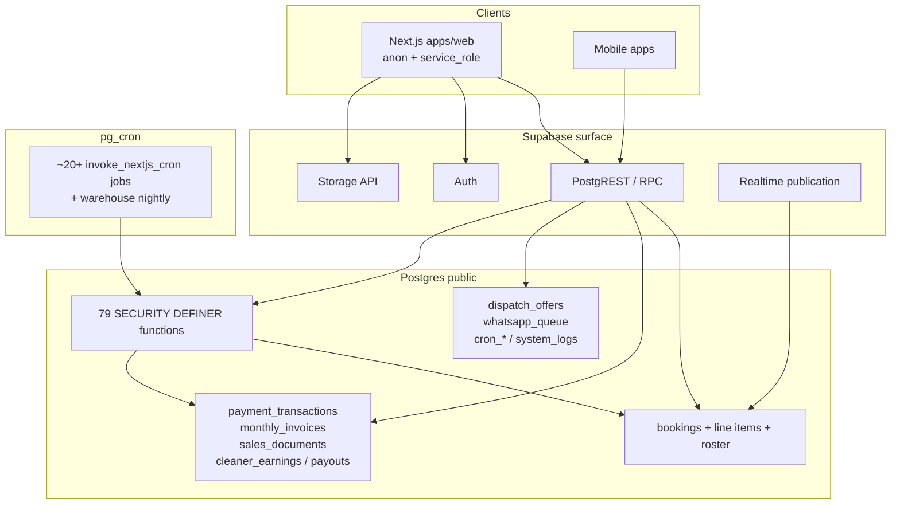

# Phase 1.11 — Database Health Audit

| Field | Value |
|-------|-------|
| **Audit ID** | DBHA-2026-07-14 |
| **Phase** | 1.11 — Database Health Audit |
| **Date** | 2026-07-14 |
| **Mode** | **AUDIT ONLY** — no schema changes, no migrations generated, no remediations applied |
| **Production project** | `tchayecuvzssixyxlvfu` (`shalean-platform`, eu-west-3, Postgres 17.6, `ACTIVE_HEALTHY`) |
| **Evidence sources** | Live linked Supabase CLI (`db query` / `db advisors`), git `supabase/migrations/20260714010000_production_baseline.sql`, `docs/database-baseline/*`, Supabase security checklist |
| **Branch inspected** | `development` @ `01312867` (baseline merge present) |
| **Standards basis** | Migration governance + Architecture docs in-repo; Supabase Security Engineering checklist; Data Governance / DoD as applied in prior SEOS audits. **Formal SEOS artefacts** (Engineering Standards, Architecture Standards, Security Engineering Standard, Data Governance Standard, Definition of Done) remain **missing from the repository** — treated as a governance gap (see F-GOV-001). |

**Non-actions (explicit):** no production DDL/DML mutation; no migration authoring; no advisor auto-fix; no `schema_migrations` repair.

---

## 1. Executive Summary

Production Postgres is a **large, domain-rich operational schema** (~175 public tables, 206 FKs, 629 indexes, 105 function signatures, 29 triggers, dense booking/payout CHECKs) that clearly supports a mature booking → payment → dispatch → earnings → payout platform. Recent baseline work (`20260714010000_production_baseline.sql` + migration governance) is a major positive for replayability.

However, the live security and privilege model **fails** Critical expectations for a public Supabase Data API:

1. **SECURITY DEFINER RPCs are executable by `anon`/`authenticated` without caller authorization** — including `admin_mark_payout_paid`, `invoke_nextjs_cron`, `apply_cleaning_credit_transaction`, and other money/ops functions. Confirmed: function bodies lack `auth.uid()` / admin / role guards; EXECUTE privilege is granted to `anon`.
2. **Storage has RLS enabled with zero policies** on `storage.objects` / related tables while public and private buckets exist.
3. **Remote migration history is severely drifted** (12 `schema_migrations` rows vs a single active baseline file in git; baseline version `20260714010000` is **not** recorded remotely).
4. **Operational debt:** `system_logs` ~432 MB / ~533k rows; `notification_logs` ~299 MB / ~905 estimated rows (severe TOAST/bloat signal); leftover `blog_posts_draft_backup_*` tables without PKs; 12 admin views still `security_invoker=false`.

**Verdict:** Functionally capable, **not privilege-hardened**. Treat Critical RPC and storage findings as **P0 before further feature work that expands Public API surface**. **Do not remediate until this report is approved.**

**Production Readiness Score (database health): 44 / 100**

---

## 2. Current Architecture

### 2.1 Topology

### 2.2 Live inventory (production)

| Object class | Count | Notes |
|--------------|------:|-------|
| Public tables | **175** | Includes 2 `blog_posts_draft_backup_*` leftovers |
| Views | **13** | 12 admin referral/econ views = security definer (default); `job_offers` = `security_invoker=true` |
| Materialized views | **2** | `mv_booking_funnel_daily`, `mv_payment_conversion_daily` |
| Functions (signatures) | **105** | 104 names; overloaded `admin_whatsapp_reliability_metrics` |
| SECURITY DEFINER | **79** | All sampled DEFINER fns pin `search_path=public` |
| Triggers | **29** | Lifecycle / invoice / payout immutability / timestamps |
| Indexes (`pg_indexes`) | **629** | Includes PK/UNIQUE-backed indexes |
| Foreign keys | **206** | Including **44** → `auth.users` |
| CHECK constraints | **317** | Strong on bookings money/status (see strengths) |
| UNIQUE constraints | **54** | |
| RLS enabled tables | **175 / 175** | **0** with RLS disabled |
| Tables with ≥1 policy | **81** | |
| RLS on + **0 policies** | **94** | Deny-by-default for `anon`/`authenticated` (table API) |
| Policies total | **113** | |
| Realtime tables | **5** | `bookings`, `dispatch_offers`, `recurring_bookings`, `team_members`, `cleaner_booking_track_points` |
| Extensions | **7** | `pg_cron`, `pg_net` (**in `public`**), `pg_stat_statements`, `pgcrypto`, `plpgsql`, `supabase_vault`, `uuid-ossp` |
| Storage buckets | **4** | `blog-media` (public), `campaign-media` (public), `booking-service-photos` (private), `expense-receipts` (private) |
| Storage policies | **0** | RLS on for storage relations; no `CREATE POLICY` rows |
| `pg_cron` jobs | **20+** | Mostly `invoke_nextjs_cron('/api/cron/...')` |
| Remote `schema_migrations` | **12** | Not aligned with git baseline era |

### 2.3 Active repo migration posture

| Path | Role |
|------|------|
| `supabase/migrations/20260714010000_production_baseline.sql` | **Sole** active migration file (~684 KB dump-derived baseline) |
| `supabase/migrations-legacy/` | **427** archived historical SQL files |
| Governance | `docs/database-baseline/migration-governance.md` + CI validator |
| Local replay | Documented PASS WITH FINDINGS (`local-replay-verification.md`) |

Production itself was **not** rebuilt from the baseline file; the baseline was **extracted from** production. Remote history still lists sparse pre-baseline versions only.

### 2.4 Access model (intended vs actual)

| Layer | Intended pattern (from app architecture) | Observed DB reality |
|-------|------------------------------------------|---------------------|
| Table CRUD for customers/cleaners | Narrow RLS policies | Present on some domain tables; **94** internal tables intentionally policy-less (deny API) |
| Privileged writes | `service_role` / server routes | Broad `GRANT` of table privileges to `anon`/`authenticated` (RLS is the real gate) |
| Atomic domain ops | DEFINER RPCs | **RPCs callable by `anon` and often unguarded** ← Critical mismatch |
| Storage | Bucket policies | **No policies** |
| Cron | DB scheduler → Next.js with secret | `invoke_nextjs_cron` **executable by `anon`**; secret loaded under DEFINER |

---

## 3. Strengths

1. **Universal RLS enablement** on all 175 public tables — no “RLS off” footgun on exposed schema.
2. **Deep domain integrity on `bookings`**: documented CHECKs for payout/status coupling (`bookings_cleaner_payout_lte_financial_cap`, `bookings_eligible_paid_require_frozen_cents`, `bookings_paid_requires_run_id`, `bookings_completed_requires_display_earnings`, assignment/status guards, team payout owner, etc.).
3. **Cents-oriented money columns** and hybrid prepaid/invoice invariants show payment engineering maturity.
4. **Hot-path indexing is substantial** (629 indexes): assignment slots, dispatch recovery, Paystack uniqueness, dashboard filters, partial indexes for completed/cancelled states.
5. **Atomic RPCs** for dispatch accept, line-item replace, team assign, lease claims — correct pattern for concurrency.
6. **DEFINER functions pin `search_path=public`** (live) — reduces classic search_path hijack risk vs earlier dump notes that flagged unset paths.
7. **`job_offers` view uses `security_invoker=true`** — correct RLS inheritance for cleaner-visible offers.
8. **Migration governance package** (baseline + legacy archive + filename policy + CI) is now in place after Phase 1 baseline work.
9. **No `user_metadata` / `raw_user_meta_data` in RLS policies** (query returned 0 rows) — avoids a known Supabase auth footgun.
10. **Operational cron coverage** is broad (dispatch, WhatsApp, payments expiry, payouts, referrals, warehouse) — shows production ops awareness.
11. **Bucket MIME/size limits** set for all four buckets.
12. Primary keys present on all non-backup tables.

---

## 4. Weaknesses

1. **Privilege model trusts “don’t call the RPC”** instead of least privilege + in-function authorization.
2. **Default privileges dump pattern**: extensive `GRANT ALL` to `anon`/`authenticated` (including TRUNCATE/TRIGGER/REFERENCES counts in the high 170s) with RLS as sole table defense — fragile if any policy is overly broad or a view bypasses RLS.
3. **Admin analytics views** (12) default to security definer semantics — potential RLS bypass if granted to non-admin roles.
4. **Storage authorization is incomplete** (RLS on, zero policies).
5. **Schema hygiene**: backup tables in production; duplicate indexes; `pg_net` in `public`.
6. **Performance/ops debt**: enormous log tables; auth RLS `initplan` patterns (62 advisor hits); ~60 unindexed FK columns.
7. **Migration history / git / production triangle is not reconciled** — future `supabase db pull/push/migrate` is unsafe until repaired under a deliberate plan.
8. **Formal SEOS standards documents are absent**, so DoD/governance scoring relies on adjacent artefacts.

---

## 5. Findings (by severity)

### Critical

| ID | Finding | Evidence | Impact |
|----|---------|----------|--------|
| **F-SEC-001** | Privileged **SECURITY DEFINER** RPCs granted to **`anon`/`authenticated`** with **no caller auth** | Live: `admin_mark_payout_paid` body performs `UPDATE bookings SET payout_status='paid'` with **no** `auth.uid` / admin check; `has_function_privilege('anon', …, 'EXECUTE') = true`. Same pattern for `mark_bookings_paid_for_cleaner_payout`, `apply_cleaning_credit_transaction`, `monthly_invoice_hard_close`, `purge_stale_pending_payment_bookings`, `claim_cleaner_earnings_for_paystack`, `accept_dispatch_offer_atomic`, etc. Baseline SQL also `GRANT … TO anon`. | Anyone with the **public anon key** can attempt money/ops mutations via `/rest/v1/rpc/...`, bypassing table RLS. |
| **F-SEC-002** | **`invoke_nextjs_cron` executable by `anon`** | Live EXECUTE=true for anon; DEFINER reads `cron_http_targets.cron_secret` (bypasses RLS) and HTTP-invokes Next.js cron routes. | Unauthenticated callers can **trigger privileged cron pipelines** (payouts, payment expiry, WhatsApp, etc.) and exercise the shared cron secret against the app. |
| **F-SEC-003** | **Storage RLS enabled with 0 policies** | `pg_policies` empty for `storage`; `storage.objects` / buckets RLS on, policy count 0. Four buckets including private `expense-receipts` and `booking-service-photos`. | Client uploads/reads via Storage API are either **broken** or entirely **service_role-dependent**; misconfiguration risk is high; public buckets still expose CDN read of known object paths. |

### High

| ID | Finding | Evidence | Impact |
|----|---------|----------|--------|
| **F-SEC-004** | **12 views** without `security_invoker` (admin referral/economics) | Live: all `admin_*` views report `security_invoker=false`; only `job_offers` is invoker. | If selectable by non-privileged roles, views **bypass base-table RLS** (Postgres/Supabase default). |
| **F-SEC-005** | Broad table **GRANT** including TRUNCATE to `anon`/`authenticated` | Live `role_table_grants`: anon truncate_n=176, authenticated=174. | Defense-in-depth failure; any RLS bug becomes catastrophic. |
| **F-MIG-001** | **Remote migration history ≠ git active migrations** | Remote: 12 versions (`20260421`…`20261071`); git active: only `20260714010000_production_baseline.sql`; baseline version **absent** remotely. | Cannot safely migrate forward/repair; high risk of divergent environments and repeated dashboard drift. |
| **F-DATA-001** | **CASCADE** financial deletes | `cleaner_earnings` CASCADE on booking **and** cleaner delete; `monthly_invoices` CASCADE on `auth.users`; `cleaner_payouts` CASCADE on cleaner. | User/cleaner deletion can **destroy ledger history** (audit/finance integrity). |
| **F-OPS-001** | Log table size / bloat | `system_logs` ~432 MB (~533k rows); `notification_logs` ~299 MB (~905 est. rows). | Cost, backup time, query latency; signals retention failure or pathological TOAST. |
| **F-AUTH-001** | Leaked password protection disabled | Advisor `auth_leaked_password_protection` WARN. | Weaker auth account security vs HaveIBeenPwned integration. |

### Medium

| ID | Finding | Evidence | Impact |
|----|---------|----------|--------|
| **F-PERF-001** | Auth RLS `initplan` anti-pattern (62) | Advisor `auth_rls_initplan` on bookings, cleaners, earnings, invoices, etc. | Policies re-evaluate `auth.uid()` per row → avoidable latency at scale. |
| **F-PERF-002** | ~60 FKs without supporting indexes | Live sample includes `bookings.city_id`, `selected_cleaner_id`, `cleaning_credit_transactions.booking_id`, etc. | DELETE/UPDATE on parents → expensive scans; join inefficiency. |
| **F-PERF-003** | Duplicate indexes (6 advisor hits) | e.g. `bookings_customer_id_idx` ≡ `bookings_user_id_idx`; duplicate paystack unique; duplicate `cleaners.auth_user_id` uniques; triple `system_logs` source/time indexes. | Write amplification; planner noise. |
| **F-PERF-004** | Multiple permissive policies (42 advisor rows) | Mostly blog admin+public SELECT overlaps (and role fan-out in advisor). | Extra policy evaluation cost. |
| **F-SEC-006** | `pg_net` installed in `public` | Advisor + live `extnamespace=public`. | Extension objects visible in exposed schema; hygiene / privilege confusion. |
| **F-SEC-007** | `FORCE ROW LEVEL SECURITY` never enabled | All tables `relforcerowsecurity=false`. | Table owners / bypass roles unrestricted; acceptable for Supabase norms but weak for shared admin DB roles. |
| **F-DATA-002** | Production backup tables without PK | `blog_posts_draft_backup_202609`, `…_20260910`. | Hygiene/security surface; breaks “no orphan production debris” DoD. |
| **F-GOV-001** | Formal SEOS standards missing | Repo search + prior SEOS audit BK-013. | Audits cannot cite a single authoritative DoD/security bar; inconsistent remediation gating. |
| **F-FUNC-001** | Mutable `search_path` on **21 non-DEFINER** (or advisor-flagged) functions | Advisor `function_search_path_mutable` (triggers/helpers: `set_updated_at`, `assign_booking_reference`, payout immutability triggers, etc.). | Lower risk than DEFINER, still advisory debt. |

### Low

| ID | Finding | Evidence | Impact |
|----|---------|----------|--------|
| **F-RLS-001** | 94 RLS-on / zero-policy tables | Includes `whatsapp_queue`, `system_logs`, pricing, payouts outbox, AI tables, etc. | **Likely intentional** service_role-only; document as pattern or add explicit deny policies for clarity. |
| **F-NAM-001** | Dual identity columns (`customer_id` / `user_id`) with duplicate indexes | Advisor duplicate indexes on bookings. | Cognitive load; index waste. |
| **F-OPS-002** | Advisor WARN-only volume (287) | All advisors returned level WARN (none ERROR). | Noise; needs triage program. |
| **F-CONS-001** | Optional / NOT VALID constraints remain | Comment on `bookings_price_snapshot_required_check` NOT VALID. | Incomplete invariant enforcement by design. |
| **F-RT-001** | Realtime limited to 5 tables | Expected, but team_members realtime + broad grants need continued policy care. | Low if policies stay correct. |

---

## 6. Standards Mapping

| Standard / bar | Status vs production DB |
|----------------|-------------------------|
| **Shalean Engineering Standards** (formal doc) | **Absent** — F-GOV-001 |
| **Architecture Standards** (formal) | **Absent**; informal coverage via `supabase/ARCHITECTURE.md`, booking architecture docs — partial alignment on domain model |
| **Security Engineering (Supabase checklist)** | **Fail** on DEFINER-in-exposed-schema + EXECUTE grants; views without invoker; storage policies; weak leaked-password setting |
| **Data Governance** | **Partial** — strong transaction CHECKs; weak retention (logs), CASCADE destructive deletes, backup debris, migration provenance |
| **Definition of Done (ops/security)** | **Fail** for public API privilege DoD; **Pass-ish** for domain constraint density and RLS-enabled tables |
| **Migration governance (in-repo)** | **Pass in git**; **Fail on remote history alignment** (F-MIG-001) |

---

## 7. Risk Register Additions

Propose adding (or promoting) these entries to the central Risk Register once formalised:

| Risk ID | Severity | Description | Likelihood | Impact | Suggested owner |
|---------|----------|-------------|------------|--------|-----------------|
| **RISK-DB-001** | Critical | Public anon key can invoke DEFINER money/ops RPCs | High | Catastrophic (false payouts, credit injection, data mutation) | Platform Security |
| **RISK-DB-002** | Critical | Public invocation of `invoke_nextjs_cron` abuses cron secret path | High | High (job storms, payout/cron side effects) | Platform Security |
| **RISK-DB-003** | High | Storage objects lack policies | Medium | High (access ambiguity; future bug → open bucket) | Platform Security |
| **RISK-DB-004** | High | Migration history drift blocks safe schema delivery | Certain | High (deploy freeze / incorrect apply) | Data Platform |
| **RISK-DB-005** | High | CASCADE deletes erase financial history | Medium | High (audit/legal/finance) | Finance Eng |
| **RISK-DB-006** | Medium | Log table growth / bloat drives cost & incident MTTR | High | Medium | Ops |
| **RISK-DB-007** | Medium | Admin views without security_invoker leak data if granted | Medium | High | Platform Security |
| **RISK-DB-008** | Low | Unindexed FKs degrade write/delete performance as volume grows | Medium | Medium | Data Platform |

---

## 8. Technical Debt Register Additions

| Debt ID | Theme | Description | Effort band |
|---------|-------|-------------|-------------|
| **DEBT-DB-001** | Privileges | Revoke EXECUTE on DEFINER RPCs from `anon`/`authenticated`; allowlist `service_role` only; add in-function auth where RPC must remain client-callable | L |
| **DEBT-DB-002** | Storage | Author bucket policies (read/write/upsert) for each bucket; document service_role-only paths | M |
| **DEBT-DB-003** | Views | Recreate admin views `WITH (security_invoker=true)` or move to private schema + revoke | M |
| **DEBT-DB-004** | Grants | Replace blanket GRANT ALL with least-privilege grants post-RPC lockdown | L |
| **DEBT-DB-005** | Migrations | Repair remote `schema_migrations` to baseline-era under controlled runbook; forbid dashboard DDL | L |
| **DEBT-DB-006** | Indexes | Drop duplicate indexes; add missing FK indexes on hot edges | M |
| **DEBT-DB-007** | RLS perf | Wrap `auth.uid()` as `(select auth.uid())` across 62 policies | M |
| **DEBT-DB-008** | Hygiene | Drop/archive `blog_posts_draft_backup_*`; move `pg_net` out of `public` | S |
| **DEBT-DB-009** | Retention | Enforce prune SLAs for `system_logs` / `notification_logs`; investigate notification_logs TOAST bloat | M |
| **DEBT-DB-010** | Docs | Publish SEOS Engineering / Security / Data Governance / DoD artefacts | M |
| **DEBT-DB-011** | Auth | Enable leaked password protection | S |
| **DEBT-DB-012** | Advisors | Triage remaining 287 WARN advisors into tracked backlog | S |

---

## 9. Production Readiness Score: **44 / 100**

Transparent rubric (DB health only):

| Dimension | Weight | Score | Rationale |
|-----------|-------:|------:|-----------|
| Security & authorization | 30 | **6** | Critical open RPCs + storage policy void dominate |
| Schema integrity & constraints | 20 | **16** | Strong booking/money CHECKs, PKs, rich FKs; CASCADE & backups deduct |
| RLS & exposure model | 15 | **8** | RLS everywhere; policy gaps intentional for many tables; view/grant issues remain |
| Performance readiness | 10 | **5** | Good index breadth; initplan, duplicates, unindexed FKs, log bloat |
| Migrations & ops readiness | 15 | **6** | Baseline in git; remote history drift; cron exists but RPC-exposed |
| Governance / standards / DoD | 10 | **3** | Formal SEOS docs missing; governance partial |
| **Total** | **100** | **44** | |

Interpretation: **Not ready** against a security-first production DoD. Domain data model quality is materially ahead of privilege hygiene.

---

## 10. Prioritized Remediation Plan (for approval — do **not** start yet)

| Priority | Item | Addresses | Effort | Est. calendar |
|----------|------|-----------|--------|---------------|
| **P0** | Revoke `anon`/`authenticated` EXECUTE on all privileged DEFINER RPCs; grant `service_role` only. Re-test app paths that call RPC via user JWT. | F-SEC-001, RISK-DB-001 | M–L | 1–3 days + regression |
| **P0** | Lock down `invoke_nextjs_cron` (revoke public EXECUTE; optionally move to private schema). Verify only `pg_cron` / superuser paths remain. | F-SEC-002, RISK-DB-002 | S–M | 0.5–1 day |
| **P0** | Add authn/authz guards inside any RPC that must remain callable by end users (e.g. cleaner accept offer). | F-SEC-001 | M | 2–4 days |
| **P0** | Define and apply Storage policies per bucket; verify upsert needs INSERT+SELECT+UPDATE. | F-SEC-003 | M | 1–2 days |
| **P1** | security_invoker / private schema for admin views; revoke from anon | F-SEC-004 | M | 1–2 days |
| **P1** | Migration history reconciliation runbook (align remote to baseline stamp **without** destructive reset) | F-MIG-001 | L | 2–5 days planning+exec |
| **P1** | Soften destructive CASCADEs on financial tables (RESTRICT / archive pattern) | F-DATA-001 | M–L | 2–4 days |
| **P1** | Log retention / bloat remediation for `notification_logs` & `system_logs` | F-OPS-001 | M | 1–3 days |
| **P2** | FK indexes + drop duplicate indexes + auth initplan rewrite | F-PERF-* | M | 2–4 days |
| **P2** | Least-privilege GRANTs; enable leaked password protection; move `pg_net` | F-SEC-005/006, F-AUTH-001 | M | 2–3 days |
| **P2** | Drop backup tables; SEOS standards bootstrap | F-DATA-002, F-GOV-001 | S–M | 1–2 weeks docs |
| **P3** | Advisor backlog burn-down; FORCE RLS decision; NOT VALID constraint validation | Low items | S–M | ongoing |

**Effort legend:** S ≤ 1 day · M 1–3 days · L > 3 days (engineering), excluding multi-party approvals.

---

## 11. Verification Checklist

Use after approved remediations (not during this audit):

### Security

- [ ] `has_function_privilege('anon', 'admin_mark_payout_paid(uuid[])', 'EXECUTE')` = **false**
- [ ] Same false for `invoke_nextjs_cron`, `apply_cleaning_credit_transaction`, `purge_stale_pending_payment_bookings`, `monthly_invoice_hard_close`, `mark_bookings_paid_for_*`, `claim_cleaner_earnings_for_paystack`
- [ ] Negative test: anonymous PostgREST RPC call returns **401/403/404 permission** — not success
- [ ] Positive test: server `service_role` (or guarded JWT path) still completes payout/cron/claim flows
- [ ] Any remaining end-user RPCs assert `auth.uid()` / role claims **inside** the function
- [ ] Storage: policies exist for each bucket; private buckets deny anon read; upsert path has INSERT+SELECT+UPDATE
- [ ] Admin views: `security_invoker=true` **or** revoked from `anon`/`authenticated`
- [ ] Advisor: `anon_security_definer_function_executable` count → **0** (or documented exceptions)

### Integrity / ops

- [ ] No `blog_posts_draft_backup_*` in production
- [ ] Financial FKs reviewed: no unwanted CASCADE on ledgers
- [ ] `system_logs` / `notification_logs` under retention SLO
- [ ] Duplicate indexes removed; critical FK indexes added
- [ ] Leaked password protection enabled

### Migrations / governance

- [ ] Remote `schema_migrations` includes baseline stamp and matches active git policy
- [ ] `npm run db:migrations:validate` green
- [ ] No dashboard-only DDL since baseline era
- [ ] SEOS Engineering / Security / Data Governance / DoD docs merged and linked from `ARCHITECTURE.md`

### Regression

- [ ] Booking create → pay → assign → complete → earnings → payout happy path
- [ ] Cron schedules still fire (WhatsApp, expire payments, weekly payouts)
- [ ] Cleaner offer accept / lifecycle still works under new RPC grants
- [ ] Customer/cleaner RLS policies still allow required SELECTs
- [ ] Storage upload paths used by blog/campaign/expenses/service photos still work

---

## 12. Advisor Snapshot (raw)

Live `supabase db advisors --linked --type all`: **287 WARN**, **0 ERROR**.

| Advisor name | Count |
|--------------|------:|
| `anon_security_definer_function_executable` | 79 |
| `authenticated_security_definer_function_executable` | 75 |
| `auth_rls_initplan` | 62 |
| `multiple_permissive_policies` | 42 |
| `function_search_path_mutable` | 21 |
| `duplicate_index` | 6 |
| `auth_leaked_password_protection` | 1 |
| `extension_in_public` | 1 |

---

## 13. Approval Gate

**No remediation, migration, grant change, policy change, or storage change should proceed until this Phase 1.11 report is explicitly approved.**

Recommended approval options:

1. **Approve P0 only** (RPC revoke + cron lockdown + storage policies) as emergency security patch.  
2. **Approve P0–P1** as a governed security+ops sprint.  
3. **Request clarifications** (e.g. which RPCs must remain JWT-callable for mobile) before grant changes.

---

*End of Phase 1.11 audit report.*
