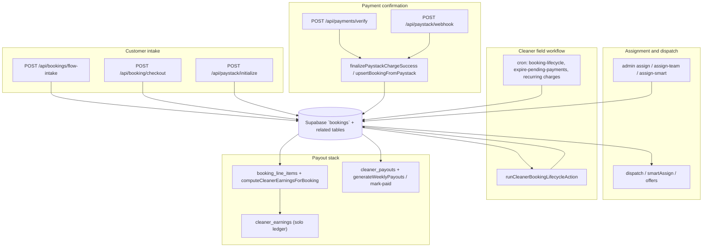

# Shalean backend end-to-end system audit

**Scope:** Booking lifecycle, customer / cleaner / admin dashboards, cross-surface convergence, financial and payout boundaries, canonical helpers, and mutation inventory.  
**Mode:** Read-only audit (no production behavior changes in this pass).  
**Primary source of truth:** `bookings` row + related tables (`booking_line_items`, `booking_cleaners`, `dispatch_offers`, `cleaner_earnings`, `cleaner_payouts`, invoices) unless code explicitly layers another authority.  
**Audit date:** 2026-05-10  
**Codebase root:** `apps/web` (Next.js App Router + Supabase admin client).

---

## Executive summary

The platform is **intentionally converging** on a shared operational read model (`describeBookingOperationalState` → `toCanonicalBookingLifecycleSurface`) while **writes remain distributed** across Paystack finalize paths, dispatch/assignment, cleaner lifecycle actions, admin overrides, and scheduled jobs. That split is **defensible** but creates **ongoing parity risk** wherever a surface reads raw columns, uses a lighter derivative (`deriveBookingOperationalPhase` alone), or applies **viewer-specific visibility rules** (especially cleaner pending-payment and recurring-unpaid policies).

**Bookings** hold authoritative lifecycle columns (`status`, timestamps, `dispatch_status`, `cleaner_response_status`, payment columns, payout columns, pricing snapshots). **`cleaner_earnings`** is a **solo post-completion ledger row** (inserted when lines are finalized — see `ensureCleanerEarningsLedgerRow`). **`cleaner_payouts`** is the **weekly batch / disbursement** layer; eligibility predicates are centralized in `bookingPayableForWeeklyBatch`.

**Strengths observed**

- Explicit contract: `describeBookingOperationalState` documents viewer-specific visibility, payment/recurring/payout strings, and capability matrices; customer wire attaches `canonicalLifecycle` from `toCanonicalBookingLifecycleSurface` (`attachCanonicalCustomerBookingLifecycle`).
- Customer UI has **parity tests** between API `canonicalLifecycle` and a local `describeDashboardBookingOperational` pass (`customerBookingCardOperationalDisplay`).
- DB migrations add **integrity constraints** (e.g. cleaner response vs `bookings.status` — see `supabase/migrations/20260608_bookings_operational_status_drift_repair.sql`).
- Payout weekly eligibility is **single-predicate** (`bookingPayableForWeeklyBatch`) with SQL audit mirrors referenced in code comments.

**Top risks (by severity)**

| Tier | Count (approx.) | Themes |
|------|-----------------|--------|
| **P0** | 4 | Money path multiplicity (Paystack verify + webhook + admin mark-paid); amount vs snapshot mismatch handling; admin completion override on recurring unpaid; any regression in idempotent finalize |
| **P1** | 8 | Dashboard drift (customer excludes `pending_payment` from authenticated APIs; cleaner `lite` vs `card` payloads; admin list bucketing vs detail badges); team vs solo payout/earnings split |
| **P2** | 10 | Duplicate or parallel classification (`deriveBookingOperationalPhase` vs full describe; legacy admin list classifier); broad mutation surface |
| **P3** | 2 | Tooling debt (ESLint volume; strict `tsc` failures in newer admin diagnostics) |

---

## Current system map

**Notable parallel rails**

- **Prepaid / Paystack checkout** vs **monthly invoice / accrual** (`billing_type`, `monthly_invoice_id`, `bookingUsesAccrualPayoutCap` in payout code).
- **Self-serve monthly dashboard booking** (`POST /api/dashboard/bookings`) — inserts real `bookings` without Paystack; DB triggers attach to monthly invoices (per route comment).

---

## Booking lifecycle trace

### Customer intake → pending payment row

| Step | Mechanism | Key modules / routes |
|------|-----------|----------------------|
| Service, rooms, extras, date/time, address | `POST /api/bookings/flow-intake` | `insertBookingFromFlowIntake` → pricing (`calculatePrice`, `buildPriceSnapshotV1Checkout`), `sanitizeBookingExtrasForPersist`, `insertPendingPaymentBookingRow` |
| Checkout lock validation | `POST /api/booking/checkout` | `validateLockForCheckout`, `resolveRatesSnapshotForLockedBooking` |
| Paystack session | `POST /api/paystack/initialize` | `paystackInitializeCore` |

### Payment confirmation

| Entry | Route / job | Canonical writer |
|-------|-------------|------------------|
| Browser return / client verify | `app/api/payments/verify/route.ts` | Pipeline into `finalizePaystackChargeSuccess` / `upsertBookingFromPaystack` |
| Paystack webhook | `app/api/paystack/webhook/route.ts` | Same finalize stack (reference + internal id resolution) |

**Risk:** Two entry points are **correct** for Paystack but must stay **bit-for-bit idempotent** on `paystack_reference` and booking idempotency (covered by tests under `lib/booking/*Paystack*.test.ts`).

### Assignment

- Automatic: `lib/dispatch/*` (`smartAssignCleaner`, `dispatchWithFallback`, offers, race handling).
- Manual: `lib/admin/performAdminAssignToCleaner`, `performAdminAssignTeam`, `runAdminAssignSmart`, API routes under `app/api/admin/bookings/[id]/assign*`.

### Cleaner workflow

- Central mutator: `lib/cleaner/runCleanerBookingLifecycleAction.ts` (accept, en-route, start, complete, issue paths — large file, multiple `.from("bookings").update` patches).
- Thin HTTP wrappers: `app/api/cleaner/bookings/[id]/*/route.ts`, `cleaner/jobs/[id]/*`.

### Recurring

- Generation: `app/api/cron/generate-recurring-bookings/route.ts`, `lib/recurring/insertRecurringOccurrenceBooking.ts` (and related).
- Charging: `app/api/cron/charge-recurring-bookings/route.ts` (duplicate path under `apps\web\app\api\cron\charge-recurring-bookings` — same logical route; Windows path casing only).
- Payment state refresh: `lib/recurring/refreshRecurringPaymentStateForBooking.ts` (writes `payment_state` JSON).

### Cancellation / expiry / refunds

- Customer cancel: `app/api/dashboard/bookings/[id]/cancel/route.ts`.
- Payment expiry cron: `app/api/cron/expire-pending-payments/route.ts`.
- Refund / reversal gating for payout recompute: `lib/payout/bookingEarningsIntegrity.ts` (`bookingPaymentRecomputeBlockedByRefund`).
- Admin edits: `lib/booking/adminEditBookingDetails.ts`, admin booking `PATCH`.

### Legacy / alternate funnels

- **Guest → user linking:** `app/api/auth/create-from-guest/route.ts` touches `bookings`.
- **Test create:** `app/api/test/create-booking/route.ts` (must never leak to production misuse — environment gated in deployment).
- **Admin create with payment:** `app/api/admin/bookings/with-payment/route.ts` — parallel creation path to funnel intake.

---

## Customer dashboard audit

### Data loading

| Concern | Implementation |
|---------|----------------|
| List + detail API | `lib/customer/customerBookingsForUser.ts` — `CUSTOMER_BOOKING_SELECT` from `lib/dashboard/customerBookingSelect.ts` |
| Normalization | `normalizeCustomerBookingRow` |
| Canonical lifecycle on wire | `attachCanonicalCustomerBookingLifecycle` → `toCanonicalBookingLifecycleSurface(..., "customer")` |

### Important behavioral split

- **List query explicitly excludes** `status in ('pending_payment','payment_expired')` (`.neq` filters in `loadCustomerBookingRowsForUser`).
- **Detail** returns **404** for `pending_payment` / `payment_expired` even if `user_id` matches (`loadCustomerBookingRowForUser`).

**Implication (P1):** Authenticated “My bookings” is **not** a complete view of all booking rows tied to the user; unpaid checkout rows are **intentionally invisible** here. Tracking / payment pages must carry that UX, or customers perceive “missing” bookings.

### Status and payment display

- Card header uses `customerBookingCardOperationalDisplay` (`lib/dashboard/customerBookingDisplay.ts`): compares API `canonicalLifecycle` to `describeDashboardBookingOperational` (customer viewer). Mismatch → `lifecycleSource: "derived"` (drift visible in tests/DOM data attributes).
- `customerBookingStatusLabel` uses **raw** `payment_status` for “Completed (billed monthly)” vs “Completed” — parallel to operational phase, not identical.

### Modify flows

- `lib/dashboard/dashboardBookingOperational.ts` — `canCustomerModifyDashboardBooking` / `dashboardBookingCustomerSurface` derive modify/rebook from `describeBookingOperationalState` with **customer** viewer.

**Verdict:** Customer dashboard is **partially unified** on read (canonical + describe parity) but **filters rows** at the API layer; do not treat customer API as the universal booking truth for unpaid checkout.

---

## Cleaner dashboard audit

### Job list

- `GET /api/cleaner/jobs` — `fetchCleanerVisibleBookingsMerged` / `cleanerJobsListRowPostFilter` (`lib/cleaner/cleanerBookingAccess.ts`), optional `lite` and `view=card` behavior (comment in route: **card** still runs stuck-earnings side effects unless `lite`).

### Earnings display on wire

- `resolveCleanerEarningsCents` (`lib/cleaner/resolveCleanerEarnings.ts`) — **precedence:** positive `cleaner_earnings_total_cents` → positive `payout_frozen_cents` → `display_earnings_cents` with edge cases for frozen `0`.

### Operational phase

- Job detail and orchestration use `describeBookingOperationalState` with `viewer: "cleaner"` (e.g. `app/cleaner/jobs/[id]/page.tsx`, `useCleanerLifecycleOrchestrator`).
- **Also** `deriveBookingOperationalPhase` is used directly in `runCleanerBookingLifecycleAction` for telemetry/diagnostics in at least one path.

### Consistency job card vs detail

- Card view can attach pay hints when `displayEarningsCents` null (`/api/cleaner/jobs` mapping) — **different shape** than full detail.

**Verdict:** Cleaner surfaces are the **most complex** (visibility modes, recurring unpaid, team roster). They use the **canonical describe** heavily but **not exclusively**; list modes trade fidelity for payload.

---

## Admin dashboard audit

### Booking list

- `GET /api/admin/bookings/route.ts` — wide column select string in route (operational + financial diagnostics on one row).
- Tab bucketing: `classifyAdminBookingListRow` (`lib/admin/adminBookingListClassify.ts`) uses **`deriveBookingOperationalPhase` only** (+ Johannesburg `date`), not the full `describeBookingOperationalState` payment/payout strings.

### Booking detail

- `GET /api/admin/bookings/[id]/route.ts` — raw `bookings` `select('*')` plus joined `booking_line_items`, `cleaner_earnings`, dispatch offers, issue reports, team summary, service QA.
- UI: `BookingDetailsView`, `BookingCard`, `BookingCardStatusBadge` use **`describeBookingOperationalState`** with `viewer: "admin"`.

### PATCH / overrides

- `PATCH /api/admin/bookings/[id]` — mutates `status`, `date`, `time`, `cleaner_id`, `selected_cleaner_id`; on cleaner change applies `BOOKING_PAYOUT_COLUMNS_CLEAR`, may reset lifecycle timestamps; on `completed` for recurring-unpaid rows sets **`admin_recurring_unpaid_completion_override_*`** and logs (`bookingIsRecurringPendingPayment`).

**Verdict:** Admin **detail** aligns with the canonical describe model; **list segmentation** is a **lighter** phase function — acceptable if documented, but it is a **known divergence surface** vs pills that use full describe.

---

## Cross-dashboard convergence matrix

| Concern | Customer | Cleaner | Admin | Converged? |
|---------|----------|---------|-------|------------|
| Operational phase / badge | `describeBookingOperationalState` (customer) + `canonicalLifecycle` on API | `describeBookingOperationalState` (cleaner) | `describeBookingOperationalState` (admin) + list bucket via `deriveBookingOperationalPhase` only | **Mostly** — admin list tabs lighter |
| Legacy `confirmed` status | Collapsed in `canonicalDbBookingStatus` | Same | Same | **Yes** |
| Pending payment visibility | Hidden from customer list/detail APIs | Special visibility rules in `cleanerBookingAccess` | Full row in admin | **No** (by design) |
| Payment state string | In `describeBookingOperationalState.paymentState` | Same family | Same | **Yes** (when describe used) |
| Payout state string | In describe + raw `payout_status` on row | Same | Same | **Yes** (when describe used) |
| Earnings amount shown | Less emphasis on jobs API; uses customer pricing fields | `resolveCleanerEarningsCents` + previews | Raw `cleaner_earnings` rows + booking columns | **Partial** — different **presentation layer** |
| Completion truth | `isAuthoritativeBookingCompleted` | Same rule in `deriveBookingOperationalPhase` | Same | **Yes** |
| Recurring unpaid completion | Via `admin_recurring_unpaid_completion_override_*` visible on row | Cleaner policy modules | Admin PATCH + logs | **Yes** (column-backed) |

---

## Financial and payout boundary audit

### Customer payment authority

- **Checkout rail:** Paystack amount vs **`price_snapshot` / locked booking** enforcement in `upsertBookingFromPaystack` and checkout validation (`validateLockForCheckout`). Tests: `paymentAmountVsSnapshot.test.ts`, `upsertBookingFromPaystack.test.ts`.
- **Invoice rail:** `monthly_invoices` status consulted for accrual payout cap (`bookingPayableForWeeklyBatch`).

### Cleaner payout eligibility (per booking)

- Booking columns: `payout_status`, `payout_frozen_cents`, `display_earnings_cents`, `cleaner_payout_cents`, `cleaner_earnings_total_cents`, `cleaner_line_earnings_finalized_at`, refund columns (via integrity helpers).
- Weekly batch inclusion: **`bookingPayableForWeeklyBatch`** (`lib/payout/bookingPayableForWeeklyBatch.ts`) — single source for “completed + settled + cents + not blocked by refund” split by accrual vs prepaid.

### `cleaner_earnings` role

- **Not** the Paystack weekly batch primary key — **`cleaner_payouts`** is.
- Acts as **per-booking ledger** for solo jobs once lines finalized (`ensureCleanerEarningsLedgerRow` inserts `pending` row; admin approval flows under `app/api/admin/cleaners/earnings/*`).
- Team jobs: ledger insert **skipped** (`reason: "team_job"`).

### `cleaner_payouts` role

- Generated / frozen / approved via `lib/payout/generateWeeklyPayouts.ts`, `persistCleanerPayout.ts`, `approvePayout.ts`, `markPayoutPaid`, admin routes under `app/api/admin/payouts/*`.

### Wrong-layer reads (audit flags)

- Any UI that shows **weekly** readiness from **`cleaner_earnings.status` alone** without checking booking `payout_status` / frozen cents — **risky** (admin earnings API documents cross-status comparison in `cleaner/earnings/reconcile` route comment).
- Cleaner jobs list **hides** some internal payout fields but exposes earnings via `resolveCleanerEarningsCents` — **intentional abstraction**; still must stay aligned with booking columns.

---

## Mutation map (representative inventory)

> Full static enumeration would include **100+** call sites across `lib/**` and `app/api/**`. Below: **primary writers** grouped by trigger. Severity: **C** = uses shared finalize / integrity helpers; **R** = direct field patch with business logic in-route or local helper (review carefully).

| Trigger / owner | Location | Fields / effects | C / R |
|-----------------|----------|------------------|-------|
| Flow intake | `insertBookingFromFlowIntake` → `insertPendingPaymentBooking` | Insert `pending_payment`, snapshots, customer fields | C |
| Paystack finalize | `upsertBookingFromPaystack`, `finalizePaystackChargeSuccess` | `status`, `payment_status`, amounts, `paystack_reference`, dispatch kickoff | C |
| Paystack init | `paystackInitializeCore` | reference, payment link fields | R |
| Payment decision | `lib/pay/paymentDecisionDispatch.ts` | dispatch-related patch | R |
| Dispatch core | `smartAssignCleaner`, `assignBooking`, `assignCleaner`, offers | `cleaner_id`, `dispatch_status`, timestamps | R |
| Cleaner lifecycle | `runCleanerBookingLifecycleAction` | `status`, `cleaner_response_status`, `en_route_at`, `started_at`, `completed_at`, etc. | C (centralized) |
| Admin PATCH | `app/api/admin/bookings/[id]/route.ts` | status/schedule/cleaner + payout column clear + recurring override markers | R (guarded) |
| Admin edit details | `adminEditBookingDetails.ts` | pricing, rooms, extras, snapshots, selective status/payment touches | R |
| Admin mark paid | `adminMarkBookingPaid.ts` | payment_status, amounts, lifecycle | C |
| Crons | `expire-pending-payments`, `booking-lifecycle`, `charge-recurring-bookings`, `generate-recurring-bookings`, `payment-link-reminders` | status / payment / recurring timestamps | Mixed |
| Payout persistence | `persistCleanerPayout.ts`, `approvePayout.ts`, `markPayoutPaid` | `payout_status`, `payout_frozen_cents`, `payout_id`, etc. | C |
| Line earnings | `computeCleanerEarningsForBooking.ts` | line `cleaner_earnings_cents`, booking `cleaner_earnings_total_cents` | C |
| Ledger insert | `ensureCleanerEarningsLedgerRow` | insert `cleaner_earnings` | C |
| DB triggers | e.g. `bookings_touch_became_pending_at_trg` | `became_pending_at` | DB |

---

## Duplicate logic map

| Topic | Locations | Notes |
|-------|-----------|-------|
| Operational phase | `deriveBookingOperationalPhase` vs full `describeBookingOperationalState` | Describe **wraps** derive; avoid UI using only derive when payment/payout strings needed |
| Admin list tabs | `classifyAdminBookingListRow` vs `BookingCard` describe | List uses **lighter** derive-based bucketing |
| Customer visible status | `customerBookingStatusLabel` vs `describeDashboardBookingOperational` | Two complementary lenses (billing label vs operational badge) |
| Earnings cents | `resolveCleanerEarningsCents` vs raw `display_earnings_cents` / frozen | Precedence comments are the contract |
| Paystack finalize | `payments/verify` + `paystack/webhook` | Required duplication — rely on idempotency + tests |

---

## Canonical helper coverage

| Invariant | Canonical helper | Duplicates / bypass | Suggested owner module |
|-----------|------------------|---------------------|------------------------|
| DB status vocabulary | `canonicalDbBookingStatus` | Raw string compares scattered | `lib/booking/canonicalBookingStatus.ts` |
| Operational phase (fieldwork) | `deriveBookingOperationalPhase` | `BookingTimeline.tsx`, `app/track/[bookingId]/page.tsx` | Keep **one** UI helper that calls describe for dashboards |
| Full operational + payment + payout + capabilities | `describeBookingOperationalState` | Partial overlaps in classify-only paths | `lib/booking/describeBookingOperationalState.ts` |
| Customer/server read model | `toCanonicalBookingLifecycleSurface` | Fallback derive in `customerBookingCardOperationalDisplay` | `lib/booking/readModels/bookingReadModel.ts` |
| Weekly batch monetary gate | `bookingPayableForWeeklyBatch` | Avoid ad-hoc SQL in apps; SQL audits in `supabase/queries/*` | `lib/payout/bookingPayableForWeeklyBatch.ts` |
| Cleaner visible earnings | `resolveCleanerEarningsCents` | Legacy `cleaner_payout_cents` on wire (stripped in jobs map) | `lib/cleaner/resolveCleanerEarnings.ts` |
| Ledger row existence (solo) | `ensureCleanerEarningsLedgerRow` | Admin “fix earnings” routes | `lib/payout/ensureCleanerEarningsLedger.ts` |

---

## Risk register

### P0 — money, payment, payout, or booking truth

1. **Dual finalize ingress (verify + webhook)** without strict idempotency or amount/snapshot parity → duplicate credit or wrong status (mitigated by tests; still highest operational risk).
2. **`upsertBookingFromPaystack` amount vs snapshot mismatch** → integrity statuses (`payment_mismatch`, `payment_reconciliation_required`) — needs ops runbook discipline.
3. **Admin `PATCH` completion on recurring-unpaid rows** → explicit override columns + warn logs; risk of **completed job without settled customer cash** if misused.
4. **Cleaner reassignment + payout column clear** (`BOOKING_PAYOUT_COLUMNS_CLEAR`) — correct for truth reset; if partial failure between clear and recompute, transient **null earnings** states possible (mitigated by recompute hooks / crons).

### P1 — dashboard mismatch or wrong operational action

1. Customer APIs **hide** `pending_payment` / `payment_expired` rows → mismatch vs admin/cleaner or marketing tracking pages.
2. Cleaner **`lite=1`** skips side-effects that **card** view runs — mobile clients on legacy mode can show **stale earnings**.
3. Admin **list tabs** (`classifyAdminBookingListRow`) vs **detail pills** (full describe) can bucket differently for edge statuses (e.g. `payment_expired` forced to completed bucket).
4. **Team jobs:** solo `cleaner_earnings` ledger skipped; roster + `payout_owner_cleaner_id` — easier to show **different** “who gets paid” vs **who does work** if UI reads wrong column.
5. **Recurring `payment_state` JSON** maintained by `refreshRecurringPaymentStateForBooking` — second truth next to `payment_status`; drift if one writer fails.

### P2 — duplication / maintainability

1. Large **`runCleanerBookingLifecycleAction`** surface — many branches touching same columns.
2. Parallel **admin booking creation** paths (funnel vs `with-payment` vs dashboard monthly).
3. Multiple **cron** routes touching recurring payment timestamps (`recurring_next_charge_attempt_at` in generate + backfill paths).
4. **`legacyClassifyAdminBookingListRow`** retained for mismatch logging — dead weight unless env flag used.

### P3 — cleanup / hygiene

1. ESLint: **301** reported problems in `apps/web` run (see commands section).
2. `npx tsc --noEmit` failures concentrated in newer admin payout diagnostics — quality gate not green.

---

## Recommended fix phases (conservative)

### Phase A — Logging / diagnostics only

- Enable / standardize `CANONICAL_OPERATIONAL_MISMATCH_LOG` sampling in staging for admin list vs describe.
- Extend payout integrity cron logging (`payout-integrity-daily`) fields if gaps vs `phase15a` read models.

### Phase B — Canonical read helpers only

- Ensure **every** dashboard list row includes `canonicalLifecycle` **or** server-side `describeBookingOperationalState` output (no raw `status` badges).
- Unify admin list bucket to call **same** `describeBookingOperationalState` **read-only** for bucket key (keep performance cap).

### Phase C — Narrow write-path convergence

- Document a **single** “post-payment success” orchestration entry (`finalizePaystackChargeSuccess`) as the only mutator from Paystack events; route all verify/webhook code through it (already mostly true — verify drift only).
- Reduce direct `.from('bookings').update` in crons by funneling through typed patch builders.

### Phase D — Dashboard display convergence

- Customer: explicit **“awaiting payment”** surface if product wants parity (separate from hiding rows).
- Cleaner: deprecate `lite=1` or make it call the same post-process as card for earnings.

### Phase E — Payout enforcement after sign-off

- Only after SQL audits (`supabase/queries/audit_payout_subsystem_convergence_phase11.sql` family) and stakeholder sign-off: tighten RLS / constraints tying `cleaner_payouts` to `bookingPayableForWeeklyBatch` predicates.

---

## Verification commands (2026-05-10)

| Command | cwd | Result |
|---------|-----|--------|
| `npm run lint` | `apps/web` | **Exit 1** — ESLint reported **301** problems (**210** errors, **91** warnings). |
| `npx tsc --noEmit` | `apps/web` | **Exit 2** — TypeScript errors including `app/admin/payouts/phase15a-diagnostics/page.tsx` (Select component API mismatch), `lib/payout/phase15aAnomaliesReadModel.ts` (`payout_id` / `cleaner_id` on narrowed types), duplicate `ok` key in repair routes, test typing. |
| `npm test` (`vitest run`) | `apps/web` | **Exit 0** — **169** test files, **798** tests passed. |

**Note:** `package.json` does not define `npm run typecheck`; `npx tsc --noEmit` was used as the typecheck equivalent.

---

## Deliverables checklist

| Item | Value |
|------|-------|
| Audit report path | `docs/audits/shalean-backend-end-to-end-system-audit.md` |
| Files changed | **This file only** (`docs/audits/shalean-backend-end-to-end-system-audit.md`) |
| Production code changed | **None** |

---

## Files inspected (representative)

**Booking & payment:** `lib/booking/insertBookingFlowIntake.ts`, `insertPendingPaymentBooking.ts`, `paystackInitializeCore.ts`, `finalizePaystackChargeSuccess.ts`, `upsertBookingFromPaystack.ts`, `runPaystackVerifyFinalizePipeline.ts`, `app/api/payments/verify/route.ts`, `app/api/paystack/webhook/route.ts`, `app/api/bookings/flow-intake/route.ts`, `app/api/booking/checkout/route.ts`.

**Lifecycle & status:** `lib/booking/deriveBookingOperationalPhase.ts`, `lib/booking/describeBookingOperationalState.ts`, `lib/booking/canonicalBookingStatus.ts`, `lib/booking/readModels/bookingReadModel.ts`, `lib/booking/processLifecycleJob.ts`, `app/api/cron/booking-lifecycle/route.ts`.

**Customer:** `lib/customer/customerBookingsForUser.ts`, `lib/customer/attachCanonicalCustomerBookingLifecycle.ts`, `lib/dashboard/customerBookingSelect.ts`, `lib/dashboard/customerBookingDisplay.ts`, `lib/dashboard/dashboardBookingOperational.ts`, `app/api/customer/bookings/[id]/route.ts`.

**Cleaner:** `app/api/cleaner/jobs/route.ts`, `lib/cleaner/runCleanerBookingLifecycleAction.ts`, `lib/cleaner/cleanerBookingAccess.ts`, `lib/cleaner/resolveCleanerEarnings.ts`, `lib/cleaner/cleanerMobileBookingMap.ts`, `app/cleaner/jobs/[id]/page.tsx`.

**Admin:** `app/api/admin/bookings/route.ts`, `app/api/admin/bookings/[id]/route.ts`, `lib/admin/adminBookingListClassify.ts`, `components/admin/BookingDetailsView.tsx`, `components/admin/BookingCard.tsx`.

**Payout:** `lib/payout/bookingPayableForWeeklyBatch.ts`, `lib/payout/ensureCleanerEarningsLedger.ts`, `lib/payout/persistCleanerPayout.ts`, `lib/payout/computeCleanerEarningsForBooking.ts`, `lib/payout/generateWeeklyPayouts.ts`, `lib/payout/bookingEarningsIntegrity.ts`.

**DB:** `supabase/migrations/20260608_bookings_operational_status_drift_repair.sql`, `20260489_bookings_became_pending_at_unassignable_dispatch.sql` (sample triggers).

**Grep-wide:** All `app/api/**/route.ts` booking-related paths and `rg "\\.from\\(\"bookings\"\\)"` under `apps/web` for mutation inventory.

---

*End of audit document.*
