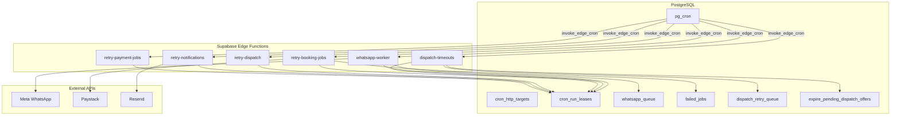
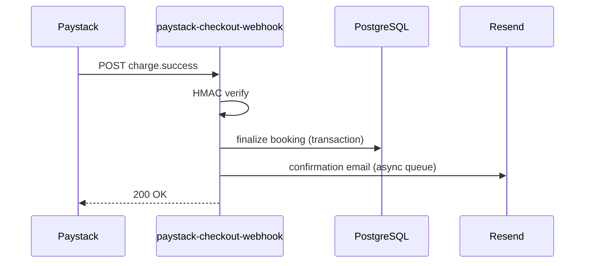
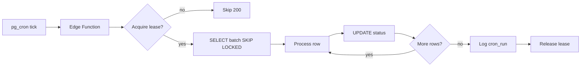

# Backend Migration Architecture — Vercel → Supabase

**Status:** Phase 1a implemented (`whatsapp-worker` Edge Function) — **pg_cron not cut over yet** (shadow mode)  
**Date:** July 9, 2026  
**Scope:** Shalean Platform (`apps/web` + `supabase/`)

---

## 1. Objective

Permanently reduce **Vercel Fluid Active CPU** by moving background processing off Vercel Node.js Functions while keeping the frontend on Vercel for low-latency user-facing flows.

| Layer | Responsibility |
|-------|----------------|
| **Vercel** | Next.js UI, SSR, RSC, booking funnel, auth, admin/customer/cleaner CRUD, lightweight APIs |
| **Supabase Edge Functions** | Cron workers, webhooks, queue processors, external API calls (Paystack, Resend, Meta) |
| **PostgreSQL** | Pure DB work: expiry, cleanup, pruning, bulk status updates, triggers |

---

## 2. Target architecture

```
┌─────────────────────────────────────────────────────────────────────────┐
│                              VERCEL                                     │
│  Next.js 16 · proxy.ts · SSR/RSC · Booking funnel · Admin/Customer UI │
│  Lightweight APIs: quote, price, availability, auth, CRUD, PDF proxy    │
└───────────────────────────────┬─────────────────────────────────────────┘
                                │ User traffic only
                                ▼
┌─────────────────────────────────────────────────────────────────────────┐
│                            SUPABASE                                     │
│                                                                         │
│  ┌──────────────┐    pg_cron + pg_net    ┌──────────────────────────┐  │
│  │  PostgreSQL  │ ─────────────────────► │  Edge Functions (Deno)   │  │
│  │  functions   │    invoke_edge_cron()  │  · whatsapp-worker       │  │
│  │  triggers    │                        │  · dispatch-timeouts     │  │
│  │  queues      │ ◄── read/write batch ── │  · retry-* (split)       │  │
│  └──────────────┘                        │  · phase-2 crons         │  │
│                                          │  · phase-3 webhooks      │  │
│  Tables: whatsapp_queue, failed_jobs,    └──────────────────────────┘  │
│  dispatch_retry_queue, booking_lifecycle_jobs, cron_run_leases           │
└─────────────────────────────────────────────────────────────────────────┘
                                │
                    Paystack · Resend · Meta WhatsApp · Google APIs
```

### Scheduler evolution

**Today:** `pg_cron` → `invoke_nextjs_cron()` → `https://shalean.co.za/api/cron/*` (Vercel)

**Target:** `pg_cron` → `invoke_edge_cron(function_name)` → `https://<project>.supabase.co/functions/v1/<name>`

Vercel cron routes remain as **fallback** during cutover (feature-flagged), then return `410` or proxy to Edge.

---

## 3. Queue worker contract

Every worker follows the same pattern — **no monoliths, no blocking polls**:

```
1. Authenticate (CRON_SECRET or service role)
2. Acquire lease (cron_run_leases)
3. SELECT batch FOR UPDATE SKIP LOCKED
4. Process each row (external API if needed)
5. UPDATE row status / DELETE on success
6. Log result → system_logs / cron_runs
7. Release lease
8. Exit (scheduler invokes again)
```

**Forbidden in Edge Functions:**
- `while (Date.now() < deadline)` poll loops
- `setTimeout` waits > 1s except explicit rate-limit pacing
- Processing more than one responsibility per function
- Files > 250 lines (split into `_shared` modules)

---

## 4. Folder structure

```
supabase/
├── functions/
│   ├── _shared/                    # Reusable Deno modules (see contracts)
│   │   ├── config.ts
│   │   ├── logger.ts
│   │   ├── supabaseAdmin.ts
│   │   ├── auth.ts
│   │   ├── cron.ts
│   │   ├── paystack.ts
│   │   ├── resend.ts
│   │   ├── whatsapp.ts
│   │   ├── errors.ts
│   │   ├── responses.ts
│   │   └── utils.ts
│   │
│   ├── whatsapp-worker/            # Phase 1 — Priority 1
│   ├── dispatch-timeouts/          # Phase 1 — Priority 2
│   ├── retry-booking-jobs/         # Phase 1 — Priority 3a
│   ├── retry-dispatch/             # Phase 1 — Priority 3b
│   ├── retry-notifications/        # Phase 1 — Priority 3c
│   ├── retry-payment-jobs/         # Phase 1 — Priority 3d
│   │
│   ├── booking-lifecycle/          # Phase 2
│   ├── generate-recurring-bookings/
│   ├── charge-recurring-bookings/
│   ├── payment-link-reminders/
│   ├── booking-reminders/
│   ├── deferred-payment-link-emails/
│   ├── assignment-ack-timeout/
│   ├── notification-health/
│   ├── ops-health/
│   │
│   ├── paystack-checkout-webhook/  # Phase 3 (rename from route path)
│   ├── paystack-transfer-webhook/
│   └── whatsapp-webhook/
│
├── migrations/
│   └── (future) YYYYMMDD_invoke_edge_cron.sql
│
└── ARCHITECTURE.md                 # Pointer to this doc
```

---

## 5. Shared modules (`_shared/`)

| Module | Responsibility | Ports from |
|--------|----------------|------------|
| `config.ts` | Env validation, feature flags, batch limits | `process.env.*` patterns in cron routes |
| `logger.ts` | `logSystemEvent`, `logCronRun`, `reportOperationalIssue` | `lib/logging/systemLog.ts` |
| `supabaseAdmin.ts` | Service-role client singleton | `lib/supabase/admin.ts` |
| `auth.ts` | `verifyCronSecret`, webhook HMAC helpers | `lib/cron/verifyCronSecret.ts`, Paystack HMAC |
| `cron.ts` | `acquireCronLock`, `releaseCronLock`, `withCronLock` | `lib/cron/cronLock.ts`, `cronLockKeys.ts` |
| `paystack.ts` | Verify, charge authorization, transfer reconcile | `lib/payments/*`, `lib/paystack/*` |
| `resend.ts` | Send email via Resend API | `lib/email/resendFrom.ts` |
| `whatsapp.ts` | Meta Graph API send + safeguards | `lib/dispatch/metaWhatsAppSend.ts`, `lib/whatsapp/*` |
| `errors.ts` | Typed errors, operational issue helpers | `lib/logging/systemLog.ts` |
| `responses.ts` | Standard JSON response shapes | Next.js `NextResponse` patterns |
| `utils.ts` | Email normalize, date YMD, timing-safe compare | `lib/booking/normalizeEmail.ts`, etc. |

**Porting strategy:** Copy logic into Deno-compatible modules incrementally. Do **not** import from `apps/web/lib` at runtime (different runtime). Use a future `packages/worker-core` if duplication becomes painful.

---

## 6. Phase 1 — Highest CPU consumers

### Priority 1: `whatsapp-worker`

| Attribute | Value |
|-----------|-------|
| **Current route** | `apps/web/app/api/cron/whatsapp-worker/route.ts` |
| **Schedule** | `* * * * *` (1,440 inv/day) |
| **Core lib** | `lib/whatsapp/queue.ts` → `processWhatsAppPendingBatch` |
| **Edge Function** | `supabase/functions/whatsapp-worker/index.ts` |
| **Pattern** | Queue worker: read 15 pending rows → Meta API → update status |
| **Est. CPU savings** | **~2.0–2.5 h/month** Fluid Active CPU |

**Dependencies to port:**
- `lib/whatsapp/queue.ts` (batch processor)
- `lib/dispatch/metaWhatsAppSend.ts` (Graph API)
- `lib/whatsapp/whatsappMetaSafeguards.ts` (rate limits)
- `lib/whatsapp/queueTerminalSms.ts` (SMS fallback)
- `lib/notifications/customerPhoneNormalize.ts`

**Keep on Vercel during cutover:** Route returns `200` with `{ migrated: true, forwarded: true }` or `410` after stable period.

---

### Priority 2: `dispatch-timeouts`

| Attribute | Value |
|-----------|-------|
| **Current route** | `apps/web/app/api/cron/dispatch-timeouts/route.ts` |
| **Schedule** | `* * * * *` (1,440 inv/day) |
| **Core lib** | `lib/dispatch/runDispatchTimeouts.ts` |
| **Edge Function** | `supabase/functions/dispatch-timeouts/index.ts` |
| **PostgreSQL** | `expire_pending_dispatch_offers()` already exists |
| **Est. CPU savings** | **~2.0–2.5 h/month** |

**Hybrid approach (recommended):**

```
Edge Function entry
  ├── RPC: expire_pending_dispatch_offers(200)     ← PostgreSQL (pure DB)
  ├── RPC: enqueue_stranded_pending_bookings()     ← if exists / add migration
  └── TS: processDeferredDispatchOfferNotifications ← external notify only
```

**Dependencies to port:**
- `lib/dispatch/runDispatchTimeouts.ts`
- `lib/dispatch/dispatchOffers.ts` → `processDeferredDispatchOfferNotifications` only
- `lib/dispatch/dispatchRetryQueue.ts` → `enqueueStrandedBookings`
- `lib/dispatch/dispatchEscalation.ts` → admin webhook (optional)

**Do NOT port:** `offerRace.ts` / `dispatchWithFallback.ts` poll loops — not used in cron path.

---

### Priority 3: Split `retry-failed-jobs`

| Attribute | Value |
|-----------|-------|
| **Current route** | `apps/web/app/api/cron/retry-failed-jobs/route.ts` (552 lines) |
| **Schedule** | `* * * * *` (1,440 inv/day) |
| **Problem** | Monolith: 12+ responsibilities, 30s debounce still wakes Vercel every minute |

#### Split mapping

| New Edge Function | Responsibility | Source lines / lib | Schedule |
|-------------------|----------------|-------------------|----------|
| `retry-booking-jobs` | `failed_jobs` types `booking_insert`, `payment_reconciliation` → `finalizePaidBooking` | route.ts L218–387, `lib/booking/bookingOperations.ts` | `* * * * *` |
| `retry-payment-jobs` | `payment_mismatch`, `booking_finalize` terminal drain; monthly child settlement repair | route.ts L162–216, L447–450, `lib/monthlyInvoice/repairPaidMonthlyInvoiceChildSettlementDrift.ts` | `*/5 * * * *` |
| `retry-dispatch` | `processDispatchRetryQueue`, `runOfferExpiryMaintenance`, SLA breaches, offer timeout metrics | route.ts L437–440, `lib/dispatch/dispatchRetryQueue.ts`, `lib/dispatch/dispatchSlaWatchdog.ts` | `* * * * *` |
| `retry-notifications` | Lifecycle job retry, issue repairs, review SMS, abandon checkout reminders | route.ts L389–435, L442–443, `lib/booking/processLifecycleJob.ts`, `lib/reviews/reviewPromptSms.ts` | `*/5 * * * *` |
| ~~retry-whatsapp~~ | **Merged into `whatsapp-worker`** — no separate failed_jobs whatsapp drain in monolith | — | — |

**Alerts / housekeeping** (move to `ops-health` in Phase 2):
- `failed_jobs` backlog alert (L114–139)
- Unassignable bookings alert (L141–160)
- `failed_jobs` terminal cleanup (L452–470)
- `maybeRollupYesterdayLifecycleMetrics` (L472–477)
- `syncCleanerQualityFlags`, `logDailyOpsSummaryIfNeeded` (L444–445)

**Est. CPU savings (split):** **~2.5–3.0 h/month** (smaller functions = shorter cold starts)

---

## 7. Phase 2 — Scheduled jobs

| Edge Function | Current route | Schedule | Core lib |
|---------------|---------------|----------|----------|
| `booking-lifecycle` | `/api/cron/booking-lifecycle` | `*/15 * * * *` | `route.ts` + completion, referrals, payouts |
| `generate-recurring-bookings` | `/api/cron/generate-recurring-bookings` | `*/10 * * * *` | 504-line route |
| `charge-recurring-bookings` | `/api/cron/charge-recurring-bookings` | `*/10 * * * *` | Paystack charge loop |
| `payment-link-reminders` | `/api/cron/payment-link-reminders` | `*/15 * * * *` | Email enqueue |
| `booking-reminders` | `/api/cron/booking-reminders` | `*/15 * * * *` | Pre-visit reminders |
| `deferred-payment-link-emails` | `/api/cron/deferred-payment-link-emails` | `*/5 * * * *` | Queue drain |
| `assignment-ack-timeout` | `/api/cron/assignment-ack-timeout` | `*/5 * * * *` | **Candidate for PostgreSQL** |
| `notification-health` | `/api/cron/notification-health` | `*/10 * * * *` | **Candidate for PostgreSQL** |
| `ops-health` | `/api/cron/ops-health` | `*/15 * * * *` | Metrics aggregation |

**Est. additional CPU savings:** **~1.8–2.4 h/month**

---

## 8. Phase 3 — Webhooks (after cron stable)

| Edge Function | Current route | Notes |
|---------------|---------------|-------|
| `paystack-checkout-webhook` | `/api/paystack/webhook` | HMAC sha512, `finalizePaidBooking` pipeline |
| `paystack-transfer-webhook` | `/api/webhooks/paystack` | Cleaner payout transfers |
| `whatsapp-webhook` | `/api/webhooks/whatsapp` | Meta verify + inbound replies |

**Cutover:** Run dual-write (both URLs active) for 1 week, compare `system_logs`, switch Paystack/Meta dashboard URL.

**Est. additional CPU savings:** **~1.0 h/month** + lower checkout latency

---

## 9. PostgreSQL function candidates

Logic that should **not** be JavaScript:

| Function | Status | Replaces |
|----------|--------|----------|
| `expire_pending_dispatch_offers(p_limit)` | **Exists** | Part of `runDispatchTimeouts` |
| `purge_stale_pending_payment_bookings()` | **Exists** | Complements `expire-pending-payments` cron |
| `run_analytics_warehouse_nightly()` | **Exists** | HTTP analytics-warehouse |
| `repair_empty_team_booking_rosters(40)` | **Exists** | — |
| `prune_*` (4 functions) | **Exist** | prune crons |
| `enqueue_stranded_pending_bookings()` | **Verify/add** | `enqueueStrandedBookings` in TS |
| `expire_pending_payments_batch()` | **New** | `/api/cron/expire-pending-payments` |
| `mark_monthly_invoices_overdue_batch()` | **New** | `/api/cron/mark-monthly-invoices-overdue` |
| `assignment_ack_timeout_batch()` | **New** | `/api/cron/assignment-ack-timeout` |
| `prune_failed_jobs_terminal(older_than)` | **New** | Cleanup in retry monolith |
| `notification_health_snapshot()` | **New** | `/api/cron/notification-health` |

**Trigger candidates (future):**
- `booking_lifecycle_jobs` enqueue on `bookings.status` change
- `whatsapp_queue` enqueue on notification template match
- Referral credit on first completed booking (partially in lifecycle cron today)

---

## 10. Remains on Vercel (explicit)

### User-facing (do not migrate)

- Booking confirmation: `/api/booking-v2/confirm`, `/api/bookings`, `/api/book/confirm`
- Quote/price: `/api/booking/price`, `/api/booking/quote`, `/api/booking-v2/*`
- Availability: `/api/booking/time-slots`, `/api/booking/cleaners`, `/api/cleaners/available`
- Auth: `/api/auth/*`, `/api/cleaner/login`, `proxy.ts` session refresh
- Customer/cleaner self-service CRUD
- Admin CRUD (~150 routes)
- Invoice PDF proxies (Zoho stream-through)
- SSR pages, RSC, marketing, blog

### Lightweight (keep unless proven heavy)

- `/api/health`, `/api/analytics/event`, `/api/cities`, `/api/pricing/catalog`
- `/api/referrals/validate-checkout` (once per checkout)
- `/api/offers/*` (token-based, low volume)

---

## 11. Dependency diagrams

### Phase 1 cutover



### Phase 3 webhooks



### Data flow: queue worker



---

## 12. Migration roadmap

| Phase | Duration | Deliverables | Rollback |
|-------|----------|--------------|----------|
| **0 — Scaffold** | 2 days | Folder structure, `_shared` contracts, `invoke_edge_cron` migration draft, feature flags | N/A |
| **1a — whatsapp-worker** | 3–5 days | Edge function + pg_cron pointer + shadow logging | Revert pg_cron to Vercel URL |
| **1b — dispatch-timeouts** | 3–5 days | SQL-first + thin Edge wrapper | Same |
| **1c — retry split** | 5–7 days | 4 functions, retire monolith route | Re-enable single Vercel route |
| **1 — Stabilize** | 1 week | Monitor `cron_runs`, compare metrics, no regressions | — |
| **2 — Scheduled batch** | 2 weeks | 9 Edge functions | Per-function rollback |
| **3 — Webhooks** | 1 week | 3 Edge functions + dashboard URL updates | Dual URL period |
| **4 — SQL consolidation** | 1 week | New PostgreSQL functions, remove HTTP for pure DB | — |
| **5 — Cleanup** | 3 days | 410 on Vercel cron routes, delete dead code | — |

### Cutover checklist (per function)

- [ ] Edge function deployed to staging
- [ ] Secrets in Supabase Vault (`CRON_SECRET`, `PAYSTACK_SECRET_KEY`, `RESEND_API_KEY`, Meta tokens)
- [ ] `cron_run_leases` job name registered
- [ ] Shadow mode: pg_cron calls Edge, Vercel route still active, compare logs 48h
- [ ] Switch pg_cron to Edge URL
- [ ] Monitor 7 days
- [ ] Vercel route → `410 Gone` or proxy stub

---

## 13. CPU reduction estimates

**Baseline:** 12h 7m Fluid Active CPU / 4h Hobby limit (303% over)

| Phase | Functions moved | Est. Fluid CPU after | Under 4h? |
|-------|-----------------|----------------------|-----------|
| Current | 0 | 12.1 h | No |
| Phase 1 complete | 6 (3 priorities) | **4.5–5.5 h** | Marginal |
| Phase 2 complete | +9 scheduled | **2.5–3.5 h** | Yes |
| Phase 3 complete | +3 webhooks | **1.5–2.5 h** | Yes (headroom) |
| Phase 4 SQL | DB-only jobs | **1.0–2.0 h** | Yes |

**Note:** Account has 6+ Vercel projects sharing quota. Shalean Phase 1 alone may not unpause account if siblings consume heavily.

---

## 14. Risks

| Risk | Severity | Mitigation |
|------|----------|------------|
| Deno ≠ Node (`crypto`, npm packages) | **High** | Port incrementally; test HMAC + Paystack in staging |
| Duplicate schedulers (Vercel + Edge) | **High** | `cron_run_leases`; verify Vercel dashboard has zero crons |
| `finalizePaidBooking` complexity in Edge | **High** | Phase 1c last; extensive integration tests |
| Paystack webhook URL change | **Medium** | Dual URL for 1 week |
| Lost observability | **Medium** | Mirror `logCronRun` to existing tables |
| Edge 150s timeout | **Medium** | Batch limits; split functions |
| Secret sprawl | **Medium** | Supabase Vault; document in runbook |
| Breaking admin dispatch assign (poll loops) | **Low** | Not in scope — stays on Vercel |
| pg_cron placeholder `cron_http_targets` | **High** | Pre-flight check before any cutover |

---

## 15. Implementation gate

**Do not write migration logic until:**

1. This architecture is reviewed and approved
2. Staging Supabase project available for Edge Function deploy
3. Shadow-mode logging strategy agreed
4. Rollback procedure documented in runbook

---

## Related documents

- `docs/runbook-cron-secret-rotation.md` — current pg_cron setup
- `supabase/functions/README.md` — Edge Function development guide
- `supabase/ARCHITECTURE.md` — quick pointer
