# Phase 11B — Payout authority and lifecycle specification (audit-only)

**Status:** specification / decision record. **No runtime changes** are implied by this document.  
**Prerequisite:** Phase 11 payout subsystem map and `supabase/queries/audit_payout_subsystem_convergence_phase11.sql`.  
**Successor:** Phase 12 — eligibility enforcement convergence (implement only after sign-off here).

---

## 1. Problem statement

There is **no single payout truth** across:

- `bookings` (`payout_status`, `payout_frozen_cents`, `payout_id`, `payment_status`, invoice link),
- weekly **`cleaner_payouts`** batching,
- **`cleaner_earnings`** ledger + Paystack disbursements,
- **admin** RPCs and UI,
- **accrual caps** (`bookingPayoutConstraintCapCents` / DB checks).

Terms such as **eligible**, **payable**, **batched**, **approved**, and **paid** are **not** the same lifecycle stage on every rail. Phase 12 must not proceed until **authority** and **lifecycle** are explicitly chosen per billing model.

---

## 2. Payout lifecycle — conceptual map (target vocabulary)

These are **logical** stages; today they may be represented on different tables or missing for some rails.

```mermaid
stateDiagram-v2
  direction LR
  [*] --> Accrued: earnings basis exists\n(display / line / legacy payout)
  Accrued --> CustomerSettled: customer cash or\ninvoice settlement truth
  CustomerSettled --> PayoutEligible: policy gate\n(booking and/or ledger)
  PayoutEligible --> Batched: weekly cleaner_payouts\nor ledger batch
  Batched --> TransferPending: Paystack / run\ninitiated
  TransferPending --> Paid: funds confirmed
  Paid --> Reversed: chargeback /\nmanual reversal
  Reversed --> [*]
```

**Mapping notes (current system, not prescriptive):**

| Logical stage | Typical signals today | Gap |
|----------------|------------------------|-----|
| Accrued | `cleaner_payout_cents`, `display_earnings_cents`, line finalize | Not unified |
| Customer settled | `payment_status`, `monthly_invoices.status` | Weekly batch does not require this |
| Payout eligible | `payout_status = eligible` (monthly path) | Prepaid may stay `pending` on booking |
| Batched | `bookings.payout_id` → `cleaner_payouts` | Can attach **before** booking `eligible` |
| Transfer pending | `cleaner_payouts` / run status; ledger `processing` | Parallel rails |
| Paid | `payout_status = paid` + timestamps; ledger `paid`; Paystack | Must not double-pay |

---

## 3. Authority matrix — “what authorizes payout?”

Each column is a **candidate** authority. **No row is universally sufficient today.**

| Authority signal | Monthly invoice rail | Weekly `cleaner_payouts` | `cleaner_earnings` + Paystack | Admin mark-paid |
|------------------|----------------------|-------------------------|------------------------------|-----------------|
| `monthly_invoices.status = paid` | Strong (settlement) | Not consulted | Not consulted | Implied for eligible lines |
| `payment_status = success` | Strong after settle | Not required for batch | Partial context for caps | N/A |
| `payout_status = eligible` | Set at settlement | **Not required** to enter batch | Different string set | **Required** for RPC |
| `payout_frozen_cents` | Set with eligible; immutable after | Not required for batch link | N/A | Used for amounts |
| `cleaner_payout_cents > 0` + `completed` | Necessary but not sufficient for *disbursement* | **Primary driver for batch** | N/A | N/A |
| `payout_id` null | N/A | **Gate for inclusion** | N/A | N/A |
| `cleaner_earnings.status = approved` | N/A | N/A | **Driver for auto-transfer** | N/A |

**Decision required (Phase 11B sign-off):** For each billing model, mark which authorities are **necessary** and **sufficient** to move to: (a) batch inclusion, (b) ledger approval, (c) booking `eligible`, (d) mark-paid.

---

## 4. Per-rail settlement and batching requirements (draft for decision)

| Billing model (conceptual) | Customer settlement truth (today) | Booking payout gate (today) | Weekly batch (today) | Open decision |
|----------------------------|-------------------------------------|------------------------------|------------------------|----------------|
| Prepaid per booking | Paystack / `payment_status` | **`payout_status` often stays `pending`**; cents persisted via persist path | **May batch on completed + cents + null `payout_id`** | Should batch require `payment_status = success` and/or `payout_status = eligible`? |
| Recurring monthly invoice | Invoice paid + line settle | **`eligible` + `payout_frozen_cents`** at settle | Same weekly rule as prepaid | Should batch **require** `eligible` (or invoice `paid`) for lines with `monthly_invoice_id`? |
| Line-item ledger | Frozen line snapshot + `cleaner_earnings` | Parallel model | Distinct from `cleaner_payouts` weeklies | How ledger “approved” relates to booking `paid` |

---

## 5. Batching eligibility rules (Phase 12 design input)

**Observed today (`generateWeeklyPayouts`):**

- Filters: `status = completed`, `is_test = false`, `payout_id is null`, positive `cleaner_payout_cents`, completion week window, per cleaner.
- **Does not** filter: `payout_status`, `payment_status`, `monthly_invoices.status`.

**Specification question:** Should weekly batch membership require **any** of:

1. `payout_status = eligible`, or  
2. `payment_status = success` (and not `pending_monthly`), or  
3. `monthly_invoice_id is null OR monthly_invoices.status = paid`, or  
4. Exclusion list for accrual-unsettled lines only?

Recommendation for Phase 12 **design** (not implemented here): **define one predicate `booking_payable_for_weekly_batch(booking)`** per billing mode and document replay/idempotency (below).

---

## 6. Refund / reversal semantics (Phase 11C — read-only audit)

**Scope:** Traced application code and selected DB triggers/migrations. **Not** covered: manual Paystack dashboard operations with no webhook, or future product work.

### 6.1 Paystack webhooks — customer charges (`apps/web/app/api/paystack/webhook/route.ts`)

| Event | Behaviour |
|-------|-----------|
| `charge.failed` | **No booking or payout mutation.** Resolves `bookingId` when possible, logs `reportOperationalIssue`, posts a dispatch-control alert (`payment_charge_failed`), returns `200`. |
| `charge.success` | **Forward settlement only:** tries `applyMonthlyInvoicePayment` (monthly invoice path); else `finalizePaidBooking` for per-booking checkout. No idempotent “un-success” path. |
| Refund / reversal / chargeback events (e.g. `charge.refunded`, `refund.processed`) | **Not handled** — handler returns early for any event other than `charge.failed` / `charge.success`. No listener updates `refunded_at`, `refund_status`, `payout_status`, or invoice state from Paystack refunds. |

### 6.2 Paystack webhooks — transfers to cleaners (`apps/web/app/api/webhooks/paystack/route.ts` + `lib/payout/paystackTransferStatus.ts`)

| Event | Weekly `cleaner_payouts` rail (`payout_transfers`) | Ledger rail (`earnings_disbursement_transfers` → `cleaner_earnings`) |
|-------|---------------------------------------------------|----------------------------------------------------------------------|
| `transfer.success` | Marks transfer `success`; when all transfers for payout are terminal (≥1 success, none processing), sets parent `cleaner_payouts` to `status = paid`, `payment_status = success`, `paid_at`. May close `cleaner_payout_runs`. | Marks transfer `success`; sets `cleaner_earnings_disbursements.status = paid` and linked `cleaner_earnings` rows `status = paid`, `paid_at`. |
| `transfer.failed` | Marks transfer `failed`; aggregates sibling transfer statuses and sets `cleaner_payouts.payment_status` to `failed` or `partial_failed` (if mix of success + failed). **Does not** clear `bookings.payout_id`, change `bookings.payout_status`, or delete the batch row. | Sets transfer `failed`; **reverts** linked `cleaner_earnings` from `processing` → `approved` with `disbursement_id = null`; sets disbursement `status = failed`. **Does not** mutate `bookings` payout columns. |

**Cron backstop:** `apps/web/app/api/cron/reconcile-paystack-transfers/route.ts` polls Paystack for stuck `processing` transfers and applies the same `applyTransferSuccess` / `applyTransferFailed` helpers.

### 6.3 `bookings.refunded_at` / `refund_status` (migration `20260806_bookings_refund_tracking.sql`)

- Columns exist for **refund / reversal tracking** and are wired into **`bookingPaymentRecomputeBlockedByRefund`** (`lib/payout/bookingEarningsIntegrity.ts`) so paid-like “stuck zero display” recompute heuristics can be suppressed when set.
- **No application code path** (grep across `apps/web` and `supabase` migrations beyond the DDL) **writes** these columns today — they are preparatory / manual / future use. Paystack refund webhooks do not populate them.

### 6.4 `payout_frozen_cents` after settlement (`20260801_bookings_payout_owner_in_team_frozen_immutable.sql`)

- Trigger **`bookings_trg_payout_frozen_immutable_after_eligible`**: once `payout_status` was **`eligible` or `paid`**, any update that changes `payout_frozen_cents` **raises an exception**.
- **Partial vs full customer refund** is therefore **not** modeled in app code: there is no automated path to shrink frozen basis after `eligible`/`paid`; correcting amounts would require a deliberate migration/RPC or temporarily working outside this invariant.

### 6.5 Customer cancellation (`apps/web/app/api/dashboard/bookings/[id]/cancel/route.ts`)

- Allowed only in early operational statuses (`pending` / `confirmed` / `assigned`), not after `started_at`.
- **Monthly invoice:** if `monthly_invoices.is_closed` is true for the linked invoice, cancel returns **409** (“closed billing month”).
- Otherwise update sets `status = cancelled`, zeros **`cleaner_payout_cents` / bonus / company_revenue**, sets `payout_type = cancelled_zero`. **Does not** clear or set `payout_status`, `payout_id`, `payout_frozen_cents`, or `payment_status` in this handler.
- **After monthly settlement** (`payment_status = success`, `payout_status = eligible`, frozen set): the **invoice-finalization trigger** (`bookings_lock_under_finalized_monthly_invoice` in `20260702_monthly_invoice_partial_snapshot_payout.sql`) blocks turning the booking to **`cancelled`** (among other financial mutations) unless the narrow settlement exception applies — so **“cancel after settlement” is blocked at DB layer**, not handled as a financial reversal.

### 6.6 Monthly invoice “reversal”

- **No** automated flow reverses `monthly_invoices.status` from `paid` on a Paystack refund webhook.
- Post-send economics can use **`invoice_adjustments`** (see `insertInvoiceAdjustment.ts` and related migrations) to change totals on open invoice states; that is separate from Paystack refund automation.

### 6.7 Weekly batching vs refunds / failed transfers (`generateWeeklyPayouts.ts`)

- If linking `payout_id` to bookings fails or **zero** rows link, the code **deletes** the inserted `cleaner_payouts` row for that cleaner/week — **replay-safe**, no orphan batch without bookings.
- A batch that **already** linked bookings but later hits **`transfer.failed`** leaves **`payout_id`** on those bookings; **`payout_status`** on bookings is unchanged by transfer webhooks (admin `paid` / monthly `eligible` semantics live only on the booking row for those rails).

### 6.8 `cleaner_earnings` adjustments

- **Dispute resolution** (`cleaner-earnings-disputes` API) can insert **`cleaner_earnings_adjustments`**; comments and UI state this **does not** change the original `cleaner_earnings` snapshot row.
- **Transfer failure** (§6.2) returns ledger rows from `processing` to **`approved`** so they can be picked up again; not a customer-refund reversal.

### 6.9 Admin “Refund” UI

- `BookingActionsDropdown` exposes an optional **Refund** action, but **call sites** in `BookingDetailsView` / `BookingCard` **do not pass `onRefund`** — no wired admin refund flow in those surfaces from this audit.

### 6.10 Checklist answers (Phase 11C)

| Question | Answer |
|----------|--------|
| Does refund clear or block `payout_status` / `payout_id` / ledger row? | **No automated refund path.** Transfer **failure** clears ledger `processing` state only; **does not** clear `payout_id` or booking `payout_status`. |
| Partial refund vs full — `payout_frozen_cents`? | **No app handling**; trigger **blocks** changing `payout_frozen_cents` after `eligible`/`paid`. |
| `cleaner_payouts.payment_status` failed vs booking `payout_status`? | **`payment_status`** updated on the batch row only; **booking `payout_status` unchanged** by webhook. |
| Customer cancel vs monthly draft / sent / paid? | **Closed month** → HTTP 409. **Unsettled** → cancel zeros payout cents, **not** payout columns above. **Finalized paid invoice** → DB lock blocks cancel as financial change. |

**Phase 12 implication:** Eligibility gates must assume **backward money movement is mostly unmodeled** in webhooks today; any gate that relies on `refunded_at` / `refund_status` needs **writers** and/or new events before those columns are trustworthy.

---

## 7. Admin override semantics (observed)

- **`admin_mark_payout_paid`:** only `payout_status = eligible` for given cleaner(s); sets `paid`, `payout_paid_at`, shared `payout_run_id`.
- **Manual monthly settle:** `markMonthlyInvoicePaidManual` — sets lines to `success` + **`eligible`** + frozen (same family as webhook settle).
- **Earnings reset safety:** `adminBookingEarningsResetSafety` — blocks certain edits when `payout_status` in eligible/paid.

**Spec question:** When admin forces a state, which ledger / weekly rows must be reconciled or voided?

---

## 8. Replay and idempotency expectations

| Mechanism | Expectation |
|------------|-------------|
| `admin_mark_payout_paid` | Shared `payout_run_id`; mark-paid route treats zero updates + zero eligible as **replay** |
| Monthly invoice Paystack dedup | `monthly_invoice_paystack_charge_dedup` |
| Weekly `cleaner_payouts` insert + link | Must remain safe on cron retry (verify delete-on-failure paths in `generateWeeklyPayouts`) |
| Ledger disbursement | Advisory lock + single update (per migration comment on `cleaner_earnings_disbursements`) |

Phase 12 changes must preserve or extend these properties.

---

## 9. Invariant SQL probes

**Existing:** `supabase/queries/audit_payout_subsystem_convergence_phase11.sql` (P1–P4).

**Extended (P5–P7):** same file — weekly pool vs unsettled monthly; booking paid vs ledger; optional index on probes.

**Related:** `supabase/queries/audit_monthly_invoice_settlement_invariants.sql`, `supabase/queries/payout_metrics_daily_monitoring.sql`.

**Phase 13 (reconciliation audit):** `docs/payout-phase13-cleaner-earnings-reconciliation-audit.md` — `bookings.payout_status` vs `cleaner_payouts` vs `cleaner_earnings` vs Paystack; P6/P7 divergences; rail decision framing.

**Phase 14 (rail decision + enforcement plan, no code):** `docs/payout-phase14-rail-decision-enforcement-plan.md` — hybrid invariants, Phase 15 outline.

**Phase 15A (measurement before enforcement):** `docs/payout-phase15a-measurement-before-enforcement.md` — probes, shadow validation, dashboards, observability only.

---

## 10. Explicit non-goals (Phase 11B)

- No ad-hoc `payout_status` checks in crons without the matrix above signed off.
- No merging `cleaner_payouts` and `cleaner_earnings` without a migration plan.
- No single “payout engine” rewrite until authority per rail is agreed.

---

## 11. Sign-off block (for humans)

| Question | Owner | Decision |
|----------|-------|----------|
| What authorizes **weekly** batch inclusion? | | |
| What authorizes **`cleaner_earnings` approval**? | | |
| What authorizes **`payout_status = eligible`** on prepaid? | | |
| Single customer-settled predicate name? | | |

Phase 12 (`bookingPayableForWeeklyBatch`) is implemented. **Phase 13** (reconciliation audit): `docs/payout-phase13-cleaner-earnings-reconciliation-audit.md`. **Phase 14** (hybrid decision + Phase 15 plan, no code): `docs/payout-phase14-rail-decision-enforcement-plan.md`.
