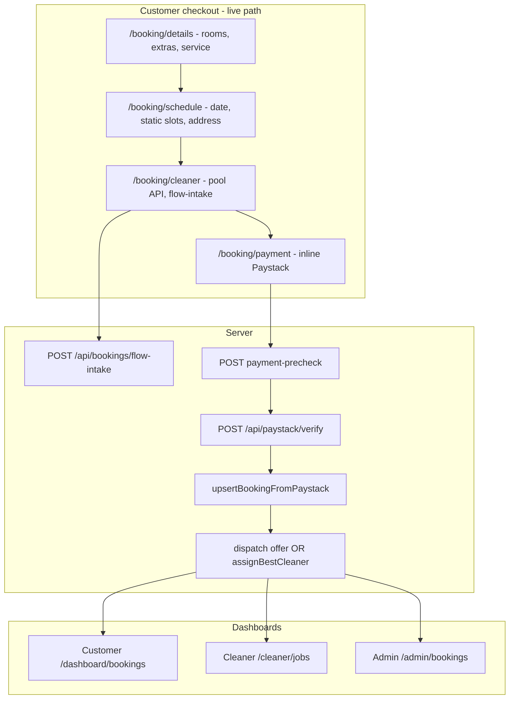
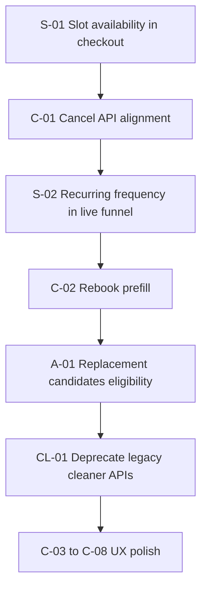

# Standard Cleaning — End-to-End Audit Report

> **Generated:** 2026-05-30  
> **Scope:** Standard cleaning only (`standard` slug, `standard_cleaning` funnel type) from checkout step 1 through customer, cleaner, and admin dashboards.  
> **Related registers:** [Platform issues (REV-*)](../PLATFORM_ISSUES.md) · [Booking architecture](../architecture/booking-system-architecture.md) · [Payments runbook](../runbook-payments.md)

---

## Executive summary

| Metric | Value |
|--------|-------|
| **P0 issues (this audit)** | 0 open — S-01, C-01 fixed 2026-05-30 |
| **P1 issues (A-01)** | Fixed 2026-05-30 — replacement-candidates uses `getEligibleCleaners` |
| **P1 issues** | 7 — funnel drift, rebook, CTAs, replacement candidates, dual APIs, payment paths |
| **P2 issues** | 12 — copy, labels, filters, slug hygiene, documented REV items |
| **P3 / polish** | 5 — UX gaps, naming, optional QA |
| **Regression-covered (no action)** | M13/M14 admin eligibility convergence; strict Standard vs Airbnb prefs in pool |

Standard cleaning is the **default** catalog service and the dominant production slug. Most dashboard surfaces are **service-agnostic**; gaps appear where checkout, dispatch statuses, and billing models diverge. The highest-impact fixes are **wiring real slot availability into the live schedule step** and **aligning customer modify APIs with operational phase logic** for post-pay dispatch states (`pending_assignment`, `offered`).

---

## 1. Scope and canonical identifiers

### In scope

| Concept | Value | Primary source |
|---------|-------|----------------|
| Catalog ID | `standard` | [`serviceCategories.ts`](../../apps/web/components/booking/serviceCategories.ts) |
| Funnel type key | `standard_cleaning` | Same file — `TYPE_TO_SERVICE_ID` |
| Flow group | `regular` (`REGULAR_FLOW_SERVICE_IDS`) | With `airbnb` only |
| DB column | `bookings.service_slug = 'standard'` | Checkout / Paystack finalize |
| Capability gate | **None** | [`serviceCapabilityEligibility.ts`](../../apps/web/lib/booking/serviceCapabilityEligibility.ts) — only `deep` / `move` use `can_do_*` columns |
| Cleaner step | **Solo picker** (not team) | [`CleanerStep.tsx`](../../apps/web/components/booking/steps/CleanerStep.tsx) — `isTeamAssignedService()` false for `standard` |
| Admin detail | Solo assign card | [`BookingDetailsView.tsx`](../../apps/web/components/admin/BookingDetailsView.tsx) — `ADMIN_SOLO_CLEANER_DETAIL_CARD_SERVICES` |

### Out of scope (mentioned only when shared code affects Standard)

- Deep, Move, Carpet, Airbnb-specific UX (team jobs, QA checklists, capability columns).
- Marketing-only APIs (`GET /api/cleaners/available` — REV-015).

### Production booking path (live)

Path-based checkout guarded by [`bookingCheckoutGuards.ts`](../../apps/web/lib/booking/bookingCheckoutGuards.ts):

```
/booking → redirect → /booking/details → /booking/schedule → /booking/cleaner → /booking/payment?bookingId=
```

State: [`bookingCheckoutStore.ts`](../../apps/web/lib/booking/bookingCheckoutStore.ts) (default `service: "standard"`).

**Not live:** Query-param funnel [`BookingFlowClient.tsx`](../../apps/web/components/booking/BookingFlowClient.tsx) — implemented but **not mounted** on any `app/` route.

### End-to-end lifecycle



---

## 2. Booking funnel (step 1 → payment → assignment)

### Step map (live path)

| Step | Route | Component | Standard-specific behavior |
|------|-------|-----------|----------------------------|
| 1 | `/booking/details` | [`BookingDetailsPage.tsx`](../../apps/web/components/booking/checkout/pages/BookingDetailsPage.tsx) | Service dropdown from pricing catalog; default `standard` |
| 2 | `/booking/schedule` | [`ScheduleStep.tsx`](../../apps/web/components/booking/steps/ScheduleStep.tsx) | Static time grid; suburb + street |
| 3 | `/booking/cleaner` | [`CleanerStep.tsx`](../../apps/web/components/booking/steps/CleanerStep.tsx) | Solo cleaner list via `GET /api/booking/cleaners` |
| 4 | `/booking/payment` | [`useUnifiedPaymentFlow.ts`](../../apps/web/lib/booking/useUnifiedPaymentFlow.ts) | Inline Paystack; no `/api/paystack/initialize` on pay click |

Creation: [`insertBookingFlowIntake.ts`](../../apps/web/lib/booking/insertBookingFlowIntake.ts) → `pending_payment` row.  
Finalize: [`upsertBookingFromPaystack.ts`](../../apps/web/lib/booking/upsertBookingFromPaystack.ts) → offer to picked cleaner or `assignBestCleaner` for auto-assign.

### Eligibility engine (Standard)

Canonical pool: [`getEligibleCleaners.ts`](../../apps/web/lib/booking/getEligibleCleaners.ts).

Filter order: account active → weekday → calendar → service area → slot conflicts → **capability gate (skipped for Standard)** → **strict `cleaner_preferences.preferred_services`**.

Regression tests: [`cleanerServicePreferenceEligibility.test.ts`](../../apps/web/lib/booking/__tests__/cleanerServicePreferenceEligibility.test.ts).

| Consumer | Entry |
|----------|--------|
| Public picker | `GET /api/booking/cleaners` → `getAvailableCleaners` |
| Checkout honor | `resolveCheckoutCleanerSelection` → `isCleanerInAvailablePoolForSlot` |
| Post-pay dispatch | `smartAssignCleaner` → `findSmartDispatchCandidates` |
| Admin hard assign | `performAdminAssignToCleaner` |

---

### Issue register — booking funnel

#### S-01 — P0: Schedule step allows times with zero eligible cleaners

| Field | Detail |
|-------|--------|
| **Symptom** | Customer selects date/time on step 2; cleaner step or post-payment dispatch may have no assignable cleaners. |
| **Root cause** | [`ScheduleStep.tsx`](../../apps/web/components/booking/steps/ScheduleStep.tsx) calls `getRenderableScheduleTimes(date)` **without** an availability map. [`buildScheduleSlotModels`](../../apps/web/components/booking/schedule/ScheduleTimeSlots.tsx) sets `isAvailable = availability?.[time] ?? **true**` when availability is omitted. No call to [`GET /api/booking/time-slots`](../../apps/web/app/api/booking/time-slots/route.ts) or [`POST /api/booking/lock`](../../apps/web/app/api/booking/lock/route.ts) on this path. |
| **Contrast** | Orphan funnel [`StepScheduleV2.tsx`](../../apps/web/components/booking/steps/StepScheduleV2.tsx) fetches `/api/booking/time-slots` with cleaner counts and supports lock. |
| **Evidence** | `ScheduleStep.tsx` L58: `getRenderableScheduleTimes(date)` — no second argument. `ScheduleTimeSlots.tsx` L44: default `true` for availability. |
| **Fix** | 1) After suburb (`serviceAreaLocationId`) + service are known, fetch time-slots with `serviceType=standard`, `locationId`, `date`. 2) Pass `Record<time, boolean>` into `getRenderableScheduleTimes`. 3) Disable or hide slots with zero eligible cleaners. 4) Optionally require lock before cleaner step (parity with lock-based funnel). 5) Add vitest: schedule step never marks slot available when `countEligibleCleaners === 0`. |
| **Verification** | Manual: pick remote suburb + peak time → no false “available” slots. API: compare slot grid vs `GET /api/booking/cleaners` for same params. |

---

#### S-02 — P1: Recurring frequency / plan discounts only in dead funnel

| Field | Detail |
|-------|--------|
| **Symptom** | Weekly/biweekly Standard plans and related discounts unreachable for most customers. |
| **Root cause** | `CleaningFrequencySelector` lives in orphan `StepDetailsForm`; [`bookingCheckoutStore.ts`](../../apps/web/lib/booking/bookingCheckoutStore.ts) has no `cleaningFrequency` field. |
| **Fix** | **Option A:** Port frequency to checkout store + details step + `flow-intake` / Paystack metadata. **Option B:** Mount unified `BookingFlowClient` and retire path checkout (larger migration). |
| **Verification** | E2E or integration: weekly Standard booking persists frequency and correct price in `booking_snapshot`. |

---

#### S-03 — P1: Dual payment architectures

| Field | Detail |
|-------|--------|
| **Symptom** | Two validation/metadata shapes; risk of drift and support confusion. |
| **Root cause** | **Live:** `flow-intake` + inline Paystack ([`useUnifiedPaymentFlow.ts`](../../apps/web/lib/booking/useUnifiedPaymentFlow.ts)). **Orphan:** HMAC lock + [`POST /api/paystack/initialize`](../../apps/web/app/api/paystack/initialize/route.ts) + redirect ([`StepPayment.tsx`](../../apps/web/components/booking/steps/StepPayment.tsx)). |
| **Fix** | Mark orphan path deprecated in code comments and docs; ensure all new features use flow-intake pipeline only; single snapshot schema in [`paystackChargeTypes.ts`](../../apps/web/lib/booking/paystackChargeTypes.ts). |
| **Verification** | Audit [`bookingCreationPathsAudit.ts`](../../apps/web/lib/booking/bookingCreationPathsAudit.ts); no new routes bypassing flow-intake. |

---

#### S-04 — P2: Unknown slugs default to `standard`

| Field | Detail |
|-------|--------|
| **Root cause** | [`canonicalizeBookingServiceSlug.ts`](../../apps/web/lib/booking/canonicalizeBookingServiceSlug.ts) maps unknown → `standard`. |
| **Fix** | Strict validation on **writes** (admin create, API body); canonicalize only on **reads** of legacy rows. |
| **Risk** | Mis-labeled Deep/Move jobs if bad slug injected. |

---

#### S-05 — P2: Legacy `quick` slug in DB, retired in app

| Field | Detail |
|-------|--------|
| **Root cause** | `pricing_services` migration seeds `quick`; `BOOKING_SERVICE_IDS` has no `quick` ([`serviceCategories.retireQuick.test.ts`](../../apps/web/components/booking/serviceCategories.retireQuick.test.ts)). |
| **Fix** | Admin catalog migration: map `quick` → `standard` or archive rows. |

---

#### S-06 — P2: REV-010 — Dispatch offer to picked cleaner on eligibility fallback

| Field | Detail |
|-------|--------|
| **Reference** | [REV-010](../PLATFORM_ISSUES.md) |
| **Behavior** | `checkoutPaidDispatchOfferCleanerId` may target customer pick on `fallback`; auto-assign excludes via `excludeCleanerIds`. |
| **Fix** | Ops documentation (done); optional product change: block offer when cleaner not in canonical pool. |
| **File** | [`checkoutCleanerEligibility.ts`](../../apps/web/lib/booking/checkoutCleanerEligibility.ts) |

---

#### S-07 — P2: REV-009 — Strict preference filtered twice in dispatch

| Field | Detail |
|-------|--------|
| **Reference** | [REV-009](../PLATFORM_ISSUES.md) |
| **Fix** | Optional: remove redundant `cleanerPreferenceStrictExcludesJob` in `findSmartDispatchCandidates` after pool fetch. |

---

## 3. Customer dashboard

### Surface map

| Path | File | Standard notes |
|------|------|----------------|
| `/dashboard` | [`app/dashboard/page.tsx`](../../apps/web/app/dashboard/page.tsx) | Recent cards; `showActions={false}` on home |
| `/dashboard/bookings` | [`app/dashboard/bookings/page.tsx`](../../apps/web/app/dashboard/bookings/page.tsx) | List; pay-as-you-go + monthly share UI |
| `/dashboard/bookings/[id]` | [`app/dashboard/bookings/[id]/page.tsx`](../../apps/web/app/dashboard/bookings/[id]/page.tsx) | Detail; cancel/reschedule |
| `/dashboard/book` | [`app/dashboard/book/page.tsx`](../../apps/web/app/dashboard/book/page.tsx) | Monthly self-book; redirects pay-as-you-go to `/booking` |
| `/dashboard/payments` | [`app/dashboard/payments/page.tsx`](../../apps/web/app/dashboard/payments/page.tsx) | Receipt list |

APIs: `GET /api/customer/bookings`, `POST /api/dashboard/bookings/[id]/cancel`, `PATCH .../reschedule`.

Operational layer: [`dashboardBookingOperational.ts`](../../apps/web/lib/dashboard/dashboardBookingOperational.ts) → [`describeBookingOperationalState`](../../apps/web/lib/booking/describeBookingOperationalState.ts).

---

### Issue register — customer dashboard

#### C-01 — P0: Cancel/reschedule UI vs API mismatch (post-pay Standard dispatch)

| Field | Detail |
|-------|--------|
| **Symptom** | After Paystack, booking often enters `pending_assignment` or `offered`. Customer sees **Reschedule** / **Cancel**; API returns 400 *"This booking cannot be cancelled/rescheduled."* |
| **Root cause** | **UI:** [`deriveBookingOperationalPhase.ts`](../../apps/web/lib/booking/deriveBookingOperationalPhase.ts) L119 maps `pending`, `offered`, `pending_assignment` → operational phase `"pending"`. [`CUSTOMER_MODIFY_PHASES`](../../apps/web/lib/dashboard/dashboardBookingOperational.ts) includes `"pending"`. **API:** [`cancel/route.ts`](../../apps/web/app/api/dashboard/bookings/[id]/cancel/route.ts) L11 `CANCELLABLE = pending | confirmed | assigned`. [`reschedule/route.ts`](../../apps/web/app/api/dashboard/bookings/[id]/reschedule/route.ts) L11 `RESCHEDULE_STATUSES` — same set. **`pending_assignment` and `offered` are excluded.** |
| **Fix (recommended)** | Extend `CANCELLABLE` and `RESCHEDULE_STATUSES` to include `pending_assignment` and `offered`. On cancel: revoke open dispatch offers, clear `cleaner_id` if offer-only, notify ops. On reschedule: re-run assignment / offer expiry per [`ensureBookingAssignment`](../../apps/web/lib/dispatch/ensureBookingAssignment.ts). Add API tests for Standard pay-as-you-go path. |
| **Fix (alternative)** | Narrow UI: hide modify buttons unless `status ∈ CANCELLABLE` (expose raw status check on card). Worse UX for dispatch limbo. |
| **Verification** | Vitest: operational `modifiable` ↔ API allowed set. Manual: Paystack Standard → `pending_assignment` → cancel succeeds. |

---

#### C-02 — P1: Rebook does not prefill prior booking

| Field | Detail |
|-------|--------|
| **Symptom** | "Rebook" sends customer to empty `/booking`. |
| **Root cause** | [`booking-card.tsx`](../../apps/web/components/dashboard/booking-card.tsx) L177: `<Link href="/booking">`. [`applyRebookSnapshot`](../../apps/web/lib/booking/rebookApply.ts) only used on [`booking/success`](../../apps/web/app/booking/success/page.tsx). |
| **Fix** | Link to `/booking/details?rebook=<bookingId>` or call `applyRebookSnapshot(booking.raw.booking_snapshot)` before navigate; hydrate [`bookingCheckoutStore`](../../apps/web/lib/booking/bookingCheckoutStore.ts) for path checkout (may need adapter from snapshot → store shape). |
| **Verification** | Manual: rebook from completed Standard → rooms/extras/address prefilled. |

---

#### C-03 — P1: "Book Cleaning" CTA targets monthly-only flow

| Field | Detail |
|-------|--------|
| **Symptom** | Pay-as-you-go Standard customers hit `/dashboard/book` then redirect warning. |
| **Root cause** | Nav/home CTAs point to `/dashboard/book`; page gates monthly billing. |
| **Fix** | Primary CTA → `/booking?service=standard` (or `/booking/details`). Reserve `/dashboard/book` for users with active monthly plan flag. |
| **Files** | [`dashboard-shell.tsx`](../../apps/web/components/dashboard/dashboard-shell.tsx), [`dashboard/page.tsx`](../../apps/web/app/dashboard/page.tsx) |

---

#### C-04 — P2: Cancel dialog copy assumes monthly billing

| Field | Detail |
|-------|--------|
| **Root cause** | [`customerCancelBookingHint`](../../apps/web/lib/dashboard/customerCancelCopy.ts) always mentions "monthly invoice" when invoice not finalized — even when `monthly_invoice_id` is null. |
| **Fix** | If `!monthly_invoice_id` → pay-as-you-go copy ("Your booking will be cancelled; refund policy per terms"). |

---

#### C-05 — P2: Payments page status labels misleading

| Field | Detail |
|-------|--------|
| **Symptom** | Cancelled → "Refunded" without refund check; `pending_monthly` → "Paid". |
| **File** | [`app/dashboard/payments/page.tsx`](../../apps/web/app/dashboard/payments/page.tsx) |
| **Fix** | Reuse [`customerBookingStatusLabel`](../../apps/web/lib/dashboard/customerBookingDisplay.ts) or map `billing_type` + `status` explicitly. |

---

#### C-06 — P2: Status badge oversimplified

| Field | Detail |
|-------|--------|
| **Symptom** | Assigned/accepted jobs show **"Scheduled"**; detail in tooltip only. |
| **Files** | [`customerBookingDisplay.ts`](../../apps/web/lib/dashboard/customerBookingDisplay.ts), [`customer-booking-status-badge.tsx`](../../apps/web/components/dashboard/customer-booking-status-badge.tsx) |
| **Fix** | Surface "Cleaner assigned" / "On the way" in badge text when `cleaner_response_status` is `accepted` / `on_my_way`. |

---

#### C-07 — P2: Inconsistent service display names

| Field | Detail |
|-------|--------|
| **Symptom** | DB `bookings.service` may be `"Standard"` or `"Standard Cleaning"`. |
| **Fix** | In [`bookingUtils.ts`](../../apps/web/lib/dashboard/bookingUtils.ts), prefer `getServiceLabel(service_slug ?? 'standard')` with fallback to raw `service`. |

---

#### C-08 — P3: UX polish backlog

| Item | Location | Fix |
|------|----------|-----|
| Bookings subtitle implies monthly-only | `bookings/page.tsx` | Neutral copy: "Upcoming and past cleans" |
| Table view no cancel/reschedule | `customer-bookings-table.tsx` | Add action column or row menu |
| Detail missing rebook + review | `bookings/[id]/page.tsx` | Mirror card actions |
| Empty upcoming state no CTA button | `bookings/page.tsx` + `empty-state.tsx` | `action` → `/booking` |
| Payments rows not linked to booking | `payments/page.tsx` | Link to `/dashboard/bookings/[id]` |
| Invoice detail no per-visit breakdown | `invoices/[invoiceId]/page.tsx` | List booking IDs on invoice |

---

## 4. Cleaner dashboard

### Surface map

| Path | API | Standard notes |
|------|-----|----------------|
| `/cleaner/dashboard` | `GET /api/cleaner/dashboard` | Capped jobs; may omit `service_slug` |
| `/cleaner/jobs` | `GET /api/cleaner/jobs` | Merged visibility; Standard = solo |
| `/cleaner/jobs/[id]` | `GET` + `POST` lifecycle | No QA checklist for Standard |
| `/cleaner/earnings` | `GET /api/cleaner/earnings` | % of basis for solo Standard |

Accept paths:

1. **Dispatch offer** (pre-assign): `POST /api/cleaner/offers/:id/accept|decline`
2. **Assigned job**: `POST /api/cleaner/jobs/:id` `{ action: "accept", idempotency_key }`

Earnings: [`computeCleanerOfferEarningsSnapshot.ts`](../../apps/web/lib/payout/computeCleanerOfferEarningsSnapshot.ts) — junior 60% / senior 70% of payment basis for solo Standard.

---

### Issue register — cleaner dashboard

#### CL-01 — P1: Dual lifecycle APIs without shared idempotency

| Field | Detail |
|-------|--------|
| **Symptom** | Legacy clients can double-accept. |
| **Canonical** | [`POST /api/cleaner/jobs/[id]`](../../apps/web/app/api/cleaner/jobs/[id]/route.ts) with idempotency table |
| **Legacy** | `POST /api/cleaner/bookings/[id]/accept`, `POST /api/cleaner/respond` |
| **Fix** | Return 410 with `Link` header to jobs route, or proxy legacy → jobs with generated idempotency key. |

---

#### CL-02 — P2: Dashboard API omits `service_slug`

| Field | Detail |
|-------|--------|
| **File** | [`app/api/cleaner/dashboard/route.ts`](../../apps/web/app/api/cleaner/dashboard/route.ts) |
| **Fix** | Add `service_slug` to select; map in [`cleanerMobileBookingMap.ts`](../../apps/web/lib/cleaner/cleanerMobileBookingMap.ts) if needed. |

---

#### CL-03 — P2: List `view=card` lighter than detail

| Field | Detail |
|-------|--------|
| **Behavior** | No team roster fetch, fewer fields on list. |
| **Fix** | Document; add optional `?full=1` if product needs peer names on Standard solo cards. |

---

#### CL-04 — P2: `/api/cleaner/roster` naming confusion

| Field | Detail |
|-------|--------|
| **Actual** | Availability / work areas — not `booking_cleaners` team roster |
| **Fix** | Rename to `/api/cleaner/work-settings` alias or document in cleaner onboarding. |

---

#### CL-05 — P3: No Standard QA checklist (by design)

| Field | Detail |
|-------|--------|
| **File** | [`bookingServiceQa.ts`](../../apps/web/lib/booking/bookingServiceQa.ts) |
| **Action** | None unless product requests Standard QA routes. |

---

## 5. Admin dashboard

### Surface map

| Path | Key component |
|------|----------------|
| `/admin/bookings` | List + [`AdminAssignForm`](../../apps/web/components/admin/AdminAssignForm.tsx) |
| `/admin/bookings/[id]` | [`BookingDetailsView`](../../apps/web/components/admin/BookingDetailsView.tsx) |

Standard uses **solo cleaner assign card** (not team dispatch primary UI).

APIs: `GET/POST /api/admin/bookings`, `GET .../assign-eligibility`, `POST .../offer`, `POST .../assign-smart`, `POST .../retry-dispatch`.

---

### Issue register — admin dashboard

#### A-01 — P1: `replacement-candidates` bypasses canonical eligibility

| Field | Detail |
|-------|--------|
| **Symptom** | Admin may see cleaners who fail strict Standard prefs, capability, or `is_available=false`. |
| **Root cause** | [`replacement-candidates/route.ts`](../../apps/web/app/api/admin/bookings/[id]/replacement-candidates/route.ts) scores overlap + distance + rating; does not call `getEligibleCleaners` or `cleanerPreferenceStrictExcludesJob`. |
| **Fix** | Load `service_slug` from booking; filter candidates through `getEligibleCleaners` for slot; merge with existing composite score for ordering. Reuse `accountIneligible` from [`adminAssignEligibility.ts`](../../apps/web/lib/admin/adminAssignEligibility.ts). |
| **Verification** | Test: strict Airbnb-only cleaner never appears for `standard` replacement list. |

---

#### A-02 — P2: No service-type filter on booking list

| Field | Detail |
|-------|--------|
| **File** | [`app/api/admin/bookings/route.ts`](../../apps/web/app/api/admin/bookings/route.ts) |
| **Fix** | Query param `serviceSlug=standard`; UI filter chip on [`admin/bookings/page.tsx`](../../apps/web/app/admin/bookings/page.tsx). |

---

#### A-03 — P2: `rosterCleaners` OR-logic footgun

| Field | Detail |
|-------|--------|
| **Risk** | Cleaner with `is_available=false` but `status="available"` may appear in roster list. |
| **Mitigation today** | `canAssignWithoutForce: false` from M13 [`computeAssignEligibility`](../../apps/web/lib/admin/adminAssignEligibility.ts). |
| **Fix** | Tighten roster filter to require `accountIneligible === false`. |

---

#### A-04 — P2: `force=true` bypasses eligibility pool

| Field | Detail |
|-------|--------|
| **By design** | [`performAdminAssignToCleaner.ts`](../../apps/web/lib/admin/performAdminAssignToCleaner.ts) |
| **Fix** | Confirm modal + structured audit log entry for forced Standard assigns. |

---

#### A-05 — Fixed: M13/M14 admin eligibility convergence

| Field | Detail |
|-------|--------|
| **Tests** | [`m13m14AdminEligibilityConvergence.test.ts`](../../apps/web/lib/admin/__tests__/m13m14AdminEligibilityConvergence.test.ts) |
| **Status** | Admin schedule hints and hard assign align with `getEligibleCleaners` for account gates and strict prefs. **No further action.** |

---

## 6. Platform, CI, and testing gaps

| ID | Severity | Issue | Action for Standard |
|----|----------|-------|---------------------|
| REV-008 | P2 | 220 ESLint errors; not in CI | Triage booking + dashboard touch files first |
| REV-012 | P2 | E2E env-gated | Add Standard smoke: details → payment → `pending_assignment` → cancel (see [`e2e/README.md`](../../apps/web/e2e/README.md)) |
| — | P2 | Webhook vs verify race | Covered partially by idempotency tests; full double-delivery E2E gated |
| — | P2 | Full path checkout E2E | No default CI spec for `/booking/details` live path |

### Recommended vitest commands

```bash
cd apps/web
npm run test -- cleanerServicePreferenceEligibility
npm run test -- m13m14AdminEligibilityConvergence
npm run test -- customerBookingCardOperationalDisplay
npm run test -- dashboardBookingOperational
```

CI revenue slice (`.github/workflows/web-test.yml`) already includes booking/dispatch/admin eligibility tests.

---

## 7. Recommended fix order



| Phase | IDs | Goal |
|-------|-----|------|
| **1 — Revenue integrity** | S-01, C-01, A-01 | No false availability; customer can cancel dispatch limbo; admin replacement respects pool |
| **2 — Conversion & retention** | S-02, C-02, C-03 | Plans + rebook + correct book CTA |
| **3 — Maintainability** | CL-01, S-03, A-02 | Single payment path; cleaner API consolidation; admin filters |
| **4 — Polish** | C-04–C-08, CL-02–CL-04, S-04–S-05 | Copy, labels, slug hygiene |

---

## 8. Verification checklist (appendix)

### P0 fixes

| Issue | Automated | Manual |
|-------|-----------|--------|
| S-01 | Integration: slot API vs displayed slots for `standard` + location | Book Standard in low-coverage suburb; confirm unavailable times hidden |
| C-01 | API test: cancel `pending_assignment` + `offered` returns 200 | Paystack book → cancel before accept |

### P1 fixes

| Issue | Automated | Manual |
|-------|-----------|--------|
| A-01 | Unit: replacement list excludes strict wrong-service cleaners | Admin replacement UI for Standard job |
| C-02 | — | Rebook from dashboard card prefills checkout |
| CL-01 | — | Legacy accept route returns 410 or proxies |

### Standard happy-path manual script

1. `/booking/details` — service Standard, 2 bed, 1 bath, extras.
2. `/booking/schedule` — valid suburb, date, time with ≥1 eligible cleaner (after S-01 fix).
3. `/booking/cleaner` — pick cleaner or auto-assign; submit contact → `flow-intake`.
4. Pay via Paystack test → `/booking/success`.
5. **Customer:** `/dashboard/bookings/[id]` — status, cancel (if pre-fieldwork).
6. **Cleaner:** accept offer or job → en route → start → complete.
7. **Admin:** assign-eligibility matches picker; assign or retry-dispatch.
8. **Customer:** completed → rebook (after C-02) → review if eligible.

### Environment for E2E (optional)

| Variable | Purpose |
|----------|---------|
| `PLAYWRIGHT_BASE_URL` | Staging/preview URL |
| `E2E_PAYSTACK` | Enable Paystack sandbox specs |
| `SUPABASE_SERVICE_ROLE_KEY` | Server-side booking assertions |

---

## 9. File index (quick reference)

| Area | Path |
|------|------|
| Service catalog | `apps/web/components/booking/serviceCategories.ts` |
| Live checkout store | `apps/web/lib/booking/bookingCheckoutStore.ts` |
| Schedule step | `apps/web/components/booking/steps/ScheduleStep.tsx` |
| Time slot models | `apps/web/components/booking/schedule/ScheduleTimeSlots.tsx` |
| Eligibility core | `apps/web/lib/booking/getEligibleCleaners.ts` |
| Paystack finalize | `apps/web/lib/booking/upsertBookingFromPaystack.ts` |
| Customer operational | `apps/web/lib/dashboard/dashboardBookingOperational.ts` |
| Cancel API | `apps/web/app/api/dashboard/bookings/[id]/cancel/route.ts` |
| Cleaner jobs API | `apps/web/app/api/cleaner/jobs/route.ts` |
| Admin assign | `apps/web/lib/admin/performAdminAssignToCleaner.ts` |
| Platform register | `docs/PLATFORM_ISSUES.md` |

---

*End of report.*
